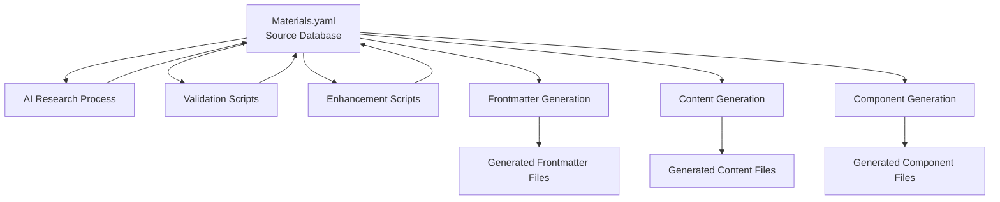

# 📋 MATERIALS.YAML vs FRONTMATTER PROCESS SEPARATION

## 📅 Document Date: September 30, 2025
## 🎯 Purpose: Document the separation between materials database updates and content generation

---

## 🎯 EXECUTIVE SUMMARY

The Z-Beam Generator system has **TWO DISTINCT PROCESSES**:

1. **Materials Database Management** - Updating source data in `Materials.yaml`
2. **Content Generation** - Creating frontmatter and content from source data

**These processes are SEPARATE and serve different purposes.** Understanding this separation is critical for system maintenance and development.

---

## 📊 PROCESS OVERVIEW



---

## 🗂️ PROCESS 1: MATERIALS DATABASE MANAGEMENT

### **Purpose**: Maintain the source data that drives all content generation

### **Target File**: `data/Materials.yaml`

### **Process Characteristics**:
- **Manual/Script-Driven**: Updates via dedicated scripts and AI research
- **Data-Focused**: Manages material property values, sources, confidence levels
- **Quality-Controlled**: Enforces uniqueness, AI research requirements, validation
- **Infrequent Updates**: Changes when new materials added or research improves

### **Key Scripts for Materials.yaml Updates**:

#### **1. Validation Scripts**
```bash
# FAIL-FAST validation (blocks system if violations found)
python3 scripts/validation/fail_fast_materials_validator.py

# Comprehensive materials validation
python3 scripts/validation/materials_validator.py

# Schema validation
python3 tests/test_materials_yaml_validation.py
```

#### **2. Enhancement Scripts**
```bash
# Add new materials or properties
python3 scripts/enhance_materials.py

# Clean and normalize data
python3 scripts/tools/clean_materials_yaml.py

# Capitalize material names consistently
python3 scripts/tools/capitalize_materials_yaml.py
```

#### **3. AI Research Scripts**
```bash
# AI research automation (future implementation)
python3 scripts/research/ai_materials_researcher.py

# Batch research processing (future implementation)
python3 scripts/research/batch_materials_research.py
```

#### **4. Analysis Scripts**
```bash
# Analyze data gaps and quality issues
python3 scripts/analysis/material_data_gap_analyzer.py

# Validate data completeness
python3 scripts/tools/analyze_material_fields.py
```

### **Materials.yaml Structure**:
```yaml
# CORE SOURCE DATA STRUCTURE
materials:
  category_name:
    items:
      - name: "Material Name"
        properties:
          property_name:
            value: [unique_ai_researched_value]
            source: ai_research              # REQUIRED
            confidence: 0.9+                 # REQUIRED >= 0.9
            research_basis: "Citation"       # REQUIRED
            research_date: "YYYY-MM-DD"     # REQUIRED
            validation_method: "Method"     # REQUIRED

material_index:
  "Material Name": category_name

machineSettingsRanges:
  # Laser parameter ranges for all materials
```

### **Update Workflow**:
1. **Research Phase**: AI research specific material properties
2. **Validation Phase**: Ensure data meets quality requirements
3. **Integration Phase**: Update Materials.yaml with new data
4. **Testing Phase**: Validate entire database integrity
5. **Deployment Phase**: Updated database available for content generation

---

## 🗂️ PROCESS 2: CONTENT GENERATION

### **Purpose**: Generate user-facing content FROM the materials database

### **Source File**: `data/Materials.yaml` (READ-ONLY)

### **Generated Files**: 
- Frontmatter YAML files
- Content markdown files
- Component files (tags, captions, etc.)

### **Process Characteristics**:
- **Automated**: Triggered by user commands or batch operations
- **Content-Focused**: Creates user-facing documentation and content
- **Frequent Generation**: Can be run multiple times with same source data
- **Source-Dependent**: Quality depends entirely on Materials.yaml data quality

### **Key Generation Commands**:

#### **1. Individual Material Generation**
```bash
# Generate all components for specific material
python3 run.py --material "Aluminum"

# Generate specific components only
python3 run.py --material "Steel" --components "frontmatter,text"
```

#### **2. Batch Generation**
```bash
# Generate all materials (requires clean Materials.yaml)
python3 run.py --all

# Generate content batch (first 8 categories)
python3 run.py --content-batch
```

#### **3. Component-Specific Generation**
```bash
# Generate frontmatter only
python3 -c "from components.frontmatter import generate_frontmatter; generate_frontmatter('Aluminum')"

# Generate text content only
python3 -c "from components.text import generate_text; generate_text('Copper')"
```

### **Generation Architecture**:
```python
# CONTENT GENERATION FLOW
1. load_materials()  # Load from Materials.yaml
2. validate_material_data()  # Ensure data quality
3. generate_component()  # Create specific content
4. save_output_file()  # Write generated content
```

### **Generated File Locations**:
```
content/
├── components/
│   ├── frontmatter/
│   │   └── material-name-laser-cleaning.yaml
│   ├── text/
│   │   └── material-name-content.md
│   ├── tags/
│   │   └── material-name-tags.yaml
│   └── caption/
│       └── material-name-caption.yaml
```

---

## 🔄 CRITICAL DIFFERENCES

### **Materials.yaml Updates (Process 1)**:
- **WHO**: Data engineers, materials scientists, AI researchers
- **WHEN**: When new materials added or research improves
- **WHAT**: Material property values, sources, confidence levels
- **HOW**: Dedicated scripts, AI research, validation tools
- **FREQUENCY**: Weekly/monthly data improvement cycles
- **VALIDATION**: Fail-fast validation, uniqueness requirements
- **IMPACT**: Affects ALL future content generation

### **Content Generation (Process 2)**:
- **WHO**: Content creators, developers, automated systems
- **WHEN**: When content needed for website, documentation
- **WHAT**: User-facing content, frontmatter, descriptions
- **HOW**: Automated generation from Materials.yaml data
- **FREQUENCY**: Daily/on-demand content creation
- **VALIDATION**: Content quality, formatting, consistency
- **IMPACT**: Affects specific generated files only

---

## 🚨 FAIL-FAST INTEGRATION

### **Materials.yaml Process (Enforced)**:
- ✅ **Validation Required**: All updates must pass fail-fast validation
- ✅ **No Defaults Allowed**: Zero tolerance for default/fallback values
- ✅ **AI Research Required**: All properties must be independently researched
- ✅ **Uniqueness Enforced**: No duplicate values across materials

### **Content Generation Process (Dependent)**:
- ⚠️ **Blocked if Materials.yaml Invalid**: Cannot generate with defaults present
- ⚠️ **Quality Depends on Source**: Generated content quality reflects source data quality
- ✅ **Fail-Fast on Load**: System refuses to load invalid Materials.yaml
- ✅ **Clean Generation**: With valid source data, generates high-quality content

---

## 📋 WORKFLOW EXAMPLES

### **Example 1: Adding New Material**
```bash
# Step 1: Materials Database Process
python3 scripts/research/ai_materials_researcher.py --material "Titanium Alloy"
python3 scripts/validation/fail_fast_materials_validator.py
python3 scripts/enhance_materials.py --add "Titanium Alloy"

# Step 2: Content Generation Process
python3 run.py --material "Titanium Alloy"
python3 run.py --material "Titanium Alloy" --components "frontmatter,text,tags"
```

### **Example 2: Improving Existing Data**
```bash
# Step 1: Materials Database Process (Research Better Values)
python3 scripts/research/batch_materials_research.py --category "metal"
python3 scripts/validation/fail_fast_materials_validator.py

# Step 2: Content Generation Process (Regenerate with Better Data)
python3 run.py --all  # Regenerate all content with improved data
```

### **Example 3: Quality Assurance Cycle**
```bash
# Step 1: Validate Materials Database
python3 tests/test_materials_uniqueness_requirements.py
python3 scripts/validation/fail_fast_materials_validator.py

# Step 2: Test Content Generation
python3 run.py --test
python3 tests/test_pipeline_integration.py
```

---

## 🎯 PROCESS RESPONSIBILITIES

### **Materials Database Team**:
- **Data Quality**: Ensure all properties are AI-researched and unique
- **Research Management**: Coordinate AI research of material properties
- **Validation**: Maintain fail-fast validation and quality standards
- **Schema Management**: Define and maintain Materials.yaml structure
- **Documentation**: Document research methodologies and data sources

### **Content Generation Team**:
- **Generation Quality**: Ensure generated content meets user requirements
- **Template Management**: Maintain content generation templates and prompts
- **Component Development**: Develop and maintain generation components
- **User Experience**: Optimize generated content for end-user consumption
- **Integration**: Ensure smooth integration with deployment systems

---

## 📊 CURRENT STATUS

### **Materials.yaml Process Status**:
- ❌ **4,224 violations detected** requiring remediation
- ❌ **98.6% default values** need AI research replacement
- ❌ **System blocked** until materials database cleaned
- ✅ **Validation infrastructure** in place and enforced
- ✅ **Remediation plan** documented and ready for execution

### **Content Generation Process Status**:
- ⚠️ **Blocked** due to Materials.yaml validation failures
- ✅ **Generation infrastructure** ready and functional
- ✅ **Components available** for all content types
- ✅ **Quality systems** in place for generated content
- ⚠️ **Waiting for clean source data** to resume operations

---

## 🚀 RECOMMENDED WORKFLOW

### **Phase 1: Fix Materials Database (Weeks 1-8)**
1. Execute Materials.yaml remediation plan
2. Replace all default values with AI research
3. Ensure 100% validation compliance
4. Document all research sources and methods

### **Phase 2: Resume Content Generation (Week 9+)**
1. Validate system startup with clean Materials.yaml
2. Run comprehensive content generation tests
3. Generate content for all 121 materials
4. Deploy generated content to production systems

### **Phase 3: Ongoing Operations**
1. **Materials Database**: Monthly research cycles, quarterly validation
2. **Content Generation**: On-demand generation, weekly batch updates
3. **Quality Assurance**: Continuous monitoring, automated testing
4. **Documentation**: Keep process documentation current

---

## 📖 DOCUMENTATION REFERENCES

### **Materials Database Process**:
- `MATERIALS_ANALYSIS_CRITICAL_FINDINGS.md` - Current state analysis
- `MATERIALS_UNIQUE_VALUES_REQUIREMENTS.md` - Quality requirements
- `MATERIALS_REMEDIATION_PLAN.md` - Action plan for fixes
- `scripts/validation/fail_fast_materials_validator.py` - Validation tool

### **Content Generation Process**:
- `docs/DATA_SOURCES.md` - Data flow documentation
- `components/frontmatter/docs/README.md` - Frontmatter generation
- `components/text/docs/README.md` - Text generation
- `run.py` - Main content generation interface

### **Integration Documentation**:
- `FAIL_FAST_ENFORCEMENT_COMPLETE.md` - System integration
- `tests/test_materials_uniqueness_requirements.py` - Test validation
- `GROK_INSTRUCTIONS.md` - System requirements and constraints

---

## 🎯 CONCLUSION

**The separation between Materials.yaml updates and content generation is FUNDAMENTAL to system architecture.**

- **Materials.yaml** = **Source Database** (high-quality, AI-researched, validated data)
- **Content Generation** = **Consumer Process** (creates user content from source data)

**These processes MUST remain separate** to maintain:
- **Data Quality**: Source data controlled and validated independently
- **Generation Flexibility**: Content can be regenerated with improved data
- **System Reliability**: Clear separation of concerns and responsibilities
- **Quality Assurance**: Independent validation and testing of each process

**Current Priority**: Fix Materials.yaml database to enable content generation resume.

---

**Process Owner**: Z-Beam Generator Development Team
**Last Updated**: September 30, 2025
**Review Cycle**: Quarterly
**Next Review**: January 1, 2026