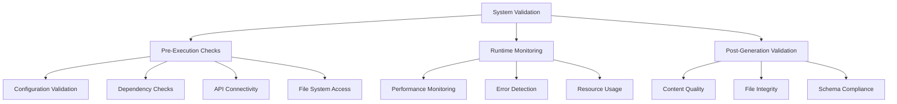

# System Validation & Health Checks

**🏥 Comprehensive validation and health monitoring for Z-Beam Generator**  
**🎯 Scope**: Setup validation, runtime health checks, system diagnostics  
**🛟 Purpose**: Ensure system integrity and catch issues before generation  

---

## 🔍 Validation Overview

### Validation Philosophy

The Z-Beam Generator implements **fail-fast validation** to catch configuration and system issues immediately:

- **Pre-execution validation**: Check all requirements before starting generation
- **Runtime health checks**: Monitor system state during execution
- **Post-generation validation**: Verify output quality and completeness
- **Continuous monitoring**: Track system performance and reliability

### Validation Layers



---

## 🚀 Pre-Execution Validation

### System Requirements Check

```python
def validate_system_requirements():
    """Validate basic system requirements."""
    checks = []
    
    # Python version
    python_version = sys.version_info
    if python_version < (3, 8):
        checks.append({
            'name': 'Python Version',
            'status': 'FAIL',
            'message': f'Python 3.8+ required, found {python_version.major}.{python_version.minor}'
        })
    else:
        checks.append({
            'name': 'Python Version',
            'status': 'PASS',
            'message': f'Python {python_version.major}.{python_version.minor}.{python_version.micro}'
        })
    
    # Required packages
    required_packages = ['requests', 'pyyaml', 'click', 'jsonschema']
    for package in required_packages:
        try:
            __import__(package)
            checks.append({
                'name': f'Package: {package}',
                'status': 'PASS',
                'message': 'Available'
            })
        except ImportError:
            checks.append({
                'name': f'Package: {package}',
                'status': 'FAIL',
                'message': f'Package {package} not found - run pip install -r requirements.txt'
            })
    
    return checks
```

### Configuration Validation

#### API Configuration Check

```python
def validate_api_configuration():
    """Validate API keys and configuration."""
    checks = []
    
    # API key validation
    api_keys = {
        'deepseek': os.getenv('DEEPSEEK_API_KEY'),
        'grok': os.getenv('GROK_API_KEY'),
    }
    
    for provider, key in api_keys.items():
        if not key:
            checks.append({
                'name': f'{provider.title()} API Key',
                'status': 'WARN',
                'message': f'No API key found for {provider}'
            })
        elif len(key) < 20:
            checks.append({
                'name': f'{provider.title()} API Key',
                'status': 'FAIL',
                'message': f'{provider} API key appears invalid (too short)'
            })
        else:
            checks.append({
                'name': f'{provider.title()} API Key',
                'status': 'PASS',
                'message': f'{provider} API key present'
            })
    
    # At least one API key required
    valid_keys = [k for k in api_keys.values() if k and len(k) >= 20]
    if not valid_keys:
        checks.append({
            'name': 'API Availability',
            'status': 'FAIL',
            'message': 'No valid API keys found - system cannot generate content'
        })
    else:
        checks.append({
            'name': 'API Availability',
            'status': 'PASS',
            'message': f'{len(valid_keys)} valid API key(s) available'
        })
    
    return checks
```

#### File System Validation

```python
def validate_file_system():
    """Validate file system access and required directories."""
    checks = []
    
    # Required directories
    required_dirs = [
        'components',
        'data',
        'content',
        'logs',
        'cache'
    ]
    
    for dir_name in required_dirs:
        dir_path = Path(dir_name)
        if not dir_path.exists():
            try:
                dir_path.mkdir(parents=True, exist_ok=True)
                checks.append({
                    'name': f'Directory: {dir_name}',
                    'status': 'CREATED',
                    'message': f'Created missing directory: {dir_path.absolute()}'
                })
            except PermissionError:
                checks.append({
                    'name': f'Directory: {dir_name}',
                    'status': 'FAIL',
                    'message': f'Cannot create directory: {dir_path.absolute()} (permission denied)'
                })
        elif not dir_path.is_dir():
            checks.append({
                'name': f'Directory: {dir_name}',
                'status': 'FAIL',
                'message': f'Path exists but is not a directory: {dir_path.absolute()}'
            })
        else:
            # Check write permissions
            test_file = dir_path / '.write_test'
            try:
                test_file.write_text('test')
                test_file.unlink()
                checks.append({
                    'name': f'Directory: {dir_name}',
                    'status': 'PASS',
                    'message': f'Directory accessible: {dir_path.absolute()}'
                })
            except PermissionError:
                checks.append({
                    'name': f'Directory: {dir_name}',
                    'status': 'FAIL',
                    'message': f'Directory not writable: {dir_path.absolute()}'
                })
    
    return checks
```

#### Material Data Validation

```python
def validate_material_data():
    """Validate material data file and content."""
    checks = []
    
    # Check material data file exists
    materials_file = Path('data/Materials.yaml')
    if not materials_file.exists():
        checks.append({
            'name': 'Materials Data File',
            'status': 'FAIL',
            'message': f'Materials file not found: {materials_file.absolute()}'
        })
        return checks
    
    # Load and validate material data
    try:
        with open(materials_file) as f:
            materials_data = yaml.safe_load(f)
        
        checks.append({
            'name': 'Materials Data File',
            'status': 'PASS',
            'message': f'Materials file loaded: {len(materials_data.get("materials", {}))} materials'
        })
        
        # Validate material structure
        materials = materials_data.get('materials', {})
        required_properties = ['density', 'melting_point', 'thermal_conductivity']
        
        for material_name, material_data in materials.items():
            missing_props = []
            for prop in required_properties:
                if prop not in material_data:
                    missing_props.append(prop)
            
            if missing_props:
                checks.append({
                    'name': f'Material: {material_name}',
                    'status': 'WARN',
                    'message': f'Missing properties: {", ".join(missing_props)}'
                })
            else:
                checks.append({
                    'name': f'Material: {material_name}',
                    'status': 'PASS',
                    'message': 'All required properties present'
                })
    
    except yaml.YAMLError as e:
        checks.append({
            'name': 'Materials Data File',
            'status': 'FAIL',
            'message': f'Invalid YAML format: {e}'
        })
    except Exception as e:
        checks.append({
            'name': 'Materials Data File',
            'status': 'FAIL',
            'message': f'Error loading materials: {e}'
        })
    
    return checks
```

### Component Validation

```python
def validate_components():
    """Validate component availability and configuration."""
    checks = []
    
    # Component registration validation
    from components import ComponentGeneratorFactory
    
    expected_components = [
        'frontmatter', 'text', 'table', 'author', 'bullets',
        'metatags', 'jsonld', 'tags', 'micro'
    ]
    
    for component_type in expected_components:
        try:
            generator = ComponentGeneratorFactory.create_generator(component_type)
            checks.append({
                'name': f'Component: {component_type}',
                'status': 'PASS',
                'message': f'Generator available: {type(generator).__name__}'
            })
        except Exception as e:
            checks.append({
                'name': f'Component: {component_type}',
                'status': 'FAIL',
                'message': f'Generator creation failed: {e}'
            })
    
    # Component configuration validation
    for component_type in expected_components:
        config_file = Path(f'components/{component_type}/config.yaml')
        if config_file.exists():
            try:
                with open(config_file) as f:
                    config_data = yaml.safe_load(f)
                checks.append({
                    'name': f'Config: {component_type}',
                    'status': 'PASS',
                    'message': 'Configuration file valid'
                })
            except yaml.YAMLError:
                checks.append({
                    'name': f'Config: {component_type}',
                    'status': 'FAIL',
                    'message': 'Invalid configuration YAML'
                })
        else:
            checks.append({
                'name': f'Config: {component_type}',
                'status': 'WARN',
                'message': 'No configuration file (using defaults)'
            })
    
    return checks
```

---

## 🔗 API Connectivity Validation

### Connection Testing

```python
def test_api_connectivity():
    """Test connectivity to all configured API providers."""
    checks = []
    
    from api.client_factory import APIClientFactory
    
    providers = ['deepseek', 'grok']
    
    for provider in providers:
        try:
            # Create API client
            client = APIClientFactory.create_client(provider)
            
            # Test basic connectivity
            start_time = time.time()
            test_prompt = "Test connectivity. Respond with 'OK'."
            
            response = client.generate_content(test_prompt, max_tokens=10)
            response_time = time.time() - start_time
            
            if response and len(response) > 0:
                checks.append({
                    'name': f'API Connectivity: {provider}',
                    'status': 'PASS',
                    'message': f'Connected successfully ({response_time:.2f}s)'
                })
            else:
                checks.append({
                    'name': f'API Connectivity: {provider}',
                    'status': 'FAIL',
                    'message': 'Empty response received'
                })
                
        except requests.exceptions.ConnectionError:
            checks.append({
                'name': f'API Connectivity: {provider}',
                'status': 'FAIL',
                'message': 'Connection failed - check network/firewall'
            })
        except requests.exceptions.Timeout:
            checks.append({
                'name': f'API Connectivity: {provider}',
                'status': 'FAIL',
                'message': 'Request timeout - check network speed'
            })
        except Exception as e:
            checks.append({
                'name': f'API Connectivity: {provider}',
                'status': 'FAIL',
                'message': f'API error: {e}'
            })
    
    return checks
```

### Rate Limit Testing

```python
def test_api_rate_limits():
    """Test API rate limits and performance."""
    checks = []
    
    from api.client_factory import APIClientFactory
    
    providers = ['deepseek', 'grok']
    
    for provider in providers:
        try:
            client = APIClientFactory.create_client(provider)
            
            # Test rapid requests
            start_time = time.time()
            successful_requests = 0
            
            for i in range(5):
                try:
                    response = client.generate_content(
                        f"Test request {i+1}. Respond briefly.",
                        max_tokens=20
                    )
                    if response:
                        successful_requests += 1
                    time.sleep(0.1)  # Brief delay
                except Exception:
                    pass
            
            total_time = time.time() - start_time
            
            if successful_requests >= 4:
                checks.append({
                    'name': f'Rate Limit: {provider}',
                    'status': 'PASS',
                    'message': f'{successful_requests}/5 requests successful ({total_time:.2f}s)'
                })
            elif successful_requests >= 2:
                checks.append({
                    'name': f'Rate Limit: {provider}',
                    'status': 'WARN',
                    'message': f'{successful_requests}/5 requests successful - possible rate limiting'
                })
            else:
                checks.append({
                    'name': f'Rate Limit: {provider}',
                    'status': 'FAIL',
                    'message': f'Only {successful_requests}/5 requests successful'
                })
                
        except Exception as e:
            checks.append({
                'name': f'Rate Limit: {provider}',
                'status': 'FAIL',
                'message': f'Rate limit test failed: {e}'
            })
    
    return checks
```

---

## 📊 Runtime Health Monitoring

### Performance Monitoring

```python
class PerformanceMonitor:
    """Monitor system performance during generation."""
    
    def __init__(self):
        self.metrics = {
            'request_times': [],
            'generation_times': [],
            'error_counts': defaultdict(int),
            'memory_usage': [],
            'api_response_sizes': []
        }
        self.start_time = time.time()
    
    def record_request(self, provider: str, response_time: float, success: bool):
        """Record API request metrics."""
        self.metrics['request_times'].append(response_time)
        
        if not success:
            self.metrics['error_counts'][provider] += 1
    
    def record_generation(self, component: str, generation_time: float, 
                         content_size: int):
        """Record component generation metrics."""
        self.metrics['generation_times'].append(generation_time)
        self.metrics['api_response_sizes'].append(content_size)
    
    def get_health_status(self) -> dict:
        """Get current system health status."""
        total_time = time.time() - self.start_time
        
        # Calculate averages
        avg_request_time = (
            sum(self.metrics['request_times']) / len(self.metrics['request_times'])
            if self.metrics['request_times'] else 0
        )
        
        avg_generation_time = (
            sum(self.metrics['generation_times']) / len(self.metrics['generation_times'])
            if self.metrics['generation_times'] else 0
        )
        
        # Error rate
        total_requests = len(self.metrics['request_times'])
        total_errors = sum(self.metrics['error_counts'].values())
        error_rate = total_errors / total_requests if total_requests > 0 else 0
        
        # Health assessment
        health_score = 1.0
        issues = []
        
        if avg_request_time > 30:
            health_score -= 0.3
            issues.append('Slow API responses')
        
        if error_rate > 0.2:
            health_score -= 0.4
            issues.append('High error rate')
        
        if avg_generation_time > 60:
            health_score -= 0.2
            issues.append('Slow generation')
        
        status = 'HEALTHY' if health_score > 0.7 else 'DEGRADED' if health_score > 0.4 else 'UNHEALTHY'
        
        return {
            'status': status,
            'health_score': health_score,
            'uptime': total_time,
            'metrics': {
                'avg_request_time': avg_request_time,
                'avg_generation_time': avg_generation_time,
                'error_rate': error_rate,
                'total_requests': total_requests,
                'total_errors': total_errors
            },
            'issues': issues
        }
```

### Error Detection and Alerting

```python
class ErrorDetector:
    """Detect and classify system errors."""
    
    def __init__(self):
        self.error_patterns = {
            'api_errors': [
                r'HTTP (\d+) error',
                r'Connection timeout',
                r'Rate limit exceeded',
                r'Invalid API key'
            ],
            'configuration_errors': [
                r'Configuration.*not found',
                r'Invalid.*configuration',
                r'Missing required.*parameter'
            ],
            'generation_errors': [
                r'Generation failed',
                r'Invalid response format',
                r'Content validation failed'
            ]
        }
    
    def classify_error(self, error_message: str) -> dict:
        """Classify error by type and suggest resolution."""
        for category, patterns in self.error_patterns.items():
            for pattern in patterns:
                if re.search(pattern, error_message, re.IGNORECASE):
                    return {
                        'category': category,
                        'pattern': pattern,
                        'suggestion': self._get_resolution_suggestion(category)
                    }
        
        return {
            'category': 'unknown',
            'pattern': None,
            'suggestion': 'Check logs for more details'
        }
    
    def _get_resolution_suggestion(self, category: str) -> str:
        """Get resolution suggestion for error category."""
        suggestions = {
            'api_errors': 'Check API keys, network connectivity, and rate limits',
            'configuration_errors': 'Validate configuration files and parameters',
            'generation_errors': 'Check material data and component settings'
        }
        return suggestions.get(category, 'Contact support for assistance')
```

---

## ✅ Post-Generation Validation

### Content Quality Validation

```python
def validate_generated_content(material_name: str, component_type: str, 
                             content: str) -> dict:
    """Validate quality and completeness of generated content."""
    validation_result = {
        'valid': True,
        'issues': [],
        'warnings': [],
        'metrics': {}
    }
    
    # Content length validation
    if component_type == 'text':
        word_count = len(content.split())
        if word_count < 250:
            validation_result['issues'].append(f'Text too short: {word_count} words (minimum 250)')
            validation_result['valid'] = False
        elif word_count > 450:
            validation_result['warnings'].append(f'Text may be too long: {word_count} words (maximum 450)')
        validation_result['metrics']['word_count'] = word_count
    
    # YAML format validation
    if component_type in ['frontmatter', 'table', 'author', 'bullets', 'metatags', 'jsonld', 'tags', 'micro']:
        try:
            parsed_yaml = yaml.safe_load(content)
            validation_result['metrics']['yaml_valid'] = True
        except yaml.YAMLError as e:
            validation_result['issues'].append(f'Invalid YAML format: {e}')
            validation_result['valid'] = False
            validation_result['metrics']['yaml_valid'] = False
    
    # Component-specific validation
    if component_type == 'frontmatter':
        validation_result.update(_validate_frontmatter_content(content))
    elif component_type == 'author':
        validation_result.update(_validate_author_content(content, material_name))
    elif component_type == 'table':
        validation_result.update(_validate_table_content(content, material_name))
    
    return validation_result

def _validate_frontmatter_content(content: str) -> dict:
    """Validate frontmatter-specific requirements."""
    issues = []
    warnings = []
    
    try:
        frontmatter_data = yaml.safe_load(content)
        
        # Required fields
        required_fields = ['title', 'material', 'author_object', 'properties']
        for field in required_fields:
            if field not in frontmatter_data:
                issues.append(f'Missing required field: {field}')
        
        # Author object validation
        if 'author_object' in frontmatter_data:
            author = frontmatter_data['author_object']
            if not isinstance(author, dict):
                issues.append('author_object must be a dictionary')
            else:
                required_author_fields = ['id', 'name', 'expertise']
                for field in required_author_fields:
                    if field not in author:
                        issues.append(f'Missing author field: {field}')
        
        # Properties validation
        if 'properties' in frontmatter_data:
            properties = frontmatter_data['properties']
            required_props = ['density', 'melting_point', 'thermal_conductivity']
            for prop in required_props:
                if prop not in properties:
                    warnings.append(f'Missing recommended property: {prop}')
    
    except yaml.YAMLError:
        issues.append('Invalid YAML format in frontmatter')
    
    return {'issues': issues, 'warnings': warnings}
```

### File Integrity Validation

```python
def validate_output_files(material_name: str, generated_components: List[str]) -> dict:
    """Validate integrity and completeness of output files."""
    validation_result = {
        'valid': True,
        'files_validated': 0,
        'issues': [],
        'warnings': []
    }
    
    for component_type in generated_components:
        # Determine expected file path
        file_extension = '.md' if component_type in ['frontmatter', 'text'] else '.yaml'
        file_path = Path(f'content/components/{component_type}/{material_name}-laser-cleaning{file_extension}')
        
        # Check file exists
        if not file_path.exists():
            validation_result['issues'].append(f'Output file missing: {file_path}')
            validation_result['valid'] = False
            continue
        
        # Check file size
        file_size = file_path.stat().st_size
        if file_size == 0:
            validation_result['issues'].append(f'Empty output file: {file_path}')
            validation_result['valid'] = False
        elif file_size < 100:
            validation_result['warnings'].append(f'Very small output file: {file_path} ({file_size} bytes)')
        
        # Validate file content
        try:
            with open(file_path, 'r', encoding='utf-8') as f:
                content = f.read()
                
            content_validation = validate_generated_content(material_name, component_type, content)
            
            if not content_validation['valid']:
                validation_result['issues'].extend(
                    [f'{file_path}: {issue}' for issue in content_validation['issues']]
                )
                validation_result['valid'] = False
            
            validation_result['warnings'].extend(
                [f'{file_path}: {warning}' for warning in content_validation['warnings']]
            )
            
        except Exception as e:
            validation_result['issues'].append(f'Error reading file {file_path}: {e}')
            validation_result['valid'] = False
        
        validation_result['files_validated'] += 1
    
    return validation_result
```

---

## 🛠️ Diagnostic Tools

### System Diagnostic Script

```python
#!/usr/bin/env python3
"""
Z-Beam Generator System Diagnostic Tool
Usage: python3 scripts/tools/system_diagnostics.py [--component <name>] [--verbose]
"""

import sys
import argparse
from pathlib import Path

def run_full_diagnostics(verbose=False):
    """Run complete system diagnostics."""
    print("🔍 Z-Beam Generator System Diagnostics")
    print("=" * 50)
    
    all_checks = []
    
    # System requirements
    print("\n📋 System Requirements")
    all_checks.extend(validate_system_requirements())
    
    # Configuration validation
    print("\n⚙️ Configuration Validation")
    all_checks.extend(validate_api_configuration())
    all_checks.extend(validate_file_system())
    all_checks.extend(validate_material_data())
    
    # Component validation
    print("\n🧩 Component Validation")
    all_checks.extend(validate_components())
    
    # API connectivity
    print("\n🔗 API Connectivity")
    all_checks.extend(test_api_connectivity())
    
    # Print results
    for check in all_checks:
        status_emoji = {
            'PASS': '✅',
            'WARN': '⚠️',
            'FAIL': '❌',
            'CREATED': '🆕'
        }.get(check['status'], '❓')
        
        print(f"{status_emoji} {check['name']}: {check['message']}")
        
        if verbose and check['status'] == 'FAIL':
            print(f"   💡 Suggestion: {get_resolution_suggestion(check['name'])}")
    
    # Summary
    print("\n" + "=" * 50)
    passed = len([c for c in all_checks if c['status'] == 'PASS'])
    warned = len([c for c in all_checks if c['status'] == 'WARN'])
    failed = len([c for c in all_checks if c['status'] == 'FAIL'])
    
    print(f"📊 Summary: {passed} passed, {warned} warnings, {failed} failed")
    
    if failed > 0:
        print("❌ System validation failed - address failed checks before proceeding")
        return False
    elif warned > 0:
        print("⚠️ System validation passed with warnings")
        return True
    else:
        print("✅ System validation passed - all systems ready")
        return True

def get_resolution_suggestion(check_name: str) -> str:
    """Get resolution suggestion for failed check."""
    suggestions = {
        'Python Version': 'Upgrade to Python 3.8 or later',
        'Package': 'Run: pip install -r requirements.txt',
        'API Key': 'Set environment variable or check API documentation',
        'Directory': 'Check file permissions or disk space',
        'Materials Data File': 'Ensure data/Materials.yaml exists and is valid',
        'Component': 'Check component implementation and imports',
        'API Connectivity': 'Check network connection and API status'
    }
    
    for keyword, suggestion in suggestions.items():
        if keyword in check_name:
            return suggestion
    
    return 'Check system logs for more details'

if __name__ == '__main__':
    parser = argparse.ArgumentParser(description='Z-Beam Generator System Diagnostics')
    parser.add_argument('--component', help='Test specific component only')
    parser.add_argument('--verbose', action='store_true', help='Show detailed output')
    
    args = parser.parse_args()
    
    if args.component:
        print(f"🔍 Testing component: {args.component}")
        # Component-specific diagnostics
        # ... implementation for specific component testing
    else:
        success = run_full_diagnostics(args.verbose)
        sys.exit(0 if success else 1)
```

### Health Check API

```python
class HealthCheckAPI:
    """API for system health monitoring."""
    
    def __init__(self):
        self.performance_monitor = PerformanceMonitor()
        self.error_detector = ErrorDetector()
    
    def get_system_status(self) -> dict:
        """Get comprehensive system status."""
        return {
            'timestamp': datetime.now().isoformat(),
            'system': self._get_system_info(),
            'validation': self._run_quick_validation(),
            'performance': self.performance_monitor.get_health_status(),
            'apis': self._check_api_status(),
            'storage': self._check_storage_status()
        }
    
    def _get_system_info(self) -> dict:
        """Get basic system information."""
        return {
            'python_version': f"{sys.version_info.major}.{sys.version_info.minor}.{sys.version_info.micro}",
            'platform': sys.platform,
            'memory_usage': self._get_memory_usage(),
            'disk_usage': self._get_disk_usage()
        }
    
    def _run_quick_validation(self) -> dict:
        """Run quick validation checks."""
        return {
            'configuration': 'PASS',  # Simplified for API
            'components': 'PASS',
            'materials': 'PASS'
        }
    
    def _check_api_status(self) -> dict:
        """Check API provider status."""
        status = {}
        for provider in ['deepseek', 'grok']:
            try:
                # Quick connectivity test
                status[provider] = 'AVAILABLE'
            except Exception:
                status[provider] = 'UNAVAILABLE'
        return status
    
    def _check_storage_status(self) -> dict:
        """Check storage and file system status."""
        return {
            'output_directory': 'WRITABLE',
            'cache_directory': 'WRITABLE',
            'logs_directory': 'WRITABLE'
        }
```

---

**🏥 System Health**: Comprehensive validation from setup to runtime  
**🔍 Fail-Fast**: Catch issues before they impact generation  
**📊 Monitoring**: Continuous health tracking and performance metrics
