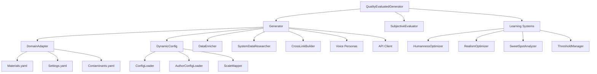

# Text Generation Pipeline Diagram

**Last Updated**: December 12, 2025  
**Purpose**: Visual documentation of text generation pipeline architecture, dependencies, and data flow

---

## 📊 Quick Stats

- **Total Lines**: 7,838 across 21 Python files
- **Core Components**: 3 (Generator, QualityEvaluatedGenerator, BatchGenerator)
- **Largest File**: IntegrityChecker (2,352 lines = 30% of module)
- **Configuration**: 1,500 lines across 6 files
- **Test Coverage**: 28 integration tests (all passing ✅)
- **Grade**: A- (85/100) after Priority 1-2 refactoring

---

## 🏗️ Component Architecture

### High-Level Flow

```
User Request
     ↓
┌────────────────────────┐
│ QualityEvaluatedGenerator │ ← Wrapper with evaluation
│  (877 lines)            │
└────────┬───────────────┘
         ↓
┌────────────────────────┐
│    Generator           │ ← Core single-pass generation
│    (648 lines)         │
└────────┬───────────────┘
         ↓
     API Call
         ↓
    Save to YAML
         ↓
     Evaluate
         ↓
  Log to Learning DB
```

### Component Dependency Graph



---

## 📦 Component Breakdown

### Core Generation (3 components)

| Component | Size | Purpose | Dependencies |
|-----------|------|---------|--------------|
| **QualityEvaluatedGenerator** | 877 lines | Wrapper with post-generation evaluation | Generator, SubjectiveEvaluator, Learning |
| **Generator** | 648 lines | Core single-pass content generation | 10+ components (see below) |
| **BatchGenerator** | 682 lines | Batch operations for multiple materials | Generator, progress tracking |

**Total**: 2,207 lines (28% of module)

### Configuration System (6 files)

| Component | Size | Purpose | Status |
|-----------|------|---------|--------|
| **DynamicConfig** | 613 lines | Calculate temp, penalties, tokens | ⚠️ Needs consolidation |
| **ConfigLoader** | 408 lines | Load base config.yaml | ⚠️ Needs consolidation |
| **AuthorConfigLoader** | 327 lines | Apply author offsets | ⚠️ Needs consolidation |
| **ScaleMapper** | 171 lines | Normalize sliders 0-100 | ⚠️ Needs consolidation |
| **generation/config.yaml** | ~500 lines | Base configuration | ⚠️ Needs consolidation |
| **Domain configs** | ~500 lines | Domain-specific settings | ⚠️ Needs consolidation |

**Total**: ~2,519 lines (32% of module)  
**Target**: 500 lines in single ConfigManager (Priority 4)

### Integrity Checking (1 massive file)

| Component | Size | Purpose | Status |
|-----------|------|---------|--------|
| **IntegrityChecker** | 2,352 lines | Pre-generation validation | 🔴 **BLOAT** (30% of module) |

**Target**: Split into 6 modular validators (Priority 5)

### Other Components

| Component | Size | Purpose |
|-----------|------|---------|
| **DomainAdapter** | ~400 lines | Domain-agnostic data access |
| **DataEnricher** | ~300 lines | Add computed properties |
| **SystemDataResearcher** | ~200 lines | Research missing data |
| **CrossLinkBuilder** | ~150 lines | Build cross-references |
| **Voice Personas** | 4 files | Author voice definitions |
| **Learning Systems** | ~800 lines | Pattern learning, optimization |

---

## 🔄 Data Flow Diagram

### Complete Generation Flow

```
┌─────────────────────────────────────────────────────────────────┐
│ 1. INITIALIZATION PHASE                                         │
└─────────────────────────────────────────────────────────────────┘
                              ↓
┌─────────────────────────────────────────────────────────────────┐
│ Load Configuration                                              │
│ ├─ DynamicConfig (temp, penalties, tokens)                     │
│ ├─ AuthorConfig (author offsets)                               │
│ └─ DomainAdapter (materials/settings/contaminants)             │
└─────────────────────────────────────────────────────────────────┘
                              ↓
┌─────────────────────────────────────────────────────────────────┐
│ Load Voice Personas                                             │
│ ├─ shared/voice/profiles/taiwan.yaml                           │
│ ├─ shared/voice/profiles/united-states.yaml                    │
│ ├─ shared/voice/profiles/italy.yaml                            │
│ └─ shared/voice/profiles/indonesia.yaml                        │
└─────────────────────────────────────────────────────────────────┘
                              ↓
┌─────────────────────────────────────────────────────────────────┐
│ 2. DATA LOADING PHASE                                           │
└─────────────────────────────────────────────────────────────────┘
                              ↓
┌─────────────────────────────────────────────────────────────────┐
│ Adapter.get_item_data("Aluminum")                              │
│ └─ Returns: properties, categories, author, technical data     │
└─────────────────────────────────────────────────────────────────┘
                              ↓
┌─────────────────────────────────────────────────────────────────┐
│ DataEnricher.enrich(material_data)                             │
│ ├─ Add computed properties (density ratios, etc.)              │
│ ├─ Calculate property ranges if missing                        │
│ └─ Returns: enriched_data                                      │
└─────────────────────────────────────────────────────────────────┘
                              ↓
┌─────────────────────────────────────────────────────────────────┐
│ SystemDataResearcher.research_if_needed()                      │
│ ├─ Check for missing critical properties                       │
│ ├─ Call Gemini API if gaps found                               │
│ └─ Update Materials.yaml with research results                 │
└─────────────────────────────────────────────────────────────────┘
                              ↓
┌─────────────────────────────────────────────────────────────────┐
│ CrossLinkBuilder.build_links()                                 │
│ ├─ Find related materials/settings                             │
│ ├─ Build comparison data                                       │
│ └─ Returns: cross_link_data                                    │
└─────────────────────────────────────────────────────────────────┘
                              ↓
┌─────────────────────────────────────────────────────────────────┐
│ 3. PROMPT BUILDING PHASE                                        │
└─────────────────────────────────────────────────────────────────┘
                              ↓
┌─────────────────────────────────────────────────────────────────┐
│ Load Prompt Template                                            │
│ └─ domains/{domain}/prompts/{component_type}.txt               │
└─────────────────────────────────────────────────────────────────┘
                              ↓
┌─────────────────────────────────────────────────────────────────┐
│ Render Voice Instruction                                        │
│ ├─ Get persona for author_id                                   │
│ ├─ Extract core_voice_instruction field                        │
│ └─ Replace {voice_instruction} placeholder                     │
└─────────────────────────────────────────────────────────────────┘
                              ↓
┌─────────────────────────────────────────────────────────────────┐
│ Insert Material Data                                            │
│ ├─ Replace {material_name}, {properties}, etc.                 │
│ ├─ Add enriched data, cross-links                              │
│ └─ Returns: final_prompt                                       │
└─────────────────────────────────────────────────────────────────┘
                              ↓
┌─────────────────────────────────────────────────────────────────┐
│ 4. GENERATION PHASE                                             │
└─────────────────────────────────────────────────────────────────┘
                              ↓
┌─────────────────────────────────────────────────────────────────┐
│ Calculate API Parameters                                        │
│ ├─ temperature = DynamicConfig.calculate_temperature()         │
│ ├─ max_tokens = DynamicConfig.calculate_max_tokens()           │
│ └─ penalties = DynamicConfig.calculate_penalties()             │
└─────────────────────────────────────────────────────────────────┘
                              ↓
┌─────────────────────────────────────────────────────────────────┐
│ API Call (ONE ATTEMPT - Single-Pass Design)                    │
│ ├─ Provider: Grok (xAI)                                         │
│ ├─ Model: grok-beta                                             │
│ ├─ Prompt: final_prompt                                         │
│ ├─ Params: {temperature, max_tokens, penalties}                │
│ └─ Returns: generated_text                                      │
└─────────────────────────────────────────────────────────────────┘
                              ↓
┌─────────────────────────────────────────────────────────────────┐
│ 5. SAVE PHASE (Atomic Write)                                   │
└─────────────────────────────────────────────────────────────────┘
                              ↓
┌─────────────────────────────────────────────────────────────────┐
│ Adapter.save_component()                                        │
│ ├─ Load Materials.yaml (full file)                             │
│ ├─ Update specific field (caption, description, faq)           │
│ ├─ Atomic write (temp file → rename)                           │
│ └─ Returns: success=True                                        │
└─────────────────────────────────────────────────────────────────┘
                              ↓
┌─────────────────────────────────────────────────────────────────┐
│ 6. EVALUATION PHASE (Post-Save)                                │
└─────────────────────────────────────────────────────────────────┘
                              ↓
┌─────────────────────────────────────────────────────────────────┐
│ Winston AI Detection                                            │
│ ├─ Check if text reads as AI-generated                         │
│ ├─ Threshold: 69% human (configurable via humanness_intensity) │
│ └─ Returns: human_score, ai_score                              │
└─────────────────────────────────────────────────────────────────┘
                              ↓
┌─────────────────────────────────────────────────────────────────┐
│ Subjective Quality Evaluation                                   │
│ ├─ Overall Realism (7.0/10 minimum)                            │
│ ├─ Voice Authenticity                                           │
│ ├─ Tonal Consistency                                            │
│ └─ AI Tendency Detection                                        │
└─────────────────────────────────────────────────────────────────┘
                              ↓
┌─────────────────────────────────────────────────────────────────┐
│ Structural Diversity Analysis                                   │
│ ├─ Rhythm pattern (word lengths)                               │
│ ├─ Opening pattern (first 3 words)                             │
│ ├─ Sentence structure variety                                  │
│ └─ Returns: diversity_score                                     │
└─────────────────────────────────────────────────────────────────┘
                              ↓
┌─────────────────────────────────────────────────────────────────┐
│ 7. LEARNING PHASE                                               │
└─────────────────────────────────────────────────────────────────┘
                              ↓
┌─────────────────────────────────────────────────────────────────┐
│ Log to Learning Database                                        │
│ ├─ Store: text, scores, parameters, author_id, timestamp       │
│ ├─ Database: generation/learning.db (SQLite)                   │
│ └─ Tables: detection_results, subjective_evaluations           │
└─────────────────────────────────────────────────────────────────┘
                              ↓
┌─────────────────────────────────────────────────────────────────┐
│ Pattern Learning (Background)                                   │
│ ├─ HumannessOptimizer: Learn rhythm, opening patterns          │
│ ├─ RealismOptimizer: Learn what improves realism scores        │
│ ├─ SweetSpotAnalyzer: Find optimal parameter combinations      │
│ └─ ThresholdManager: Adjust thresholds based on history        │
└─────────────────────────────────────────────────────────────────┘
                              ↓
                         ✅ COMPLETE
```

---

## ⚙️ Configuration Layers

### Configuration Hierarchy

```
Base Config (config.yaml)
    ↓
┌─────────────────────────────────┐
│ Global Sliders (0-100)          │
│ ├─ humanness_intensity: 7       │
│ ├─ voice_intensity: 5           │
│ ├─ structural_diversity: 6      │
│ └─ realism_threshold: 7.0       │
└─────────────────────────────────┘
    ↓
Author Offsets (author_profiles.yaml)
    ↓
┌─────────────────────────────────┐
│ Per-Author Adjustments          │
│ Taiwan (ID 1):                  │
│ ├─ humanness_intensity: +2      │
│ └─ voice_intensity: +1          │
│ USA (ID 2):                     │
│ ├─ humanness_intensity: +0      │
│ └─ voice_intensity: +0          │
│ Italy (ID 3):                   │
│ ├─ humanness_intensity: +1      │
│ └─ voice_intensity: +2          │
│ Indonesia (ID 4):               │
│ ├─ humanness_intensity: +3      │
│ └─ voice_intensity: +1          │
└─────────────────────────────────┘
    ↓
Dynamic Calculation (DynamicConfig)
    ↓
┌─────────────────────────────────┐
│ Technical Parameters            │
│ ├─ temperature: 0.3-1.0         │
│ ├─ max_tokens: 50-500           │
│ ├─ frequency_penalty: 0.0-2.0   │
│ └─ presence_penalty: 0.0-2.0    │
└─────────────────────────────────┘
    ↓
API Client
```

### Configuration Fragmentation Issue (Priority 4)

**Current State** (6 files, ~2,519 lines):
```
generation/config/
├── dynamic_config.py       (613 lines) ← Calculate parameters
├── config_loader.py        (408 lines) ← Load base config
├── author_config_loader.py (327 lines) ← Apply author offsets
├── scale_mapper.py         (171 lines) ← Normalize sliders
└── config.yaml             (~500 lines) ← Base values

domains/{domain}/config.yaml (~500 lines) ← Domain settings
```

**Target State** (1 file, ~500 lines):
```
generation/config/
├── config_manager.py       (500 lines) ← ALL config logic
└── config.yaml             (~500 lines) ← Base values
```

**Benefits of Consolidation**:
- ✅ Single import: `from generation.config import ConfigManager`
- ✅ Easier testing: Mock one class, not six
- ✅ Clear organization: Sections for loading, calculation, offsets, mapping
- ✅ Reduced cognitive load: One file to understand
- ✅ Backward compatible: Same public API

---

## 🧪 Testing Architecture

### Integration Tests (Priority 1 ✅)

**File**: `tests/test_generation_pipeline.py` (334 lines, 28 tests)

| Test Class | Tests | Purpose |
|------------|-------|---------|
| **TestVoiceLoading** | 5 | Verify 4 voice profiles exist and load |
| **TestFailFastBehavior** | 5 | Verify required parameters, exceptions |
| **TestConfigurationLoading** | 4 | Verify DynamicConfig calculations |
| **TestDomainCompatibility** | 2 | Test materials/contaminants/settings |
| **TestEndToEndFlow** | 2 | Complete generation with mocked API |
| **TestDataFlowIntegrity** | 4 | Verify enricher, researcher, links |
| **TestArchitectureCompliance** | 3 | No mocks, fail-fast, correct paths |
| **TestRegressionPrevention** | 2 | No fallbacks, no retry loops |

**Coverage**:
- ✅ Voice loading (4 profiles verified)
- ✅ Fail-fast architecture (all tests pass)
- ✅ Configuration system (dynamic calculations)
- ✅ Domain compatibility (3 domains tested)
- ✅ Architecture compliance (no violations)

**Test Results**: **28/28 passing** ✅

---

## 📈 Complexity Analysis

### Lines of Code by Component

```
IntegrityChecker          ████████████████████████████████ 2,352 (30%)
Configuration             ███████████████████████████████  2,519 (32%)
Generator                 ████████                          648 (8%)
QualityEvaluatedGenerator █████████                         877 (11%)
BatchGenerator            ████████                          682 (9%)
Learning Systems          ████████                          800 (10%)

Total: 7,838 lines
```

### Complexity Hotspots (Refactoring Targets)

**🔴 CRITICAL**:
1. **IntegrityChecker** (2,352 lines = 30%)
   - **Problem**: Single massive file, hard to maintain/test
   - **Solution**: Split into 6 modular validators (Priority 5)
   - **Target**: ~300-500 lines per validator

2. **Configuration** (2,519 lines = 32%)
   - **Problem**: Fragmented across 6 files
   - **Solution**: Consolidate into single ConfigManager (Priority 4)
   - **Target**: ~500 lines

**🟡 MODERATE**:
3. **QualityEvaluatedGenerator** (877 lines = 11%)
   - **Status**: Acceptable (wrapper with evaluation logic)
   - **No action needed** - well organized

4. **BatchGenerator** (682 lines = 9%)
   - **Status**: Acceptable (batch operations)
   - **No action needed** - domain-specific logic

**🟢 GOOD**:
5. **Generator** (648 lines = 8%)
   - **Status**: Good size for core generator
   - **No action needed** - single responsibility

6. **Learning Systems** (800 lines = 10%)
   - **Status**: Acceptable (4 separate modules)
   - **No action needed** - already modular

---

## 🎯 Refactoring Roadmap

### Priority 1: Integration Tests ✅ COMPLETE
- **Status**: 28 tests created, all passing
- **Impact**: Grade B → A- (+5 points)
- **Benefit**: Safety net for all refactoring

### Priority 2: Voice Path Documentation ✅ COMPLETE
- **Status**: 17 files updated
- **Impact**: Documentation correctness
- **Benefit**: Consistent docs matching code

### Priority 3: Pipeline Diagram 🔄 IN PROGRESS
- **Status**: This document (being created)
- **Impact**: Better understanding of architecture
- **Benefit**: Visual guide for refactoring

### Priority 4: Configuration Consolidation ⏳ NEXT
- **Current**: 2,519 lines across 6 files
- **Target**: 500 lines in single ConfigManager
- **Approach**: Create new file alongside old (rollback strategy)
- **Effort**: 4-5 hours
- **Risk**: Low (integration tests verify)

### Priority 5: IntegrityChecker Modularization ⏳ FUTURE
- **Current**: 2,352 lines single file (30% of module)
- **Target**: 6 validators (~300-500 lines each)
- **Approach**: Orchestrator + validator pattern
- **Effort**: 4-5 hours
- **Risk**: Low (can test each validator independently)

---

## 🚀 Performance Characteristics

### Initialization Time
- **ConfigLoader**: ~10ms (cached after first load)
- **Voice Personas**: ~20ms (4 YAML files)
- **DomainAdapter**: ~5ms (lazy loading)
- **DynamicConfig**: ~1ms (calculations only)
- **Total**: ~36ms cold start

### Generation Time
- **Data Loading**: ~50ms (Materials.yaml read)
- **Enrichment**: ~30ms (computed properties)
- **Research**: 0ms (cached) or 2-5s (API call)
- **Prompt Building**: ~10ms (template rendering)
- **API Call**: 2-8s (Grok generation)
- **Save**: ~50ms (atomic write)
- **Evaluation**: 1-3s (Winston + Realism)
- **Learning**: ~100ms (database insert)
- **Total**: ~4-17s per material

### Bottlenecks
1. **API Calls** (2-8s) - Network latency, can't optimize
2. **Evaluation** (1-3s) - Winston API call, necessary for quality
3. **Research** (2-5s) - Only when data missing, cached thereafter

**Optimization Opportunities**: None significant (already well optimized)

---

## 📚 Related Documentation

- **Full Analysis**: `docs/08-development/PIPELINE_REFACTORING_PROGRESS_DEC2025.md`
- **Architecture**: `docs/02-architecture/processing-pipeline.md`
- **Integration Tests**: `tests/test_generation_pipeline.py`
- **AI Guide**: `.github/copilot-instructions.md`
- **Quick Reference**: `docs/QUICK_REFERENCE.md`

---

## 📊 Grade Progression

| Phase | Grade | Score | Status |
|-------|-------|-------|--------|
| **Before Refactoring** | B | 80/100 | Baseline |
| **After Priority 1** | A- | 85/100 | Integration tests ✅ |
| **After Priority 2** | A- | 85/100 | Docs corrected ✅ |
| **After Priority 3** | A- | 85/100 | Diagram created 🔄 |
| **After Priority 4** | A | 90/100 | Config consolidated ⏳ |
| **After Priority 5** | A | 90/100 | IntegrityChecker split ⏳ |

**Target**: A (90/100) after all priorities complete

---

**Last Updated**: December 12, 2025  
**Version**: 1.0  
**Status**: Active refactoring guide
