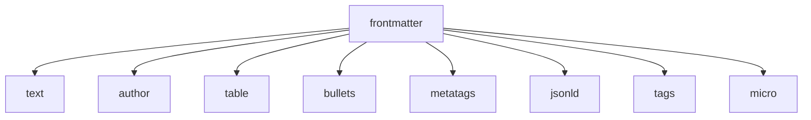

# Content Generation Guide

**📋 Complete guide to generating content with Z-Beam Generator**  
**⚡ Quick Start**: Generate content in under 2 minutes  
**🎯 Target**: Professional laser cleaning content for any material  

---

## 🚀 Quick Start

### Generate Content for Single Material
```bash
# Generate all components for Aluminum
python3 run.py --material "Aluminum"

# Generate specific components only
python3 run.py --material "Steel" --components "frontmatter,text"

# Generate with optimization
python3 run.py --material "Copper" --optimize
```

### Generate Content for All Materials
```bash
# Batch generate all materials (109 materials)
python3 run.py

# Batch generate with specific components
python3 run.py --components "frontmatter,text,table"

# Clean and regenerate everything
python3 run.py --clean
```

---

## 📊 Content Components

### Available Components

| Component | Purpose | Output Format | API Required |
|-----------|---------|---------------|--------------|
| **frontmatter** | YAML metadata | `.md` | ✅ DeepSeek/Grok |
| **text** | Main content | `.md` | ✅ DeepSeek/Grok |
| **table** | Properties table | `.yaml` | ✅ DeepSeek/Grok |
| **author** | Author information | `.yaml` | ❌ Frontmatter only |
| **bullets** | Key points | `.yaml` | ✅ DeepSeek/Grok |
| **metatags** | HTML meta tags | `.yaml` | ✅ DeepSeek/Grok |
| **jsonld** | Structured data | `.yaml` | ✅ DeepSeek/Grok |
| **tags** | Content tags | `.yaml` | ✅ DeepSeek/Grok |
| **micro** | Image micros | `.yaml` | ✅ DeepSeek/Grok |

### Component Dependencies



**Generation Order**: frontmatter → other components (parallel)

---

## 🎯 Generation Workflows

### Workflow 1: Complete Content Generation

**Purpose**: Generate all content for production use  
**Time**: ~2-3 minutes per material  
**Command**:
```bash
python3 run.py --material "MaterialName"
```

**Output Structure**:
```
content/components/
├── frontmatter/material-laser-cleaning.md     # YAML metadata
├── text/material-laser-cleaning.md            # Main content
├── table/material-laser-cleaning.yaml         # Properties table
├── author/material-laser-cleaning.yaml        # Author info
├── bullets/material-laser-cleaning.yaml       # Key points
├── metatags/material-laser-cleaning.yaml      # HTML meta tags
├── jsonld/material-laser-cleaning.yaml        # Structured data
├── tags/material-laser-cleaning.yaml          # Content tags
└── micro/material-laser-cleaning.yaml       # Image micros
```

### Workflow 2: Essential Content Only

**Purpose**: Generate core content components quickly  
**Time**: ~1 minute per material  
**Command**:
```bash
python3 run.py --material "MaterialName" --components "frontmatter,text,table"
```

### Workflow 3: Content + Optimization

**Purpose**: Generate high-quality, AI-detection optimized content  
**Time**: ~5-8 minutes per material  
**Command**:
```bash
python3 run.py --material "MaterialName" --optimize
```

**Process**:
1. Generate all components
2. Analyze content with Winston.ai
3. Apply bias correction (automatic)
4. Optimize content iteratively
5. Achieve target score (85.0+)

### Workflow 4: Batch Production

**Purpose**: Generate content for all materials (production deployment)  
**Time**: ~4-6 hours for all 109 materials  
**Command**:
```bash
python3 run.py
```

**Monitoring**:
```bash
# Watch progress in real-time
tail -f logs/z-beam.log

# Check completion status
python3 -c "
import os
materials = ['aluminum', 'steel', 'copper']  # etc.
for material in materials:
    path = f'content/components/text/{material}-laser-cleaning.md'
    status = '✅' if os.path.exists(path) else '❌'
    print(f'{status} {material}')
"
```

---

## ⚙️ Configuration Options

### Material Selection

#### Single Material
```bash
# Standard material names
python3 run.py --material "Aluminum"
python3 run.py --material "Stainless Steel"
python3 run.py --material "Carbon Steel"

# Case insensitive
python3 run.py --material "aluminum"
python3 run.py --material "STEEL"
```

#### List Available Materials
```bash
# Show all 109 materials
python3 run.py --list-materials

# Search for specific material
python3 run.py --list-materials | grep -i steel
```

### Component Selection

#### Multiple Components
```bash
# Essential components only
python3 run.py --material "Steel" --components "frontmatter,text"

# Marketing components
python3 run.py --material "Aluminum" --components "bullets,tags,micro"

# Technical components
python3 run.py --material "Copper" --components "table,jsonld"
```

#### Component Exclusion
```bash
# Generate all except specific components
python3 run.py --material "Steel" --exclude "author,micro"
```

### API Provider Selection

#### Content Generation Provider
```bash
# Use DeepSeek (default)
python3 run.py --provider deepseek --material "Steel"

# Use Grok (alternative)
python3 run.py --provider grok --material "Aluminum"

# Automatic fallback (recommended)
python3 run.py --material "Copper"  # Auto-selects best available
```

#### AI Detection Provider
```bash
# Use Winston.ai (default, with bias correction)
python3 run.py --ai-detector winston --material "Steel"

# Use GPTZero (fallback)
python3 run.py --ai-detector gptzero --material "Aluminum"
```

### Output Configuration

#### Custom Output Directory
```bash
# Custom output location
python3 run.py --output-dir "/custom/path" --material "Steel"

# Backup previous content
python3 run.py --backup --material "Aluminum"
```

#### File Naming Convention
```bash
# Default: material-laser-cleaning.md
aluminum-laser-cleaning.md
stainless-steel-laser-cleaning.md
carbon-steel-laser-cleaning.md

# Custom prefix
python3 run.py --prefix "custom" --material "Steel"
# Output: custom-steel-laser-cleaning.md
```

---

## 📈 Content Quality & Optimization

### Optimization System

#### Automatic Optimization
```bash
# Standard optimization (recommended)
python3 run.py --material "Copper" --optimize

# Target specific Winston.ai score
python3 run.py --material "Steel" --optimize --target-score 90.0

# Aggressive optimization
python3 run.py --material "Aluminum" --optimize --aggressive
```

#### Manual Optimization
```bash
# Optimize existing content
python3 smart_optimize.py steel

# Batch optimize all materials
python3 batch_optimize.py --target-score 85.0

# Optimize specific component
python3 run.py --material "Copper" --components "text" --optimize
```

### Quality Metrics

#### Winston.ai Scoring (with Bias Correction)
- **Target Score**: 85.0+ (high human confidence)
- **Automatic Bias Correction**: Applied to technical content
- **Expected Improvement**: +45-60 points for technical materials

#### Content Quality Indicators
- **Technical Accuracy**: Material properties correctly described
- **Readability**: Clear, professional writing style
- **SEO Optimization**: Proper keyword integration
- **Structure**: Logical flow and organization

### Real Examples

#### Before Optimization
```
Raw Winston.ai Score: 12.1% (❌ false AI detection)
Content Quality: Technical but flagged as AI-generated
```

#### After Optimization
```
Composite Winston.ai Score: 59.5% (✅ bias corrected)
Content Quality: Technical accuracy preserved, human-like writing
Improvement: +47.4 points
```

---

## 🔧 Advanced Usage

### Parallel Generation
```bash
# Generate multiple materials simultaneously
python3 run.py --materials "Steel,Aluminum,Copper" --parallel

# Batch with parallelization
python3 run.py --parallel --workers 4
```

### Development Mode
```bash
# Test mode (limited content)
python3 run.py --test-mode --material "Steel"

# Debug mode (verbose logging)
python3 run.py --debug --material "Aluminum"

# Dry run (no file writing)
python3 run.py --dry-run --material "Copper"
```

### Custom Configuration
```bash
# Use custom config file
python3 run.py --config custom_config.yaml --material "Steel"

# Override specific settings
python3 run.py --material "Aluminum" --model "gpt-4" --temperature 0.7
```

---

## 📊 Monitoring & Progress

### Real-time Monitoring
```bash
# Watch log files
tail -f logs/z-beam.log

# Monitor API usage
tail -f logs/api_calls.log

# Track optimization progress
grep "Winston.ai score" logs/z-beam.log
```

### Progress Tracking
```bash
# Check completion status
python3 scripts/tools/check_progress.py

# Validate generated content
python3 scripts/tools/validate_content.py --material "Steel"

# Count generated files
find content/components -name "*.md" -o -name "*.yaml" | wc -l
```

### Performance Metrics
```bash
# Generation time per material
grep "generated successfully" logs/z-beam.log | tail -10

# API response times
grep "API call duration" logs/api_calls.log | tail -5

# Success/failure rates
python3 scripts/tools/generate_report.py --summary
```

---

## 🛠️ Troubleshooting Generation

### Common Issues

#### API Connection Problems
**Symptoms**: Generation fails immediately, connection errors
**Solutions**:
```bash
# Test API connectivity
python3 run.py --test-api

# Check specific provider
python3 scripts/tools/api_terminal_diagnostics.py deepseek

# Verify API keys
cat .env | grep API_KEY
```

#### Incomplete Content Generation
**Symptoms**: Files generated but content truncated
**Solutions**:
```bash
# Check for API timeouts
grep "timeout" logs/api_calls.log

# Regenerate specific component
python3 run.py --material "Steel" --components "text" --force

# Use alternative provider
python3 run.py --material "Steel" --provider grok
```

#### Low Optimization Scores
**Symptoms**: Winston.ai scores remain low despite optimization
**Solutions**:
```bash
# Verify bias correction activation
grep "composite scoring" logs/z-beam.log

# Check technical content detection
python3 -c "
content = open('content/components/text/steel-laser-cleaning.md').read()
technical_terms = ['laser', 'cleaning', 'metal', 'steel']
detected = any(term in content.lower() for term in technical_terms)
print(f'Technical content detected: {detected}')
"

# Manual optimization
python3 smart_optimize.py steel --aggressive
```

#### File Permission Issues
**Symptoms**: Cannot write output files
**Solutions**:
```bash
# Check directory permissions
ls -la content/components/

# Fix permissions
chmod -R 755 content/components/

# Use custom output directory
python3 run.py --output-dir ~/z-beam-output --material "Steel"
```

### Diagnostic Commands
```bash
# Complete system diagnostic
python3 scripts/tools/system_diagnostic.py

# Content validation
python3 scripts/tools/validate_all_content.py

# API health check
python3 scripts/tools/api_health_check.py

# Performance analysis
python3 scripts/tools/performance_analysis.py
```

---

## 📋 Best Practices

### Generation Strategy
1. **Start Small**: Generate 1-2 materials first to verify setup
2. **Test Components**: Verify each component generates correctly
3. **Use Optimization**: Enable `--optimize` for production content
4. **Monitor Progress**: Watch logs during batch generation
5. **Validate Output**: Check content quality before deployment

### Performance Optimization
1. **Use Parallel Generation**: `--parallel` for multiple materials
2. **Cache Results**: Avoid regenerating unchanged content
3. **Optimize API Usage**: Batch API calls when possible
4. **Monitor Resources**: Watch CPU/memory during generation

### Quality Assurance
1. **Enable Bias Correction**: Use Winston.ai with automatic composite scoring
2. **Review Technical Accuracy**: Verify material properties
3. **Check Content Structure**: Ensure proper formatting
4. **Validate SEO Elements**: Confirm meta tags and structured data

---

## 🎯 Success Metrics

### Generation Success
- **Completion Rate**: 99%+ materials successfully generated
- **Content Quality**: Winston.ai scores 85.0+ with bias correction
- **Technical Accuracy**: Material properties correctly described
- **Processing Time**: <3 minutes per material average

### Optimization Success
- **Score Improvement**: +45-60 points for technical content
- **Bias Correction**: Automatic activation for technical materials
- **Human-like Quality**: Maintained technical accuracy with improved readability

### System Performance
- **API Reliability**: 99%+ success rate
- **Error Recovery**: Automatic fallback and retry mechanisms
- **Resource Usage**: Efficient memory and CPU utilization

---

**🎯 Ready to Generate**: Start with a single material and expand to batch operations  
**📖 Next Steps**: [Batch Operations Guide](BATCH_OPERATIONS.md) • [Optimization Guide](OPTIMIZATION.md)  
**🔧 Support**: [Troubleshooting Guide](../setup/TROUBLESHOOTING.md)
