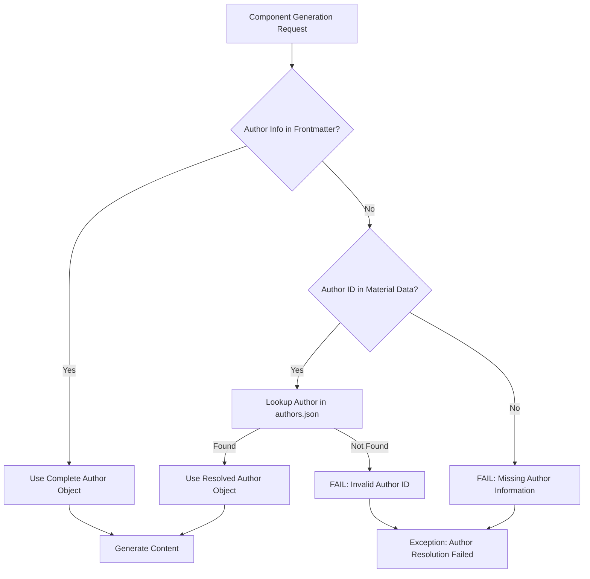

# Author Resolution Architecture

## Overview

The Z-Beam generator implements a robust **fail-fast author resolution system** that ensures complete author information is available for content generation. The system follows a hierarchical fallback approach to guarantee data integrity.

## Architecture Principle

**CRITICAL DESIGN DECISION**: Author information must be complete and accurate. The system fails immediately if valid author data cannot be resolved. This is intentional design to prevent content generation with incomplete or incorrect author attribution.

## Author Resolution Hierarchy

### Primary Source: Frontmatter Component

The **preferred source** for author information is the frontmatter component, which contains the complete author object:

```yaml
---
author: "Yi-Chun Lin"
persona_country: "Taiwan"
author_id: 1
author_object_title: "Ph.D."
author_object_expertise: "Laser Materials Processing"
---
```

**Advantages:**
- Complete author profile with all metadata
- Country-specific linguistic nuances
- Expertise and credentials
- Consistent with generated content structure

### Secondary Source: Material Configuration

When frontmatter author data is unavailable, the system falls back to material-specific configuration in `data/materials.yaml`:

```yaml
materials:
  metal:
    items:
    - name: "Aluminum"
      author_id: 1  # ← Author ID reference
      # ... other material properties
```

### Tertiary Source: Author Registry

The system resolves author IDs to complete author objects from `components/author/authors.json`:

```json
{
  "authors": [
    {
      "id": 1,
      "name": "Yi-Chun Lin",
      "sex": "f",
      "title": "Ph.D.",
      "country": "Taiwan",
      "expertise": "Laser Materials Processing",
      "image": "/images/author/yi-chun-lin.jpg"
    }
  ]
}
```

## Resolution Flow

### Complete Resolution Process



### Code Implementation

The author resolution is implemented in the frontmatter generator:

```python
def _create_template_vars(self, material_name, material_data, author_info, ...):
    """Create template variables with author resolution"""

    # 1. Try to use complete author object from frontmatter
    if author_info and "name" in author_info:
        author_name = author_info["name"]
        resolved_author_info = author_info
    else:
        # 2. Fallback to author_id from material data
        author_id = material_data.get("author_id") or material_data.get("data", {}).get("author_id")

        if author_id:
            # 3. Resolve complete author from authors.json
            resolved_author_info = get_author_by_id(author_id)
            if resolved_author_info and "name" in resolved_author_info:
                author_name = resolved_author_info["name"]
            else:
                raise Exception(f"Author ID {author_id} not found in authors registry")
        else:
            raise Exception("No author information available - fail-fast architecture")

    # Use resolved author information for template variables
    return {
        "author_name": author_name,
        "author_object_country": resolved_author_info.get("country", "Unknown"),
        "author_object_title": resolved_author_info.get("title", "Expert"),
        "author_object_expertise": resolved_author_info.get("expertise", "Materials Science"),
        # ... other template variables
    }
```

## Fail-Fast Behavior

### Validation Points

The system validates author information at multiple points:

1. **Frontmatter Generation**: Ensures author data is available
2. **Template Variable Creation**: Validates author resolution
3. **Content Generation**: Confirms author information integrity

### Error Conditions

The system fails fast on these conditions:

- **Missing Author Info**: No author data in frontmatter or material config
- **Invalid Author ID**: Author ID doesn't exist in authors.json
- **Incomplete Author Record**: Author record missing required fields
- **Malformed Author Data**: Author data structure is invalid

### Error Messages

Clear, actionable error messages:

```
"Author information with 'name' field is required for frontmatter generation"
"Failed to resolve author_id 999: Author not found in registry"
"Author data for ID 1 missing required 'name' field"
```

## Author Data Structure

### Required Author Fields

All authors must have these fields:

```json
{
  "id": 1,                    // Unique identifier (integer)
  "name": "Yi-Chun Lin",      // Full display name
  "country": "Taiwan",        // Country for linguistic context
  "expertise": "Laser Materials Processing",  // Primary expertise area
  "title": "Ph.D.",          // Academic/professional title
  "sex": "f",                // Gender for pronoun selection
  "image": "/images/author/yi-chun-lin.jpg"  // Profile image path
}
```

### Country-Specific Authors

The system maintains country-specific author personas:

- **Taiwan**: Yi-Chun Lin (Laser Materials Processing)
- **Italy**: Alessandro Moretti (Additive Manufacturing)
- **Indonesia**: Ikmanda Roswati (Ultrafast Laser Physics)
- **United States**: Todd Dunning (Optical Materials)

## Testing Strategy

### Comprehensive Test Coverage

The test suite validates all resolution paths:

```bash
# Run author resolution tests
python3 tests/e2e/test_author_resolution.py

# Test complete workflow with author resolution
python3 tests/e2e/test_comprehensive_workflow.py
```

### Test Scenarios

1. **Complete Author Object**: Frontmatter provides full author data
2. **Author ID Fallback**: Material config provides author_id
3. **Registry Resolution**: authors.json lookup succeeds
4. **Failure Cases**: Invalid IDs, missing data, malformed records

### Integration Testing

Tests validate end-to-end author resolution:

- Frontmatter generation with resolved authors
- Content generation using author metadata
- Template variable substitution accuracy
- Error handling and fail-fast behavior

## Configuration Files

### Authors Registry: `components/author/authors.json`

Central registry of all available authors with complete metadata.

### Material Configuration: `data/materials.yaml`

Maps materials to author IDs for fallback resolution:

```yaml
materials:
  metal:
    items:
    - name: "Aluminum"
      author_id: 1  # References Yi-Chun Lin
    - name: "Steel"
      author_id: 4  # References Todd Dunning
```

### Frontmatter Templates: `components/frontmatter/prompt.yaml`

Templates that utilize resolved author information:

```yaml
template: |
  Generate frontmatter for {subject} by {author_name}, {author_object_title} specializing in {author_object_expertise} from {author_object_country}.
```

## Best Practices

### For Developers

1. **Always Provide Author Context**
   ```python
   # Preferred: Complete author object
   author_info = {"name": "Yi-Chun Lin", "country": "Taiwan", ...}

   # Fallback: Author ID in material data
   material_data = {"author_id": 1, ...}
   ```

2. **Validate Author Resolution**
   ```python
   if not author_info or "name" not in author_info:
       # Attempt resolution from material data
       author_id = material_data.get("author_id")
       if author_id:
           author_info = get_author_by_id(author_id)
   ```

3. **Fail Fast on Resolution Failure**
   ```python
   if not author_info:
       raise ValueError("Author resolution failed - cannot generate content")
   ```

### For Content Authors

1. **Maintain Author Registry**: Keep `authors.json` current
2. **Assign Author IDs**: Ensure all materials have `author_id` in `materials.yaml`
3. **Validate Author Data**: Run author resolution tests before deployment

## Troubleshooting

### Common Issues

1. **"Author information required"**
   - Check frontmatter for author field
   - Verify material has author_id
   - Confirm author exists in authors.json

2. **"Author ID not found"**
   - Validate author_id value
   - Check authors.json for matching ID
   - Update material configuration

3. **"Incomplete author data"**
   - Review author record in authors.json
   - Ensure all required fields present
   - Check JSON syntax

### Debugging Steps

1. **Check Author Resolution**:
   ```python
   from utils.author_manager import get_author_by_id
   author = get_author_by_id(1)
   print(f"Author: {author}")
   ```

2. **Validate Material Configuration**:
   ```python
   import yaml
   with open('data/materials.yaml') as f:
       materials = yaml.safe_load(f)
   print(f"Aluminum author_id: {materials['materials']['metal']['items'][0]['author_id']}")
   ```

3. **Test Frontmatter Generation**:
   ```bash
   python3 -c "
   from components.frontmatter.generator import FrontmatterComponentGenerator
   gen = FrontmatterComponentGenerator()
   # Test with your material data
   "
   ```

## Performance Considerations

### Caching Strategy

- Author registry loaded once at startup
- Material configuration cached in memory
- Frontmatter data cached per material

### Resolution Optimization

- Primary path (frontmatter) is fastest
- Fallback paths add minimal overhead
- Fail-fast prevents wasted processing

## Future Enhancements

### Planned Improvements

1. **Author Expertise Matching**: Automatic author assignment based on material type
2. **Multi-Author Support**: Multiple authors per material
3. **Author Contribution Tracking**: Analytics on author usage
4. **Dynamic Author Registry**: API-driven author management

## Conclusion

The author resolution architecture ensures:

- **Data Integrity**: Complete, accurate author information
- **Fail-Fast Reliability**: Immediate failure on data issues
- **Flexible Resolution**: Multiple fallback mechanisms
- **Maintainable Design**: Clear separation of concerns
- **Comprehensive Testing**: Full validation of all resolution paths

This design prioritizes content quality and author attribution accuracy over processing convenience.
