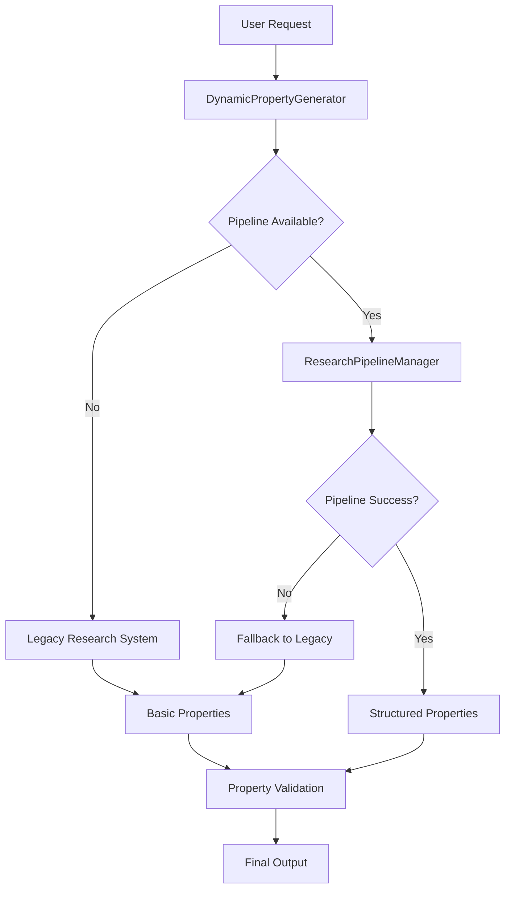

# Research Pipeline Integration Patterns

## Overview

This document describes how the Research Pipeline integrates with existing Z-Beam Generator components, including fallback mechanisms, compatibility layers, and migration strategies. The integration is designed to be seamless, backwards-compatible, and fault-tolerant.

## Integration Architecture

### System-Wide Integration Flow



### Three-Tier Integration Strategy

#### Tier 1: Research Pipeline (Primary)
- **Activation**: When ResearchPipelineManager is available and properly configured
- **Capability**: Full online research with confidence scoring and structured output
- **Output Format**: PropertyDataMetric format with value/unit/min/max/confidence
- **Fallback Trigger**: Pipeline initialization failure, API errors, or low-quality results

#### Tier 2: Legacy Research System (Secondary)
- **Activation**: When research pipeline fails or is unavailable
- **Capability**: Existing research system integration with basic property lookup
- **Output Format**: Mixed format (may require conversion to structured format)
- **Fallback Trigger**: Legacy system failure or missing data

#### Tier 3: Basic Properties (Final Fallback)
- **Activation**: When all research methods fail
- **Capability**: Static property extraction from existing Materials.yaml data
- **Output Format**: Structured format converted from existing data
- **Guarantee**: Always provides some output, even if minimal

## Component Integration Details

### DynamicPropertyGenerator Integration

**Location**: `components/frontmatter/core/dynamic_property_generator.py`

#### Pipeline Initialization
```python
class DynamicPropertyGenerator:
    def __init__(self):
        # Research pipeline initialization with graceful failure
        try:
            from ..research.research_pipeline import ResearchPipelineManager, PIPELINE_AVAILABLE
            
            if PIPELINE_AVAILABLE:
                self.pipeline_manager = ResearchPipelineManager()
                print("✅ Research pipeline initialized successfully")
            else:
                self.pipeline_manager = None
                print("⚠️ Research pipeline dependencies not available")
                
        except ImportError as e:
            self.pipeline_manager = None
            print(f"⚠️ Research pipeline import failed: {e}")
        
        except Exception as e:
            self.pipeline_manager = None
            print(f"❌ Research pipeline initialization failed: {e}")
        
        # Initialize legacy systems regardless
        self._initialize_legacy_systems()
```

#### Primary Generation Method
```python
def generate_properties_for_material(self, material_name: str, existing_data: Dict = None) -> Dict:
    """
    Generate properties using three-tier strategy with comprehensive fallback.
    
    Integration Flow:
    1. Determine material category for pipeline targeting
    2. Attempt research pipeline execution
    3. Validate pipeline results and confidence levels
    4. Fall back to legacy systems if needed
    5. Ensure structured output format consistency
    """
    
    print(f"🚀 Generating properties for {material_name}")
    
    # Material categorization for all tiers
    material_category = self._determine_material_category(material_name, existing_data)
    
    # Tier 1: Research Pipeline
    if self.pipeline_manager:
        pipeline_result = self._attempt_pipeline_generation(
            material_name, material_category
        )
        if pipeline_result:
            return pipeline_result
    
    # Tier 2 & 3: Legacy Fallback
    return self._generate_legacy_research_properties(material_name, existing_data)

def _attempt_pipeline_generation(self, material_name: str, material_category: str) -> Optional[Dict]:
    """Attempt pipeline generation with error isolation"""
    try:
        print("📊 Using research pipeline for comprehensive property generation")
        results = self.pipeline_manager.execute_complete_pipeline(
            material_name, material_category
        )
        
        # Validate pipeline results
        if self._validate_pipeline_results(results):
            properties_count = len(results.get("materialProperties", {}))
            print(f"✅ Research pipeline generated {properties_count} properties")
            return results.get("materialProperties", {})
        else:
            print("⚠️ Research pipeline results failed validation")
            return None
            
    except Exception as e:
        print(f"❌ Research pipeline failed: {str(e)}")
        return None
```

#### Result Validation
```python
def _validate_pipeline_results(self, results: Dict) -> bool:
    """Validate pipeline results meet quality standards"""
    if not results or not isinstance(results, dict):
        return False
    
    material_properties = results.get("materialProperties", {})
    if not material_properties:
        return False
    
    # Check for minimum required properties
    required_properties = ["density", "meltingPoint"]
    has_required = any(prop in material_properties for prop in required_properties)
    
    if not has_required:
        return False
    
    # Validate confidence scores
    low_confidence_count = 0
    for prop_name, prop_data in material_properties.items():
        if isinstance(prop_data, dict):
            confidence = prop_data.get("confidence", 0)
            if confidence < 40:
                low_confidence_count += 1
    
    # Reject if too many low-confidence results
    if low_confidence_count > len(material_properties) * 0.5:
        print(f"⚠️ Too many low-confidence results: {low_confidence_count}/{len(material_properties)}")
        return False
    
    return True
```

### Schema Integration

**Location**: `schemas/active/frontmatter.json`

#### PropertyDataMetric Schema Integration
```json
{
  "definitions": {
    "PropertyDataMetric": {
      "type": "object",
      "properties": {
        "value": {
          "type": ["number", "string"],
          "description": "The primary property value"
        },
        "unit": {
          "type": "string",
          "description": "Unit of measurement"
        },
        "min": {
          "type": "number",
          "description": "Minimum range value"
        },
        "max": {
          "type": "number", 
          "description": "Maximum range value"
        },
        "confidence": {
          "type": "integer",
          "minimum": 0,
          "maximum": 100,
          "description": "Confidence score 0-100"
        }
      },
      "required": ["value"],
      "additionalProperties": false
    }
  },
  
  "properties": {
    "materialProperties": {
      "type": "object",
      "patternProperties": {
        "^[a-zA-Z][a-zA-Z0-9]*$": {
          "$ref": "#/definitions/PropertyDataMetric"
        }
      },
      "additionalProperties": false
    },
    
    "machineSettings": {
      "type": "object", 
      "patternProperties": {
        "^[a-zA-Z][a-zA-Z0-9]*$": {
          "$ref": "#/definitions/PropertyDataMetric"
        }
      },
      "additionalProperties": false
    }
  }
}
```

### StreamlinedFrontmatterGenerator Integration

**Location**: `components/frontmatter/core/streamlined_generator.py`

#### Structured Format Output
```python
def _generate_basic_properties(self, existing_data: Dict) -> Dict:
    """Generate properties in structured PropertyDataMetric format"""
    properties = {}
    
    # Convert existing flat format to structured format
    for key, value in existing_data.items():
        if self._is_property_field(key):
            base_property = self._extract_base_property_name(key)
            
            if base_property not in properties:
                properties[base_property] = self._create_structured_property(
                    existing_data, base_property
                )
    
    # Add research-enhanced properties if available
    if hasattr(self, 'research_enhancer') and self.research_enhancer:
        enhanced_properties = self.research_enhancer.enhance_properties(
            properties, existing_data.get('name', '')
        )
        properties.update(enhanced_properties)
    
    return properties

def _create_structured_property(self, data: Dict, base_property: str) -> Dict:
    """Create PropertyDataMetric structure from existing data"""
    structured_prop = {}
    
    # Primary value
    if base_property in data:
        structured_prop["value"] = data[base_property]
    
    # Unit
    unit_key = f"{base_property}Unit"
    if unit_key in data:
        structured_prop["unit"] = data[unit_key]
    
    # Range values
    min_key = f"{base_property}Min"
    max_key = f"{base_property}Max"
    if min_key in data:
        structured_prop["min"] = data[min_key]
    if max_key in data:
        structured_prop["max"] = data[max_key]
    
    # Default confidence for existing data
    structured_prop["confidence"] = 85  # High confidence for curated data
    
    return structured_prop
```

## Compatibility Layer

### Format Conversion Utilities

#### Legacy to Structured Conversion
```python
class PropertyFormatConverter:
    """Convert between legacy and structured property formats"""
    
    @staticmethod
    def legacy_to_structured(legacy_properties: Dict) -> Dict:
        """Convert legacy flat format to structured PropertyDataMetric format"""
        structured_properties = {}
        processed_keys = set()
        
        # Group related property fields
        property_groups = {}
        for key, value in legacy_properties.items():
            base_property = PropertyFormatConverter._get_base_property_name(key)
            
            if base_property not in property_groups:
                property_groups[base_property] = {}
            
            field_type = PropertyFormatConverter._get_field_type(key, base_property)
            property_groups[base_property][field_type] = value
        
        # Convert each property group to structured format
        for base_property, fields in property_groups.items():
            if "value" in fields:  # Ensure we have a primary value
                structured_properties[base_property] = {
                    "value": fields["value"]
                }
                
                # Add optional fields
                for field_name in ["unit", "min", "max", "confidence"]:
                    if field_name in fields:
                        structured_properties[base_property][field_name] = fields[field_name]
        
        return structured_properties
    
    @staticmethod
    def structured_to_legacy(structured_properties: Dict) -> Dict:
        """Convert structured format back to legacy flat format for compatibility"""
        legacy_properties = {}
        
        for property_name, property_data in structured_properties.items():
            if isinstance(property_data, dict):
                # Extract structured fields to flat format
                if "value" in property_data:
                    legacy_properties[property_name] = property_data["value"]
                
                if "unit" in property_data:
                    legacy_properties[f"{property_name}Unit"] = property_data["unit"]
                
                if "min" in property_data:
                    legacy_properties[f"{property_name}Min"] = property_data["min"]
                
                if "max" in property_data:
                    legacy_properties[f"{property_name}Max"] = property_data["max"]
            else:
                # Direct value assignment for simple properties
                legacy_properties[property_name] = property_data
        
        return legacy_properties
```

#### Validation and Consistency Checking
```python
class PropertyConsistencyValidator:
    """Validate consistency between different property formats and sources"""
    
    def validate_cross_format_consistency(self, 
                                        legacy_data: Dict, 
                                        structured_data: Dict) -> List[str]:
        """Validate consistency between legacy and structured formats"""
        inconsistencies = []
        
        # Convert structured back to legacy for comparison
        converted_legacy = PropertyFormatConverter.structured_to_legacy(structured_data)
        
        # Compare values
        for property_name in set(legacy_data.keys()) & set(converted_legacy.keys()):
            legacy_value = legacy_data[property_name]
            converted_value = converted_legacy[property_name]
            
            if not self._values_equivalent(legacy_value, converted_value):
                inconsistencies.append(
                    f"{property_name}: legacy={legacy_value}, converted={converted_value}"
                )
        
        return inconsistencies
    
    def validate_pipeline_compatibility(self, pipeline_results: Dict) -> bool:
        """Validate that pipeline results conform to expected structure"""
        try:
            # Check top-level structure
            if not isinstance(pipeline_results, dict):
                return False
            
            required_sections = ["materialProperties"]
            for section in required_sections:
                if section not in pipeline_results:
                    return False
                
                section_data = pipeline_results[section]
                if not isinstance(section_data, dict):
                    return False
                
                # Validate individual properties
                for prop_name, prop_data in section_data.items():
                    if not self._is_valid_property_data_metric(prop_data):
                        return False
            
            return True
            
        except Exception:
            return False
    
    def _is_valid_property_data_metric(self, data: Any) -> bool:
        """Validate PropertyDataMetric structure"""
        if not isinstance(data, dict):
            return False
        
        # Must have value field
        if "value" not in data:
            return False
        
        # Check optional fields have correct types
        optional_fields = {
            "unit": str,
            "min": (int, float),
            "max": (int, float), 
            "confidence": int
        }
        
        for field_name, expected_type in optional_fields.items():
            if field_name in data:
                if not isinstance(data[field_name], expected_type):
                    return False
        
        return True
```

## Error Handling and Resilience

### Graceful Degradation
```python
class ResearchPipelineIntegration:
    """Manages research pipeline integration with comprehensive error handling"""
    
    def __init__(self):
        self.pipeline_available = False
        self.pipeline_manager = None
        self.last_pipeline_error = None
        self.fallback_count = 0
        
        self._initialize_pipeline()
    
    def _initialize_pipeline(self):
        """Initialize pipeline with error isolation"""
        try:
            from ..research.research_pipeline import ResearchPipelineManager, PIPELINE_AVAILABLE
            
            if PIPELINE_AVAILABLE:
                self.pipeline_manager = ResearchPipelineManager()
                self.pipeline_available = True
                print("✅ Research pipeline integration successful")
            else:
                print("ℹ️ Research pipeline dependencies not available")
                
        except ImportError as e:
            self.last_pipeline_error = f"Import failed: {e}"
            print(f"ℹ️ Research pipeline not available: {self.last_pipeline_error}")
            
        except Exception as e:
            self.last_pipeline_error = f"Initialization failed: {e}"
            print(f"⚠️ Research pipeline initialization error: {self.last_pipeline_error}")
    
    def generate_properties_with_resilience(self, 
                                          material_name: str, 
                                          material_category: str,
                                          existing_data: Dict = None) -> Dict:
        """Generate properties with multi-tier resilience"""
        
        # Attempt research pipeline if available
        if self.pipeline_available and self.pipeline_manager:
            try:
                results = self.pipeline_manager.execute_complete_pipeline(
                    material_name, material_category
                )
                
                if self._validate_results_quality(results):
                    print(f"✅ Research pipeline succeeded for {material_name}")
                    return results.get("materialProperties", {})
                else:
                    print(f"⚠️ Research pipeline results below quality threshold")
                    
            except Exception as e:
                self.last_pipeline_error = str(e)
                self.fallback_count += 1
                print(f"❌ Research pipeline error (fallback #{self.fallback_count}): {e}")
        
        # Fallback to legacy methods
        return self._generate_fallback_properties(material_name, existing_data)
    
    def _validate_results_quality(self, results: Dict) -> bool:
        """Validate results meet minimum quality standards"""
        if not results or "materialProperties" not in results:
            return False
        
        properties = results["materialProperties"]
        if len(properties) < 2:  # Minimum 2 properties required
            return False
        
        # Check average confidence
        confidences = []
        for prop_data in properties.values():
            if isinstance(prop_data, dict) and "confidence" in prop_data:
                confidences.append(prop_data["confidence"])
        
        if confidences:
            avg_confidence = sum(confidences) / len(confidences)
            return avg_confidence >= 50  # Minimum 50% average confidence
        
        return True  # Accept if no confidence scores (legacy compatibility)
    
    def get_integration_status(self) -> Dict[str, Any]:
        """Get integration status and statistics"""
        return {
            "pipeline_available": self.pipeline_available,
            "last_error": self.last_pipeline_error,
            "fallback_count": self.fallback_count,
            "integration_health": "healthy" if self.pipeline_available else "degraded"
        }
```

### Circuit Breaker Pattern
```python
class PipelineCircuitBreaker:
    """Circuit breaker for research pipeline to prevent cascading failures"""
    
    def __init__(self, 
                 failure_threshold: int = 5,
                 recovery_timeout: int = 300,
                 test_request_ratio: float = 0.1):
        self.failure_threshold = failure_threshold
        self.recovery_timeout = recovery_timeout
        self.test_request_ratio = test_request_ratio
        
        self.failure_count = 0
        self.last_failure_time = None
        self.state = "closed"  # closed, open, half_open
    
    def call_pipeline(self, pipeline_func, *args, **kwargs):
        """Execute pipeline function with circuit breaker protection"""
        
        if self.state == "open":
            if self._should_attempt_reset():
                self.state = "half_open"
            else:
                raise CircuitBreakerOpenError("Pipeline circuit breaker is open")
        
        if self.state == "half_open":
            # Only allow test requests through
            if random.random() > self.test_request_ratio:
                raise CircuitBreakerOpenError("Pipeline circuit breaker testing")
        
        try:
            result = pipeline_func(*args, **kwargs)
            self._on_success()
            return result
            
        except Exception as e:
            self._on_failure()
            raise e
    
    def _on_success(self):
        """Handle successful pipeline execution"""
        self.failure_count = 0
        self.state = "closed"
    
    def _on_failure(self):
        """Handle pipeline failure"""
        self.failure_count += 1
        self.last_failure_time = time.time()
        
        if self.failure_count >= self.failure_threshold:
            self.state = "open"
            print(f"🔴 Pipeline circuit breaker opened after {self.failure_count} failures")
    
    def _should_attempt_reset(self) -> bool:
        """Check if circuit breaker should attempt reset"""
        if self.last_failure_time is None:
            return True
        
        return (time.time() - self.last_failure_time) >= self.recovery_timeout

class CircuitBreakerOpenError(Exception):
    """Exception raised when circuit breaker is open"""
    pass
```

## Performance Integration

### Caching Integration
```python
class IntegratedCacheManager:
    """Unified caching for pipeline and legacy systems"""
    
    def __init__(self, cache_backend=None):
        self.cache_backend = cache_backend or {}
        self.pipeline_cache = {}
        self.legacy_cache = {}
        self.hit_count = 0
        self.miss_count = 0
    
    def get_cached_properties(self, 
                            material_name: str, 
                            generation_method: str = "pipeline") -> Optional[Dict]:
        """Get cached properties for material"""
        cache_key = f"{material_name}:{generation_method}"
        
        # Check appropriate cache
        cache_store = (self.pipeline_cache if generation_method == "pipeline" 
                      else self.legacy_cache)
        
        cached_data = cache_store.get(cache_key)
        if cached_data:
            if self._is_cache_valid(cached_data):
                self.hit_count += 1
                return cached_data["properties"]
            else:
                # Remove expired cache entry
                del cache_store[cache_key]
        
        self.miss_count += 1
        return None
    
    def cache_properties(self, 
                        material_name: str, 
                        properties: Dict,
                        generation_method: str = "pipeline"):
        """Cache properties for material"""
        cache_key = f"{material_name}:{generation_method}"
        cache_store = (self.pipeline_cache if generation_method == "pipeline" 
                      else self.legacy_cache)
        
        cache_store[cache_key] = {
            "properties": properties,
            "cached_at": time.time(),
            "method": generation_method
        }
    
    def _is_cache_valid(self, cached_data: Dict, ttl: int = 3600) -> bool:
        """Check if cached data is still valid"""
        cached_at = cached_data.get("cached_at", 0)
        return (time.time() - cached_at) < ttl
    
    def get_cache_statistics(self) -> Dict[str, Any]:
        """Get cache performance statistics"""
        total_requests = self.hit_count + self.miss_count
        hit_rate = (self.hit_count / total_requests) if total_requests > 0 else 0
        
        return {
            "hit_count": self.hit_count,
            "miss_count": self.miss_count,
            "hit_rate": hit_rate,
            "pipeline_cache_size": len(self.pipeline_cache),
            "legacy_cache_size": len(self.legacy_cache)
        }
```

### Monitoring and Metrics
```python
class IntegrationMetrics:
    """Monitor integration performance and health"""
    
    def __init__(self):
        self.metrics = {
            "pipeline_calls": 0,
            "pipeline_successes": 0,
            "pipeline_failures": 0,
            "fallback_activations": 0,
            "average_response_time": 0.0,
            "response_times": []
        }
    
    def record_pipeline_call(self, success: bool, response_time: float):
        """Record pipeline execution metrics"""
        self.metrics["pipeline_calls"] += 1
        
        if success:
            self.metrics["pipeline_successes"] += 1
        else:
            self.metrics["pipeline_failures"] += 1
        
        self.metrics["response_times"].append(response_time)
        self._update_average_response_time()
    
    def record_fallback_activation(self):
        """Record fallback system activation"""
        self.metrics["fallback_activations"] += 1
    
    def get_health_score(self) -> float:
        """Calculate integration health score (0-100)"""
        total_calls = self.metrics["pipeline_calls"]
        if total_calls == 0:
            return 100.0  # No calls yet
        
        success_rate = self.metrics["pipeline_successes"] / total_calls
        fallback_rate = self.metrics["fallback_activations"] / total_calls
        
        # Health score based on success rate and fallback frequency
        health_score = (success_rate * 80) + ((1 - fallback_rate) * 20)
        return min(100.0, max(0.0, health_score))
    
    def _update_average_response_time(self):
        """Update average response time"""
        times = self.metrics["response_times"]
        if times:
            self.metrics["average_response_time"] = sum(times) / len(times)
    
    def reset_metrics(self):
        """Reset all metrics"""
        for key in self.metrics:
            if isinstance(self.metrics[key], list):
                self.metrics[key] = []
            elif isinstance(self.metrics[key], (int, float)):
                self.metrics[key] = 0
```

## Testing Integration

### Integration Test Framework
```python
class PipelineIntegrationTestSuite:
    """Test suite for research pipeline integration"""
    
    def __init__(self):
        self.test_materials = [
            ("Zirconia", "ceramic"),
            ("Aluminum", "metal"), 
            ("Polyethylene", "plastic")
        ]
    
    def test_complete_integration_flow(self):
        """Test complete integration from request to output"""
        generator = DynamicPropertyGenerator()
        
        for material_name, category in self.test_materials:
            print(f"\n🧪 Testing {material_name} ({category})")
            
            # Test pipeline generation
            try:
                properties = generator.generate_properties_for_material(material_name)
                self._validate_output_format(properties)
                self._validate_property_quality(properties)
                print(f"✅ {material_name}: Pipeline integration successful")
                
            except Exception as e:
                print(f"❌ {material_name}: Integration test failed - {e}")
    
    def test_fallback_mechanisms(self):
        """Test fallback behavior when pipeline fails"""
        # Mock pipeline failure
        generator = DynamicPropertyGenerator()
        generator.pipeline_manager = None  # Force fallback
        
        for material_name, category in self.test_materials:
            properties = generator.generate_properties_for_material(material_name)
            
            # Should still get properties via fallback
            assert properties, f"Fallback failed for {material_name}"
            print(f"✅ {material_name}: Fallback mechanism working")
    
    def test_format_conversion(self):
        """Test conversion between legacy and structured formats"""
        converter = PropertyFormatConverter()
        
        # Test legacy to structured conversion
        legacy_data = {
            "density": 5.68,
            "densityUnit": "g/cm³",
            "densityMin": 5.0,
            "densityMax": 6.0
        }
        
        structured = converter.legacy_to_structured(legacy_data)
        expected_structure = {
            "density": {
                "value": 5.68,
                "unit": "g/cm³",
                "min": 5.0,
                "max": 6.0
            }
        }
        
        assert structured == expected_structure, "Legacy to structured conversion failed"
        print("✅ Format conversion test passed")
    
    def _validate_output_format(self, properties: Dict):
        """Validate output follows PropertyDataMetric format"""
        assert isinstance(properties, dict), "Properties must be dictionary"
        
        for prop_name, prop_data in properties.items():
            assert isinstance(prop_data, dict), f"{prop_name} must be dictionary"
            assert "value" in prop_data, f"{prop_name} must have value field"
    
    def _validate_property_quality(self, properties: Dict):
        """Validate property data quality"""
        assert len(properties) > 0, "Must have at least one property"
        
        # Check confidence scores if present
        for prop_name, prop_data in properties.items():
            if "confidence" in prop_data:
                confidence = prop_data["confidence"]
                assert 0 <= confidence <= 100, f"Invalid confidence for {prop_name}: {confidence}"
```

## Conclusion

The Research Pipeline integration provides a robust, fault-tolerant enhancement to the Z-Beam Generator's property generation capabilities. Through the three-tier architecture, comprehensive error handling, and backwards compatibility, the integration ensures reliable operation while enabling advanced research-driven property discovery.

Key integration benefits:
- **Seamless Fallback**: Graceful degradation ensures system reliability
- **Format Compatibility**: Automatic conversion between legacy and structured formats
- **Performance Optimization**: Integrated caching and monitoring
- **Extensibility**: Modular design supports future enhancements
- **Quality Assurance**: Comprehensive validation and testing frameworks

The integration maintains full backwards compatibility while providing a clear migration path to the enhanced research-driven property generation system.