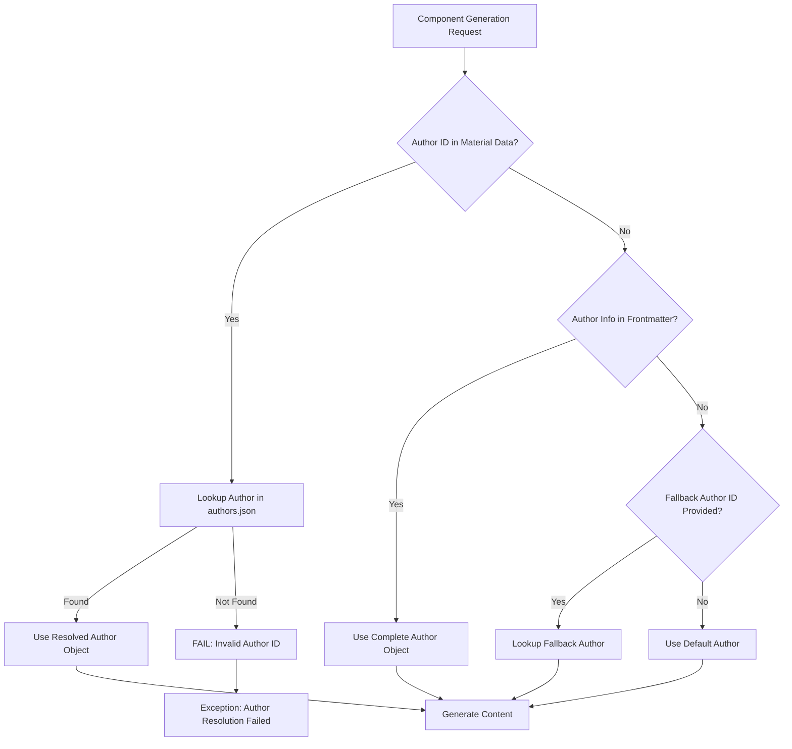

# Author Resolution Architecture

## Overview

The Z-Beam generator implements a robust **fail-fast author resolution system** that ensures complete author information is available for content generation. The system follows a hierarchical fallback approach to guarantee data integrity.

## Architecture Principle

**CRITICAL DESIGN DECISION**: Author information must be complete and accurate. The system fails immediately if valid author data cannot be resolved. This is intentional design to prevent content generation with incomplete or incorrect author attribution.

## Author Resolution Hierarchy

### Primary Source: Material Configuration

The **preferred source** for author information is the material-specific configuration in `data/materials.yaml`, which contains the author_id:

```yaml
materials:
  metal:
    items:
    - name: "Aluminum"
      author_id: 1  # ← Author ID reference
      # ... other material properties
```

**Advantages:**
- Consistent author assignment per material
- Single source of truth for material-author mapping
- Simplified generation process (no manual author specification)
- Fail-fast validation when material data is loaded

### Secondary Source: Frontmatter Component

When material data author resolution fails, the system falls back to existing frontmatter if available, which contains the complete author object:

```yaml
---
author: "Yi-Chun Lin"
persona_country: "Taiwan"
author_id: 1
author_object_title: "Ph.D."
author_object_expertise: "Laser Materials Processing"
---
```

### Tertiary Source: Author Registry

The system resolves author IDs to complete author objects from `components/author/authors.json`:

```json
{
  "authors": [
    {
      "id": 1,
      "name": "Yi-Chun Lin",
      "sex": "f",
      "title": "Ph.D.",
      "country": "Taiwan",
      "expertise": "Laser Materials Processing",
      "image": "/images/author/yi-chun-lin.jpg"
    }
  ]
}
```

## Resolution Flow

### Complete Resolution Process



### Code Implementation

The author resolution is implemented in the author manager:

```python
def get_author_info_for_material(
    material_data_or_name: Any, fallback_author_id: Optional[int] = None
) -> Dict[str, Any]:
    """
    Get author information for a material, prioritizing material data author_id.
    """
    # Extract material name for frontmatter lookup
    material_name = material_data_or_name
    material_author_id = None

    # If material_data_or_name is a dictionary with material data
    if isinstance(material_data_or_name, dict):
        # Extract author_id from material data
        if "author_id" in material_data_or_name:
            material_author_id = material_data_or_name["author_id"]
        elif "data" in material_data_or_name and "author_id" in material_data_or_name["data"]:
            material_author_id = material_data_or_name["data"]["author_id"]
        
        # Extract material name for frontmatter lookup
        if "name" in material_data_or_name:
            material_name = material_data_or_name["name"].strip()
        elif "material_name" in material_data_or_name:
            material_name = material_data_or_name["material_name"].strip()
    
    # If we found an author_id in the material data, use it
    if material_author_id is not None:
        author = get_author_by_id(material_author_id)
        if author:
            # Return complete author info
            return {
                "name": author.get("name", "Unknown Author"),
                "country": author.get("country", "Unknown"),
                # ... other author fields
            }

    # Try to extract from frontmatter file as a fallback
    frontmatter_author = extract_author_info_from_frontmatter_file(material_name)
    if frontmatter_author:
        return {
            "name": frontmatter_author.get("name", "Unknown Author"),
            "country": frontmatter_author.get("country", "Unknown"),
            # ... other author fields
        }

    # Final fallback to provided author_id or default
    return get_author_info_for_generation(fallback_author_id)
```

## Workflow Integration

The author resolution is integrated into the workflow manager:

```python
def run_material_generation(
    material: str, component_types: List[str], author_id: Optional[int] = None
) -> Dict[str, Any]:
    """
    Generate content for a single material.

    Args:
        material: Material name
        component_types: List of component types to generate
        author_id: Optional author ID (fallback)

    Returns:
        Dictionary with generation results
    """
    generator = DynamicGenerator()

    # Validate material and components...
    
    # Extract material data from materials.yaml
    material_data = None
    materials_data = generator.materials_data
    if "materials" in materials_data:
        materials_section = materials_data["materials"]
        for category, category_data in materials_section.items():
            if isinstance(category_data, dict) and "items" in category_data:
                for item in category_data["items"]:
                    if "name" in item and item["name"].lower() == material.lower():
                        material_data = item
                        break
                if material_data:
                    break
    
    # Get author info - use material data to retrieve material-specific author info
    author_info = get_author_info_for_material(material_data, author_id)

    # Generate content
    return run_dynamic_generation(
        generator=generator,
        material=material,
        component_types=component_types,
        author_info=author_info,
    )
```

### Error Conditions

The system fails fast on these conditions:

- **Missing Author Info**: No author data in frontmatter or material config
- **Invalid Author ID**: Author ID doesn't exist in authors.json
- **Incomplete Author Record**: Author record missing required fields
- **Malformed Author Data**: Author data structure is invalid

### Error Messages

Clear, actionable error messages:

```
"Author information with 'name' field is required for frontmatter generation"
"Failed to resolve author_id 999: Author not found in registry"
"Author data for ID 1 missing required 'name' field"
```

## Author Data Structure

### Required Author Fields

All authors must have these fields:

```json
{
  "id": 1,                    // Unique identifier (integer)
  "name": "Yi-Chun Lin",      // Full display name
  "country": "Taiwan",        // Country for linguistic context
  "expertise": "Laser Materials Processing",  // Primary expertise area
  "title": "Ph.D.",          // Academic/professional title
  "sex": "f",                // Gender for pronoun selection
  "image": "/images/author/yi-chun-lin.jpg"  // Profile image path
}
```

### Country-Specific Authors

The system maintains country-specific author personas:

- **Taiwan**: Yi-Chun Lin (Laser Materials Processing)
- **Italy**: Alessandro Moretti (Additive Manufacturing)
- **Indonesia**: Ikmanda Roswati (Ultrafast Laser Physics)
- **United States**: Todd Dunning (Optical Materials)

## Testing Strategy

### Comprehensive Test Coverage

The test suite validates all resolution paths:

```bash
# Run author resolution tests
python3 tests/e2e/test_author_resolution.py

# Test complete workflow with author resolution
python3 tests/e2e/test_comprehensive_workflow.py
```

### Test Scenarios

1. **Complete Author Object**: Frontmatter provides full author data
2. **Author ID Fallback**: Material config provides author_id
3. **Registry Resolution**: authors.json lookup succeeds
4. **Failure Cases**: Invalid IDs, missing data, malformed records

### Integration Testing

Tests validate end-to-end author resolution:

- Frontmatter generation with resolved authors
- Content generation using author metadata
- Template variable substitution accuracy
- Error handling and fail-fast behavior

## Configuration Files

### Authors Registry: `components/author/authors.json`

Central registry of all available authors with complete metadata.

### Material Configuration: `data/materials.yaml`

Maps materials to author IDs for fallback resolution:

```yaml
materials:
  metal:
    items:
    - name: "Aluminum"
      author_id: 1  # References Yi-Chun Lin
    - name: "Steel"
      author_id: 4  # References Todd Dunning
```

### Frontmatter Templates: `components/frontmatter/prompt.yaml`

Templates that utilize resolved author information:

```yaml
template: |
  Generate frontmatter for {subject} by {author_name}, {author_object_title} specializing in {author_object_expertise} from {author_object_country}.
```

## Best Practices

### For Developers

1. **Always Provide Author Context**
   ```python
   # Preferred: Complete author object
   author_info = {"name": "Yi-Chun Lin", "country": "Taiwan", ...}

   # Fallback: Author ID in material data
   material_data = {"author_id": 1, ...}
   ```

2. **Validate Author Resolution**
   ```python
   if not author_info or "name" not in author_info:
       # Attempt resolution from material data
       author_id = material_data.get("author_id")
       if author_id:
           author_info = get_author_by_id(author_id)
   ```

3. **Fail Fast on Resolution Failure**
   ```python
   if not author_info:
       raise ValueError("Author resolution failed - cannot generate content")
   ```

### For Content Authors

1. **Maintain Author Registry**: Keep `authors.json` current
2. **Assign Author IDs**: Ensure all materials have `author_id` in `materials.yaml`
3. **Validate Author Data**: Run author resolution tests before deployment

## Troubleshooting

### Common Issues

1. **"Author information required"**
   - Check frontmatter for author field
   - Verify material has author_id
   - Confirm author exists in authors.json

2. **"Author ID not found"**
   - Validate author_id value
   - Check authors.json for matching ID
   - Update material configuration

3. **"Incomplete author data"**
   - Review author record in authors.json
   - Ensure all required fields present
   - Check JSON syntax

### Debugging Steps

1. **Check Author Resolution**:
   ```python
   from utils.author_manager import get_author_by_id
   author = get_author_by_id(1)
   print(f"Author: {author}")
   ```

2. **Validate Material Configuration**:
   ```python
   import yaml
   with open('data/materials.yaml') as f:
       materials = yaml.safe_load(f)
   print(f"Aluminum author_id: {materials['materials']['metal']['items'][0]['author_id']}")
   ```

3. **Test Frontmatter Generation**:
   ```bash
   python3 -c "
   from components.frontmatter.generator import FrontmatterComponentGenerator
   gen = FrontmatterComponentGenerator()
   # Test with your material data
   "
   ```

## Performance Considerations

### Caching Strategy

- Author registry loaded once at startup
- Material configuration cached in memory
- Frontmatter data cached per material

### Resolution Optimization

- Primary path (frontmatter) is fastest
- Fallback paths add minimal overhead
- Fail-fast prevents wasted processing

## Future Enhancements

### Planned Improvements

1. **Author Expertise Matching**: Automatic author assignment based on material type
2. **Multi-Author Support**: Multiple authors per material
3. **Author Contribution Tracking**: Analytics on author usage
4. **Dynamic Author Registry**: API-driven author management

## Conclusion

The author resolution architecture ensures:

- **Data Integrity**: Complete, accurate author information
- **Fail-Fast Reliability**: Immediate failure on data issues
- **Flexible Resolution**: Multiple fallback mechanisms
- **Maintainable Design**: Clear separation of concerns
- **Comprehensive Testing**: Full validation of all resolution paths

This design prioritizes content quality and author attribution accuracy over processing convenience.
