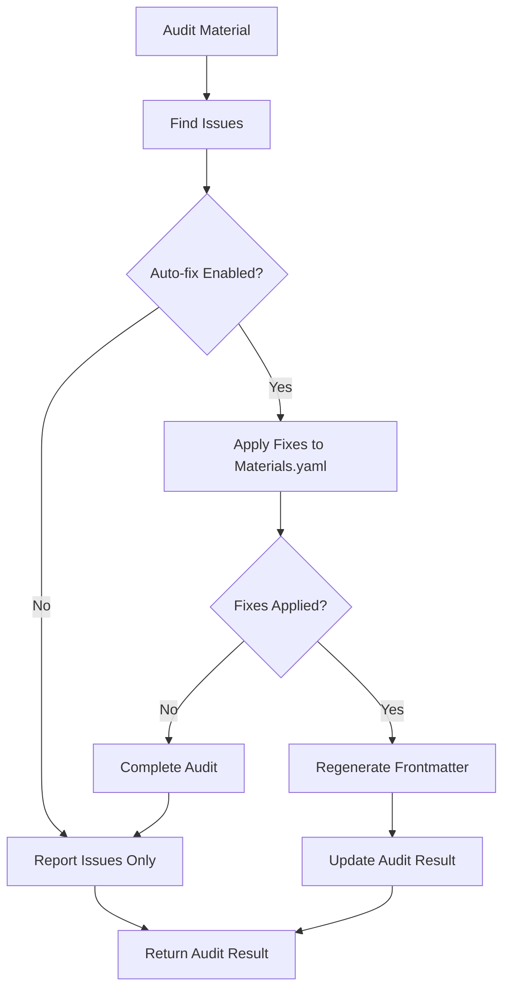

# Audit System Frontmatter Regeneration

## Overview

The enhanced audit system now automatically regenerates frontmatter files after applying fixes to Materials.yaml, ensuring data consistency between the single source of truth (Materials.yaml) and output files (frontmatter).

## How It Works

### Automatic Triggering

Frontmatter regeneration is automatically triggered when:
1. **Audit auto-fix is enabled** (`--audit-auto-fix` flag)
2. **Materials.yaml fixes are applied** (auto_fixes_applied > 0)
3. **Architectural violations are corrected** (min/max fields removed)

### Process Flow



### Implementation Details

1. **Materials.yaml Fixes Applied**
   - Min/max architectural violations removed
   - Category capitalization corrected
   - Missing confidence scores added
   - Backup created automatically

2. **Frontmatter Regeneration Triggered**
   - `StreamlinedFrontmatterGenerator` initialized
   - New frontmatter generated from updated Materials.yaml
   - Existing frontmatter backed up before replacement
   - New frontmatter written to file

3. **Audit Result Updated**
   - Auto-fix count incremented
   - Success issue added with INFO severity
   - Failure handled gracefully with MEDIUM severity warning

## Code Example

### Automatic Usage (Recommended)

```bash
# Auto-fix will automatically regenerate frontmatter after Materials.yaml fixes
python3 run.py --audit "Steel" --audit-auto-fix
```

### Programmatic Usage

```python
from components.frontmatter.services.material_auditor import MaterialAuditor

auditor = MaterialAuditor()
result = auditor.audit_material("Steel", auto_fix=True)

# Check if frontmatter was regenerated
frontmatter_regen_issues = [
    issue for issue in result.issues 
    if issue.category == "frontmatter_sync" and "AUTO-REGENERATED" in issue.description
]

if frontmatter_regen_issues:
    print("✅ Frontmatter regenerated successfully")
```

## File Locations

### Generated Files
- **Frontmatter**: `content/frontmatter/{material-name}-laser-cleaning.yaml`
- **Backup Location**: `content/frontmatter/{material-name}-laser-cleaning.backup_audit_{timestamp}.yaml`

### Source Code
- **Main Implementation**: `components/frontmatter/services/material_auditor.py`
- **Method**: `_regenerate_frontmatter_after_fixes()`
- **Generator Used**: `components/frontmatter/core/streamlined_generator.py`

## Benefits

### 1. **Data Consistency**
- Frontmatter always reflects latest Materials.yaml state
- Eliminates manual synchronization requirements
- Prevents schema violations from stale frontmatter
- **Unified requirements**: Generator and auditor use same validation system

### 2. **Automated Workflow**
- No manual intervention required
- Integrates seamlessly with existing audit process
- Maintains backup safety net
- **Two-phase fix**: Materials.yaml → Frontmatter regeneration

### 3. **Error Recovery**
- Graceful handling of regeneration failures
- Clear audit trail of all operations
- Does not fail overall audit on frontmatter issues

## Error Handling

### Successful Regeneration
```
✅ Frontmatter regenerated: content/frontmatter/steel-laser-cleaning.yaml
```

**Audit Result**: INFO severity issue added with "AUTO-REGENERATED" tag

### Failed Regeneration
```
❌ Frontmatter regeneration failed for Steel: API generation failed
```

**Audit Result**: MEDIUM severity warning added, Materials.yaml fixes still applied

### No Regeneration Needed
- Occurs when no Materials.yaml fixes were applied
- No frontmatter operations performed
- Normal audit completion

## Testing

### Unit Tests
- **File**: `tests/test_audit_frontmatter_regeneration.py`
- **Coverage**: Success cases, failure handling, no-op scenarios
- **Mocking**: API calls, file system operations

### Integration Tests
```bash
# Run comprehensive audit with regeneration
python3 run.py --audit-all --audit-auto-fix

# Verify results
ls -la content/frontmatter/*.backup_audit_*
```

## Troubleshooting

### Common Issues

1. **Frontmatter Not Regenerated**
   - Check if auto-fix is enabled (`--audit-auto-fix`)
   - Verify Materials.yaml had violations to fix
   - Review audit output for auto_fixes_applied count

2. **API Generation Failed**
   - Check API client configuration
   - Verify API keys are loaded
   - Review generator logs for specific errors

3. **File Permission Issues**
   - Ensure write permissions on content/frontmatter directory
   - Check disk space availability
   - Verify backup directory creation

### Debug Commands

```bash
# Verbose audit output
python3 run.py --audit "Material" --audit-auto-fix --verbose

# Check Materials.yaml for remaining violations
python3 -c "
from components.frontmatter.services.material_auditor import MaterialAuditor
auditor = MaterialAuditor()
result = auditor.audit_material('Steel', auto_fix=False)
print(f'Violations: {result.total_issues}')
"
```

## Configuration

### Default Settings
- **Frontmatter Generation**: `skip_subtitle=True` (for performance)
- **Backup Naming**: `{filename}.backup_audit_{timestamp}.yaml`
- **Directory**: `content/frontmatter/` (auto-created if missing)

### Customization
Currently not configurable. Contact development team for specific requirements.

---

## Related Documentation

- **Main Audit System**: `AUDIT_SYSTEM_QUICK_REFERENCE.md`
- **Data Storage Policy**: `docs/DATA_STORAGE_POLICY.md`
- **Frontmatter Generator**: `components/frontmatter/README.md`
- **Materials.yaml Architecture**: `docs/DATA_ARCHITECTURE.md`

**Status**: ✅ **IMPLEMENTED** - Frontmatter regeneration integrated with audit system