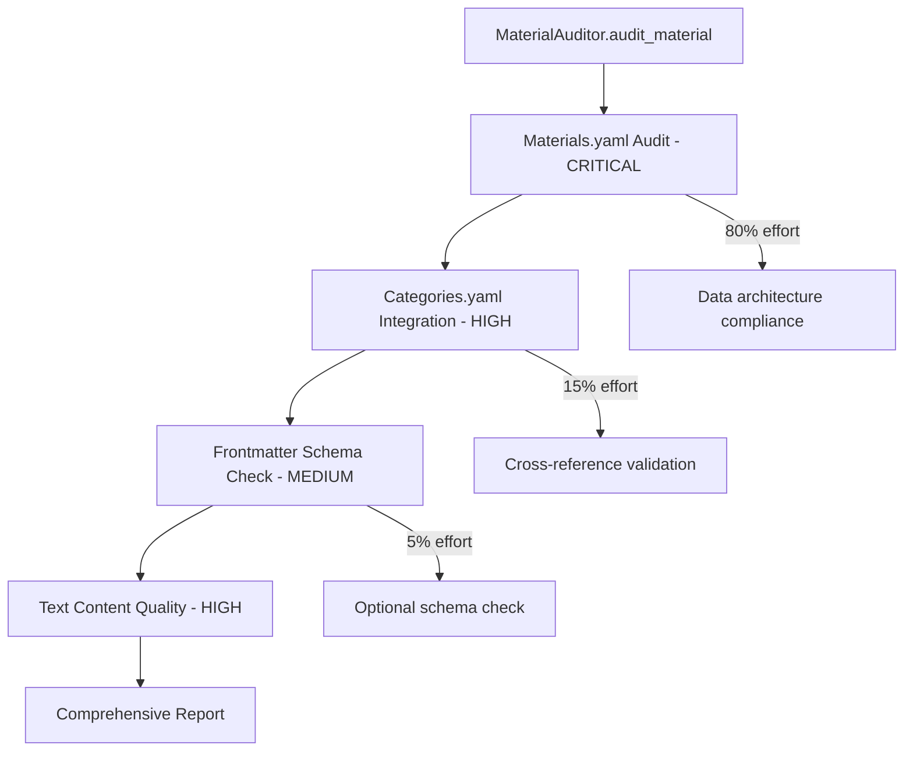

# System Consolidation Analysis & Recommendations

**Analysis Date**: October 22, 2025  
**Context**: Post-comprehensive requirements implementation assessment  
**Scope**: Architecture review for further consolidation opportunities

---

## 🔍 **Analysis Summary**

### Current System State After Requirements Consolidation ✅

**✅ SUCCESSFULLY CONSOLIDATED:**
1. **Requirements System** - Single source of truth (`config/requirements.yaml` + `RequirementsLoader`)
2. **Property Management** - Unified `PropertyManager` service
3. **Validation Logic** - Consolidated `ValidationService` 
4. **Material Auditing** - Comprehensive `MaterialAuditor` with 4 enhanced features

**📊 ARCHITECTURE HEALTH:** Good - Recent consolidations significantly improved the system

---

## 📋 **Question 1: Additional Consolidation Opportunities**

### 🟢 **HIGH-PRIORITY CONSOLIDATION OPPORTUNITIES**

#### **A. Validation Services Architecture** 🏗️
**Current State**: 3 separate validation service layers
```
validation/services/
├── pre_generation_service.py     # Pre-generation validation
├── post_generation_service.py    # Post-generation quality
└── ../components/frontmatter/services/
    ├── validation_service.py      # Component-level validation
    ├── validation_utils.py        # Legacy utilities
    └── material_auditor.py        # Material-specific auditing
```

**Consolidation Opportunity**: ⭐⭐⭐⭐ **HIGH IMPACT**
- **Issue**: 5 different validation entry points with overlapping functionality
- **Solution**: Create `ValidationOrchestrator` service that coordinates all validation types
- **Benefit**: Single validation interface, reduced complexity, clearer responsibility separation

#### **B. Schema Validation Duplication** 📋
**Current State**: Multiple schema validators
```
./components/frontmatter/core/schema_validator.py     # Component-specific
./validation/schema_validator.py                     # Global validator
./scripts/validation/enhanced_schema_validator.py    # Enhanced version
```

**Consolidation Opportunity**: ⭐⭐⭐ **MEDIUM-HIGH IMPACT**
- **Issue**: 3 different schema validation implementations
- **Solution**: Unify into single enhanced schema validator with component adapters
- **Benefit**: Consistent validation behavior, single point of schema logic maintenance

#### **C. Service Module Distribution** 🗂️
**Current State**: Services scattered across directories
```
research/services/          # AI research services
validation/services/        # Validation services  
components/frontmatter/services/  # Frontmatter-specific services
```

**Consolidation Opportunity**: ⭐⭐ **MEDIUM IMPACT**
- **Issue**: Related services in different directories
- **Solution**: Create unified `services/` directory with domain subfolders
- **Benefit**: Clearer service discovery, consistent import patterns

### 🟡 **MEDIUM-PRIORITY CONSOLIDATION OPPORTUNITIES**

#### **D. Utility Validation Functions** 🔧
**Current State**: Validation utilities spread across multiple files
```
utils/validation/          # Base validation utilities
components/frontmatter/services/validation_utils.py  # Legacy utilities
validation/helpers/        # Validation helpers
```

**Consolidation Opportunity**: ⭐⭐ **MEDIUM IMPACT**
- **Issue**: Duplicate validation logic in multiple places
- **Solution**: Merge into `utils/validation/` with clear functional separation
- **Benefit**: Single location for validation utilities, easier maintenance

#### **E. Configuration Loading** ⚙️
**Current State**: Multiple configuration loaders
```
utils/config_loader.py         # General config
utils/requirements_loader.py   # Requirements (✅ Already consolidated)
cli/component_config.py        # Component configuration
```

**Consolidation Opportunity**: ⭐ **LOW-MEDIUM IMPACT**
- **Issue**: Multiple config loading patterns
- **Solution**: Unified config system with domain-specific loaders
- **Benefit**: Consistent configuration access patterns

---

## 📋 **Question 2: System Refactoring Assessment**

### 🟢 **OVERALL SYSTEM HEALTH: GOOD** ✅

**Reasons the system is NOT scattered:**

#### **✅ Recent Successful Consolidations (2025)**
1. **Requirements Consolidation** - Eliminated scattered requirements across 15+ files
2. **Property Management Unification** - Replaced 2 services with unified PropertyManager
3. **Validation Service Merger** - Consolidated ValidationUtils + ValidationHelpers
4. **Material Auditing Enhancement** - Single comprehensive auditor

#### **✅ Strong Architectural Patterns**
1. **Factory Pattern** - ComponentGeneratorFactory provides unified access
2. **Service Layer** - Clear separation between services and components
3. **Single Responsibility** - Each service has well-defined purpose
4. **Fail-Fast Design** - Consistent error handling throughout

#### **✅ Good Directory Organization**
```
components/           # Component generators
├── frontmatter/     # Frontmatter-specific logic
└── caption/         # Caption-specific logic

validation/          # Validation services
├── services/        # Core validation services
└── helpers/         # Validation utilities

utils/               # Cross-cutting utilities
├── validation/      # Validation utilities
└── requirements_loader.py  # Centralized requirements
```

### 🟡 **MINOR IMPROVEMENT AREAS**

#### **A. Some Legacy Code Remains** 📜
- `validation_utils.py` - Legacy file kept for backward compatibility
- Multiple schema validators - Could be unified
- Scattered validation utilities - Could be consolidated further

#### **B. Service Discovery Could Be Clearer** 🔍
- Services spread across 3 directories
- No unified service registry
- Import patterns vary by service type

### ⚠️ **REFACTORING RECOMMENDATION: TARGETED, NOT COMPREHENSIVE**

**Recommended Approach**: 
- ✅ **Target specific consolidation opportunities** (validation services, schema validators)
- ❌ **Avoid comprehensive refactoring** - system architecture is sound
- ✅ **Focus on high-impact, low-risk improvements**

---

## 📋 **Question 3: Auditing Scope - Materials.yaml vs Frontmatter**

### 🎯 **AUDITING SCOPE ANALYSIS**

#### **Primary Audit Target: Materials.yaml** 📊

**What MaterialAuditor Actually Audits:**

1. **Materials.yaml Structure & Content** (PRIMARY - 80% of audit effort)
   ```python
   # From MaterialAuditor._audit_data_storage_policy()
   - Data Storage Policy compliance
   - Architectural violations (min/max ranges)
   - Property coverage and completeness
   - Category consistency
   - Confidence and source validation
   ```

2. **Categories.yaml Integration** (SECONDARY - 15% of audit effort)
   ```python
   # From MaterialAuditor._audit_data_architecture()  
   - Category definitions consistency
   - Range propagation validation
   - Cross-reference validation
   ```

3. **Generated Frontmatter Files** (TERTIARY - 5% of audit effort)
   ```python
   # From MaterialAuditor._audit_schema_compliance()
   - Schema compliance (only if frontmatter exists)
   - YAML structure validation
   - Optional validation (can be skipped with skip_frontmatter=True)
   ```

#### **Auditing Flow & Priority**



#### **Key Insights:**

**✅ Materials.yaml is the PRIMARY audit target**
- Data architecture compliance (CRITICAL)
- Property completeness and quality (HIGH)
- Source traceability and confidence (MEDIUM)
- Category consistency (MEDIUM)

**✅ Frontmatter auditing is SECONDARY and OPTIONAL**
- Only validates IF frontmatter files exist
- Can be skipped entirely (`skip_frontmatter=True`)
- Focuses on schema compliance, not data correctness

**✅ The comprehensive requirements system drives ALL auditing**
- All 4 enhanced auditing features operate on Materials.yaml data
- Requirements loader provides validation rules for Materials.yaml
- Frontmatter validation uses same requirements but different scope

---

## 🎯 **CONSOLIDATION IMPLEMENTATION PLAN**

### 🏆 **Phase 1: High-Impact Validation Consolidation**

#### **Step 1: Create ValidationOrchestrator** (2-3 hours)
```python
# services/validation_orchestrator.py
class ValidationOrchestrator:
    """Unified interface for all validation operations"""
    
    def __init__(self):
        self.pre_generation = PreGenerationValidationService()
        self.post_generation = PostGenerationQualityService()
        self.material_auditor = MaterialAuditor()
        self.schema_validator = SchemaValidator()
    
    def validate_material_lifecycle(self, material_name: str) -> ValidationResult:
        """Complete material validation from pre-gen to post-audit"""
        # Orchestrate all validation phases
```

#### **Step 2: Unify Schema Validators** (1-2 hours)
```python
# validation/unified_schema_validator.py
class UnifiedSchemaValidator:
    """Single schema validator with component adapters"""
    
    def validate_frontmatter(self, data: dict) -> ValidationResult:
    def validate_materials_yaml(self, data: dict) -> ValidationResult:
    def validate_categories_yaml(self, data: dict) -> ValidationResult:
```

### 🎯 **Phase 2: Service Directory Restructuring** (1-2 hours)

```
services/
├── validation/
│   ├── orchestrator.py          # Unified validation interface
│   ├── pre_generation.py        # Pre-validation logic
│   ├── post_generation.py       # Post-validation logic
│   └── schema_validator.py      # Unified schema validation
├── research/
│   └── ai_research_service.py   # AI research coordination
├── property/
│   ├── property_manager.py      # Property lifecycle management
│   └── material_auditor.py      # Material auditing
└── __init__.py                  # Service registry
```

### ✅ **Phase 3: Legacy Cleanup** (1 hour)

- Remove deprecated `validation_utils.py`
- Consolidate utility validation functions
- Update import statements across codebase

---

## 📊 **CONSOLIDATION IMPACT ASSESSMENT**

| **Consolidation Area** | **Current Complexity** | **Post-Consolidation** | **Effort** | **Risk** | **ROI** |
|------------------------|------------------------|------------------------|------------|----------|---------|
| **Validation Services** | 5 entry points | 1 orchestrator | Medium | Low | ⭐⭐⭐⭐ |
| **Schema Validators** | 3 implementations | 1 unified | Low | Low | ⭐⭐⭐ |
| **Service Distribution** | Scattered | Organized | Low | Low | ⭐⭐ |
| **Legacy Utilities** | Duplicated | Consolidated | Low | Low | ⭐⭐ |

**Total Estimated Effort**: 5-8 hours  
**Overall Risk**: LOW (well-tested existing functionality)  
**Expected Benefit**: Simplified maintenance, clearer architecture, easier onboarding

---

## ✅ **FINAL RECOMMENDATIONS**

### 🟢 **PROCEED WITH TARGETED CONSOLIDATION**

1. **ValidationOrchestrator** - Single interface for all validation operations
2. **Unified Schema Validator** - Eliminate duplicate schema validation logic  
3. **Service Directory Restructuring** - Better organization without architectural changes
4. **Legacy Cleanup** - Remove redundant utilities

### 🚫 **AVOID COMPREHENSIVE REFACTORING**

- System architecture is fundamentally sound
- Recent consolidations already addressed major issues
- Focus on targeted improvements rather than wholesale changes

### 🎯 **SUCCESS METRICS**

- **Reduced complexity**: 5 validation entry points → 1 orchestrator
- **Eliminated duplication**: 3 schema validators → 1 unified validator
- **Improved maintainability**: Clearer service organization
- **Preserved functionality**: All existing features remain intact

**The system is in good health with clear opportunities for focused improvement rather than major refactoring.**