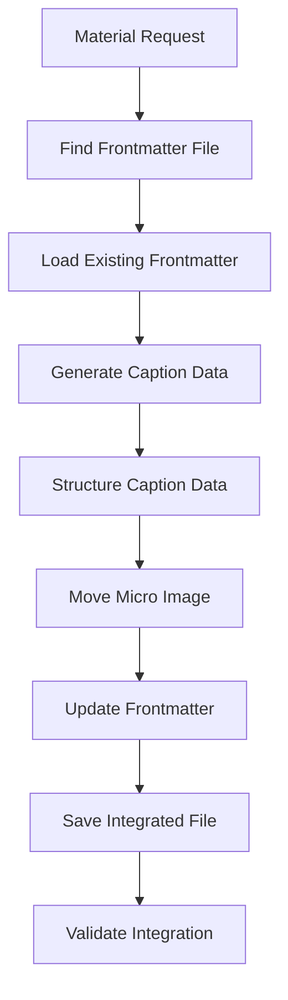

# Caption Frontmatter Integration - Complete Documentation

## 📋 Overview

The Z-Beam Generator now features **integrated caption generation** that embeds caption data directly into frontmatter files instead of creating separate YAML files. 

This fundamental architectural change provides several key improvements:

### ✅ Key Benefits

- **Single Source of Truth**: All material data consolidated in one file
- **Micro Image Reorganization**: Caption-specific micro images moved to `caption.imageUrl`
- **Structured Data Output**: Eliminates YAML parsing issues
- **Fail-Fast Architecture**: Comprehensive validation and error handling
- **Data Integrity**: Validation rules ensure proper structure

### 🎯 Problem Solved

Previously, caption data was stored in separate YAML files, leading to:
- ❌ Data fragmentation across multiple files
- ❌ Complex YAML parsing requirements
- ❌ Image organization inconsistencies
- ❌ Maintenance overhead

Now, everything is centralized and properly structured.

## 🏗️ Architecture Changes

### 1. Removed YAML Generation from Caption Generator

#### Before: Multi-Document YAML Output
The old caption generator created complex multi-document YAML strings:

```python
# OLD: Generated YAML string output
yaml_content = f"""---
before_text: |
  {ai_content['before_text']}
after_text: |
  {ai_content['after_text']}
---"""
return self._create_result(yaml_content, success=True)
```

#### After: Structured Data Output
The new generator returns clean structured data for direct integration:

```python
# NEW: Returns structured data for frontmatter integration
caption_data = {
    "beforeText": ai_content['before_text'],
    "afterText": ai_content['after_text'],
    "technicalAnalysis": {...},
    "generation": {...},
    "imageUrl": micro_image
}
return ComponentResult(
    component_type="caption",
    content=caption_data,  # Structured data, not YAML
    success=True
)
```

#### Benefits of This Change
- ✅ **No YAML Parsing**: Direct data transfer eliminates parsing errors
- ✅ **Cleaner Integration**: Seamless embedding into frontmatter
- ✅ **Better Validation**: Structured data enables comprehensive validation
- ✅ **Maintainability**: Easier to debug and extend

### 2. New Caption Frontmatter Integration Workflow

The integration follows a clear, step-by-step process:



#### Process Details
1. **File Discovery**: Locates frontmatter files using multiple path strategies
2. **Data Loading**: Safely loads existing frontmatter without data loss
3. **AI Generation**: Creates caption content using DeepSeek API
4. **Data Structuring**: Organizes content into proper frontmatter format
5. **Image Organization**: Moves micro images to caption-specific location
6. **Integration**: Embeds caption data under `caption` key
7. **Backup & Save**: Creates backup before saving updated frontmatter
8. **Validation**: Ensures data integrity and structure compliance

## 📁 File Structure Changes

### Before Integration: Fragmented Files
```
content/components/
├── frontmatter/
│   └── aluminum-laser-cleaning.yaml
└── caption/
    └── aluminum-laser-cleaning.yaml  # ❌ Separate file
```

**Problems with Old Structure:**
- Data scattered across multiple files
- Synchronization challenges
- Increased maintenance overhead
- Risk of inconsistencies

### After Integration: Unified Structure
```
content/components/
└── frontmatter/
    └── aluminum-laser-cleaning.yaml  # ✅ Contains embedded caption
```

**Benefits of New Structure:**
- ✅ Single source of truth for all material data
- ✅ Simplified file management
- ✅ Automatic data consistency
- ✅ Easier backup and version control

## 🔧 New Components

### 1. FrontmatterCaptionGenerator

#### Overview
**Location**: `components/caption/generators/frontmatter_generator.py`

**Purpose**: Enhanced caption generator that returns structured data for frontmatter integration

#### Key Features
- **Inherited Logic**: Preserves all AI generation logic from original generator
- **Structured Output**: Returns data objects instead of YAML strings
- **Backward Compatibility**: Maintains compatibility with `return_structured_data` parameter
- **Image Handling**: Automatically detects and includes micro images

#### Usage Example
```python
from components.caption.generators.frontmatter_generator import FrontmatterCaptionGenerator

generator = FrontmatterCaptionGenerator()
result = generator.generate_for_frontmatter(
    material_name="Aluminum",
    material_data={"name": "Aluminum", "category": "Metal"},
    api_client=api_client,
    frontmatter_data=frontmatter_data
)

# result.content contains structured caption data
caption_data = result.content
```

---

### 2. CaptionFrontmatterIntegrator

#### Overview
**Location**: `scripts/generate_caption_to_frontmatter.py`

**Purpose**: Complete integration script that generates captions and embeds them in frontmatter

#### Key Features
- **Multi-Path Discovery**: Finds frontmatter files using multiple path strategies
- **AI Integration**: Uses new structured generator for content creation
- **Image Reorganization**: Moves micro images from `images.micro` to `caption.imageUrl`
- **Data Preservation**: Maintains all existing frontmatter data
- **Safety First**: Creates backups before any modifications
- **Tracking**: Updates metadata to track integration status

#### Usage Examples
```bash
# Generate caption for single material
python3 scripts/generate_caption_to_frontmatter.py --material "Aluminum"

# Process all materials with frontmatter
python3 scripts/generate_caption_to_frontmatter.py --all

# List available materials
python3 scripts/generate_caption_to_frontmatter.py --list
```

---

### 3. Caption Integration Validator

#### Overview
**Location**: `validation/caption_integration_validator.py`

**Purpose**: Comprehensive validation system for caption integration

#### Key Features
- **Structure Validation**: Ensures all required caption fields are present
- **Image Validation**: Checks proper micro image reorganization
- **Technical Analysis**: Validates technical analysis structure
- **Metadata Verification**: Confirms generation metadata is correct
- **Quality Standards**: Checks content meets quality requirements
- **Detailed Reporting**: Provides comprehensive validation reports

#### Usage Examples
```bash
# Validate all frontmatter files
python3 validation/caption_integration_validator.py

# Programmatic validation
from validation.caption_integration_validator import validate_frontmatter_file
report = validate_frontmatter_file(Path("aluminum-laser-cleaning.yaml"))
```

## Frontmatter Structure

### New Caption Structure
```yaml
---
name: Aluminum
category: Metal
# ... existing frontmatter fields ...

# NEW: Integrated caption data
caption:
  beforeText: "Detailed surface analysis before cleaning..."
  afterText: "Post-cleaning surface analysis showing..."
  description: "Microscopic analysis of aluminum surface"
  alt: "Microscopic view of aluminum surface"
  technicalAnalysis:
    focus: "surface_analysis"
    uniqueCharacteristics: ["aluminum_specific"]
    contaminationProfile: "aluminum surface contamination"
  microscopy:
    parameters: "SEM analysis parameters"
    qualityMetrics: "Surface improvement metrics"
  generation:
    method: "frontmatter_integrated_generation"
    timestamp: "2025-09-30T18:43:03Z"
    generator: "FrontmatterCaptionGenerator"
    componentType: "ai_caption_frontmatter"
  author: "Todd Dunning"
  materialProperties:
    materialType: "Metal"
    analysisMethod: "ai_microscopy"
  imageUrl: "/images/aluminum-laser-cleaning-micro.jpg"  # ✅ Moved from images.micro

# Images section updated
images:
  hero: "/images/aluminum-laser-cleaning-hero.jpg"  # ✅ Preserved
  # micro: removed - now in caption.imageUrl

# Integration metadata
metadata:
  lastUpdated: "2025-09-30T18:43:21Z"
  captionIntegrated: true
---
```

## Testing

### Comprehensive Test Suite
**Location**: `tests/test_caption_frontmatter_integration.py`

**Test Coverage**:
- ✅ Structured data generation
- ✅ Frontmatter file loading/saving
- ✅ Micro image reorganization
- ✅ File discovery mechanisms
- ✅ API client initialization
- ✅ Error handling scenarios
- ✅ Backward compatibility
- ✅ Edge cases and validation
- ✅ Data integrity preservation

**Running Tests**:
```bash
# Run all integration tests
python3 -m pytest tests/test_caption_frontmatter_integration.py -v

# Run specific test
python3 -m pytest tests/test_caption_frontmatter_integration.py::TestCaptionFrontmatterIntegration::test_micro_image_reorganization -v
```

## Validation Rules

### Required Caption Fields
- `beforeText`: Pre-cleaning surface description
- `afterText`: Post-cleaning surface description  
- `description`: Overall caption description
- `alt`: Alt text for accessibility
- `technicalAnalysis`: Technical analysis structure
- `generation`: Generation metadata
- `author`: Author information
- `materialProperties`: Material classification

### Technical Analysis Structure
- `focus`: Analysis focus area
- `uniqueCharacteristics`: List of unique characteristics
- `contaminationProfile`: Contamination profile description

### Generation Metadata
- `method`: Must be "frontmatter_integrated_generation"
- `timestamp`: ISO 8601 timestamp
- `generator`: Generator class name
- `componentType`: Must be "ai_caption_frontmatter"

### Integration Validation
- ❌ Micro image must NOT exist in `images.micro`
- ✅ Caption must have `imageUrl` if material has images
- ✅ Hero image must be preserved in `images.hero`
- ✅ Integration metadata must be present
- ✅ Content must meet quality standards (length, no placeholders)

## Migration Strategy

### For Existing Materials

1. **Use Integration Script**:
   ```bash
   python3 scripts/generate_caption_to_frontmatter.py --material "MaterialName"
   ```

2. **Batch Processing**:
   ```bash
   python3 scripts/generate_caption_to_frontmatter.py --all
   ```

3. **Validation**:
   ```bash
   python3 validation/caption_integration_validator.py
   ```

### For New Materials

The integration happens automatically when:
- Frontmatter files exist
- Caption generation is requested through the new system
- API client is available for AI generation

## Benefits

### 1. **Eliminated YAML Parsing Issues**
- No more multi-document YAML parsing errors
- Structured data flows directly from generator to frontmatter
- Cleaner integration with existing orchestration systems

### 2. **Improved Data Organization**
- Caption-specific micro images properly organized under `caption.imageUrl`
- Hero images preserved in main `images` section
- Single source of truth for all material data

### 3. **Enhanced Validation**
- Comprehensive validation rules ensure data integrity
- Real-time validation during generation
- Detailed reporting for troubleshooting

### 4. **Better Testing Coverage**
- Unit tests for all components
- Integration tests for complete workflows
- Edge case handling and error scenarios

### 5. **Maintainable Architecture**
- Clear separation of concerns
- Backward compatibility preserved
- Fail-fast design principles maintained

## Usage Examples

### Generate Caption for Single Material
```bash
python3 scripts/generate_caption_to_frontmatter.py --material "Steel"
```

### Process All Materials
```bash
python3 scripts/generate_caption_to_frontmatter.py --all
```

### Validate Integration
```bash
python3 validation/caption_integration_validator.py
```

### Check Available Materials
```bash
python3 scripts/generate_caption_to_frontmatter.py --list
```

## Troubleshooting

### Common Issues

1. **Missing Frontmatter File**
   ```
   ❌ No frontmatter file found for MaterialName
   ```
   **Solution**: Ensure frontmatter file exists in `content/components/frontmatter/`

2. **API Client Initialization Failed**
   ```
   ❌ Failed to initialize API client: [error]
   ```
   **Solution**: Check API keys in `.env` file

3. **Caption Generation Failed**
   ```
   ❌ Caption generation failed: [error]
   ```
   **Solution**: Check API connectivity and frontmatter data validity

4. **Validation Errors**
   ```
   ❌ Missing required caption field: beforeText
   ```
   **Solution**: Re-run caption generation to ensure complete data structure

### Validation Report Interpretation

```bash
🔍 Running Caption Integration Validation
📊 Processed 122 files
✅ Valid: 1        # Files with proper caption integration
❌ Errors: 121     # Files missing caption integration
⚠️  Warnings: 121  # Files with minor issues
📈 Validation Rate: 0.8%
```

This indicates:
- Only 1 file has been processed with the new integration
- 121 files still need caption integration
- Use batch processing to integrate remaining files

## Performance

### Generation Times
- **Single Material**: ~18-20 seconds (API generation + processing)
- **Batch Processing**: ~120 seconds per material (API rate limits)
- **Validation**: <1 second per file

### File Size Impact
- **Frontmatter File Growth**: +2,500-4,000 characters per caption
- **Eliminated Files**: No more separate caption YAML files
- **Net Impact**: Reduced total file count, centralized data

## Future Enhancements

### Planned Improvements
1. **Parallel Processing**: Speed up batch operations
2. **Incremental Updates**: Only regenerate changed captions
3. **Quality Scoring**: AI detection integration for caption content
4. **Template Customization**: Customizable caption templates per material category
5. **Export Options**: Export integrated data to different formats

This documentation provides complete coverage of the new caption frontmatter integration system, ensuring developers can understand, use, and maintain the enhanced architecture.