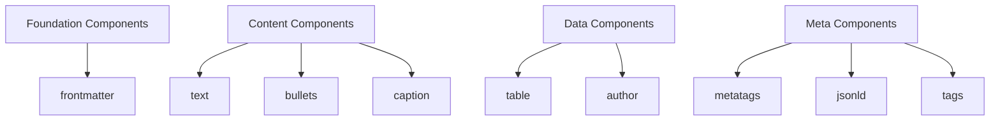
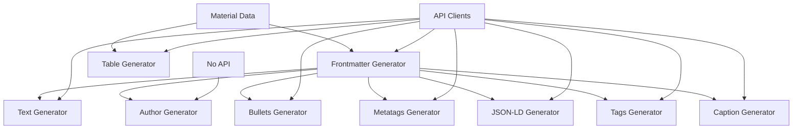

# Component System Architecture

**📋 Complete component interaction and system architecture documentation**  
**🎯 Scope**: Component lifecycle, dependencies, and interaction patterns  
**🏗️ Architecture**: Modular, dependency-aware, factory-based generation system  

---

## 🧩 Component System Overview

### Core Concepts

The Z-Beam Generator uses a **modular component architecture** where each component generates a specific type of content. Components are:

- **Independent**: Each component has its own generator class
- **Dependency-Aware**: Some components require others (frontmatter → all others)
- **Factory-Created**: All components instantiated through ComponentGeneratorFactory
- **API-Integrated**: Most components use external APIs for content generation
- **File-Output**: Each component produces structured output files

### Component Types



---

## 📦 Component Catalog

### Foundation Components

#### Frontmatter Component
- **Purpose**: YAML metadata foundation for all content
- **Dependencies**: None (foundation component)
- **API Required**: ✅ DeepSeek/Grok
- **Output**: `{material}-laser-cleaning.md`
- **Role**: Provides structured data for all dependent components

```yaml
# Example Output
---
title: "Aluminum Laser Cleaning: Precision Surface Treatment"
material: "aluminum"
author_object:
  id: 3
  name: "Ikmanda Roswati"
  expertise: "Ultrafast Laser Physics"
properties:
  density: 2.70
  melting_point: 660.3
---
```

### Content Components

#### Text Component
- **Purpose**: Main technical content and articles
- **Dependencies**: ✅ Frontmatter (author information)
- **API Required**: ✅ DeepSeek/Grok
- **Output**: `{material}-laser-cleaning.md`
- **Features**: Multi-layer prompts, author personas, optimization

#### Bullets Component
- **Purpose**: Key points and highlights
- **Dependencies**: ✅ Frontmatter (material context)
- **API Required**: ✅ DeepSeek/Grok
- **Output**: `{material}-laser-cleaning.yaml`

#### Caption Component
- **Purpose**: Image captions and descriptions
- **Dependencies**: ✅ Frontmatter (material context)
- **API Required**: ✅ DeepSeek/Grok
- **Output**: `{material}-laser-cleaning.yaml`

### Data Components

#### Table Component
- **Purpose**: Material properties table
- **Dependencies**: ❌ None (uses material data directly)
- **API Required**: ✅ DeepSeek/Grok
- **Output**: `{material}-laser-cleaning.yaml`
- **Features**: Min/max calculations, property categorization

#### Author Component
- **Purpose**: Author information and profiles
- **Dependencies**: ✅ Frontmatter (author_object extraction)
- **API Required**: ❌ None (frontmatter-only)
- **Output**: `{material}-laser-cleaning.yaml`
- **Features**: Pure data transformation, no API calls

### Meta Components

#### Metatags Component
- **Purpose**: HTML meta tags for SEO
- **Dependencies**: ✅ Frontmatter (title, description)
- **API Required**: ✅ DeepSeek/Grok
- **Output**: `{material}-laser-cleaning.yaml`

#### JSON-LD Component
- **Purpose**: Structured data for search engines
- **Dependencies**: ✅ Frontmatter (material context)
- **API Required**: ✅ DeepSeek/Grok
- **Output**: `{material}-laser-cleaning.yaml`

---

## 🔄 Component Lifecycle

### 1. Component Discovery & Registration

```python
# ComponentGeneratorFactory maintains component registry
class ComponentGeneratorFactory:
    _generators = {
        'frontmatter': FrontmatterGenerator,
        'text': TextGenerator,
        'table': TableGenerator,
        'author': AuthorGenerator,
        'bullets': BulletsGenerator,
        'metatags': MetatagsGenerator,
        'jsonld': JsonldGenerator,
        'caption': CaptionGenerator,
    }
```

### 2. Component Instantiation

```python
# Factory pattern for component creation
def create_generator(component_type):
    if component_type not in cls._generators:
        raise ComponentError(f"No generator found for component type: {component_type}")
    
    generator_class = cls._generators[component_type]
    return generator_class()
```

### 3. Dependency Resolution

```python
# Dependency graph for generation order
dependencies = {
    'frontmatter': [],  # Foundation - no dependencies
    'author': ['frontmatter'],  # Needs frontmatter author_object
    'text': ['frontmatter'],    # Needs frontmatter author info
    'bullets': ['frontmatter'], # Needs frontmatter context
    'table': [],               # Independent - uses material data
    'metatags': ['frontmatter'], # Needs frontmatter title/description
    'jsonld': ['frontmatter'],   # Needs frontmatter context
    'tags': ['frontmatter'],     # Needs frontmatter context
    'caption': ['frontmatter'],  # Needs frontmatter context
}
```

### 4. Generation Execution

```python
# Generation process with dependency awareness
def generate_components(material_name, requested_components):
    # 1. Resolve dependencies
    ordered_components = resolve_dependencies(requested_components)
    
    # 2. Generate foundation components first
    frontmatter_data = None
    if 'frontmatter' in ordered_components:
        frontmatter_data = generate_frontmatter(material_name)
    
    # 3. Generate dependent components
    for component_type in ordered_components:
        if component_type == 'frontmatter':
            continue  # Already generated
        
        generate_component(component_type, material_name, frontmatter_data)
```

---

## 🔗 Component Dependencies

### Dependency Patterns

#### Pattern 1: Foundation Dependency (Most Common)
```python
# Most components depend on frontmatter
text_generator.generate(
    material_name="aluminum",
    material_data=material_data,
    frontmatter_data=frontmatter_data  # Required dependency
)
```

#### Pattern 2: Independent Generation
```python
# Some components use material data directly
table_generator.generate(
    material_name="aluminum",
    material_data=material_data
    # No frontmatter dependency
)
```

#### Pattern 3: Data-Only Transformation
```python
# Author component extracts from frontmatter only
author_generator.generate(
    material_name="aluminum",
    material_data=material_data,
    frontmatter_data=frontmatter_data  # Source of author_object
)
```

### Dependency Graph



---

## 🏭 Component Generator Interface

### Standard Generator Interface

```python
class ComponentGenerator(ABC):
    """Base interface for all component generators."""
    
    @abstractmethod
    def generate(self, material_name: str, material_data: dict, **kwargs) -> ComponentResult:
        """Generate component content.
        
        Args:
            material_name: Name of the material (e.g., "aluminum")
            material_data: Material properties and data
            **kwargs: Component-specific arguments (e.g., frontmatter_data)
        
        Returns:
            ComponentResult with success status, content, and metadata
        """
        pass
    
    def validate_inputs(self, material_name: str, material_data: dict) -> None:
        """Validate required inputs before generation."""
        if not material_name:
            raise ValidationError("Material name is required")
        if not material_data:
            raise ValidationError("Material data is required")
```

### Component Result Standard

```python
@dataclass
class ComponentResult:
    """Standard result object for component generation."""
    success: bool
    content: str
    metadata: dict
    error_message: Optional[str] = None
    generation_time: Optional[float] = None
    api_provider: Optional[str] = None
    
    def to_dict(self) -> dict:
        """Convert result to dictionary for logging/analysis."""
        return {
            'success': self.success,
            'content_length': len(self.content) if self.content else 0,
            'metadata': self.metadata,
            'error_message': self.error_message,
            'generation_time': self.generation_time,
            'api_provider': self.api_provider
        }
```

---

## 🔧 Component Implementation Examples

### Foundation Component: Frontmatter

```python
class FrontmatterGenerator(ComponentGenerator):
    """Generates YAML frontmatter metadata."""
    
    def __init__(self, api_client=None):
        if not api_client:
            raise ConfigurationError("API client required for frontmatter generation")
        self.api_client = api_client
    
    def generate(self, material_name: str, material_data: dict, **kwargs) -> ComponentResult:
        """Generate frontmatter YAML."""
        self.validate_inputs(material_name, material_data)
        
        # Construct prompt for frontmatter generation
        prompt = self._build_frontmatter_prompt(material_name, material_data)
        
        # API call for content generation
        try:
            response = self.api_client.generate_content(prompt)
            frontmatter_yaml = self._extract_yaml(response)
            
            return ComponentResult(
                success=True,
                content=frontmatter_yaml,
                metadata={'material': material_name, 'type': 'frontmatter'},
                api_provider=self.api_client.provider_name
            )
        except Exception as e:
            return ComponentResult(
                success=False,
                content="",
                metadata={},
                error_message=f"Frontmatter generation failed: {e}"
            )
```

### Dependent Component: Text

```python
class TextGenerator(ComponentGenerator):
    """Generates main text content using frontmatter author information."""
    
    def generate(self, material_name: str, material_data: dict, frontmatter_data=None, **kwargs) -> ComponentResult:
        """Generate text content with author persona."""
        self.validate_inputs(material_name, material_data)
        
        if not frontmatter_data:
            raise ValidationError(
                "Frontmatter data is required for text generation - "
                "generate frontmatter component first"
            )
        
        # Extract author information from frontmatter
        author_info = frontmatter_data.get('author_object')
        if not author_info:
            raise ValidationError("No author_object found in frontmatter data")
        
        # Multi-layer prompt construction
        prompt = self._build_layered_prompt(material_name, material_data, author_info)
        
        # Generate content with author persona
        return self._generate_with_persona(prompt, author_info)
```

### Data-Only Component: Author

```python
class AuthorComponentGenerator(ComponentGenerator):
    """Generates author information from frontmatter data only."""
    
    def generate(self, material_name: str, material_data: dict, frontmatter_data=None, **kwargs) -> ComponentResult:
        """Generate author YAML from frontmatter author_object."""
        self.validate_inputs(material_name, material_data)
        
        if not frontmatter_data:
            raise ValidationError("Frontmatter data is required - fail-fast architecture")
        
        author_object = frontmatter_data.get('author_object')
        if not author_object:
            raise ValidationError("No author_object found in frontmatter data")
        
        # Pure data transformation - no API calls
        author_yaml = self._create_author_yaml(author_object, material_name)
        
        return ComponentResult(
            success=True,
            content=author_yaml,
            metadata={'material': material_name, 'type': 'author'},
            api_provider='none'  # No API used
        )
```

---

## 🔄 Component Interaction Patterns

### Pattern 1: Sequential Generation with Dependencies

```python
def generate_sequential(material_name, components):
    """Generate components in dependency order."""
    results = {}
    
    # Generate frontmatter first (foundation)
    if needs_frontmatter(components):
        frontmatter_result = generate_component('frontmatter', material_name)
        results['frontmatter'] = frontmatter_result
        frontmatter_data = parse_frontmatter(frontmatter_result.content)
    
    # Generate dependent components
    for component_type in components:
        if component_type == 'frontmatter':
            continue
        
        result = generate_component(
            component_type, 
            material_name, 
            frontmatter_data=frontmatter_data
        )
        results[component_type] = result
    
    return results
```

### Pattern 2: Parallel Generation with Shared Dependencies

```python
async def generate_parallel(material_name, components):
    """Generate independent components in parallel."""
    # Generate foundation components first
    frontmatter_data = None
    if needs_frontmatter(components):
        frontmatter_result = await generate_component('frontmatter', material_name)
        frontmatter_data = parse_frontmatter(frontmatter_result.content)
    
    # Generate dependent components in parallel
    dependent_components = [c for c in components if c != 'frontmatter']
    tasks = [
        generate_component(comp, material_name, frontmatter_data=frontmatter_data)
        for comp in dependent_components
    ]
    
    results = await asyncio.gather(*tasks)
    return dict(zip(dependent_components, results))
```

### Pattern 3: Conditional Generation

```python
def generate_conditional(material_name, components, conditions):
    """Generate components based on conditions."""
    results = {}
    
    for component_type in components:
        # Check if component should be generated
        if not should_generate_component(component_type, conditions):
            continue
        
        # Check dependencies
        if requires_frontmatter(component_type) and 'frontmatter' not in results:
            frontmatter_result = generate_component('frontmatter', material_name)
            results['frontmatter'] = frontmatter_result
        
        # Generate component
        result = generate_component(component_type, material_name, results)
        results[component_type] = result
    
    return results
```

---

## 📁 File Organization & Output Structure

### Output Directory Structure

```
content/components/
├── frontmatter/              # Foundation metadata
│   ├── aluminum-laser-cleaning.md
│   ├── steel-laser-cleaning.md
│   └── copper-laser-cleaning.md
├── text/                     # Main content
│   ├── aluminum-laser-cleaning.md
│   ├── steel-laser-cleaning.md
│   └── copper-laser-cleaning.md
├── table/                    # Properties tables
│   ├── aluminum-laser-cleaning.yaml
│   ├── steel-laser-cleaning.yaml
│   └── copper-laser-cleaning.yaml
├── author/                   # Author information
│   ├── aluminum-laser-cleaning.yaml
│   ├── steel-laser-cleaning.yaml
│   └── copper-laser-cleaning.yaml
└── [other components]/
```

### File Naming Convention

```python
def get_output_filename(material_name: str, component_type: str) -> str:
    """Generate standardized output filename."""
    # Normalize material name (handle spaces, special characters)
    normalized_name = material_name.lower().replace(' ', '-').replace('_', '-')
    
    # Determine file extension
    extension = '.md' if component_type in ['frontmatter', 'text'] else '.yaml'
    
    # Construct filename
    return f"{normalized_name}-laser-cleaning{extension}"
```

---

## 🔍 Component Monitoring & Debugging

### Component Generation Metrics

```python
class ComponentMetrics:
    """Tracks component generation performance and success rates."""
    
    def __init__(self):
        self.generation_times = defaultdict(list)
        self.success_rates = defaultdict(list)
        self.error_counts = defaultdict(int)
    
    def record_generation(self, component_type: str, result: ComponentResult):
        """Record component generation metrics."""
        self.generation_times[component_type].append(result.generation_time)
        self.success_rates[component_type].append(result.success)
        
        if not result.success:
            self.error_counts[component_type] += 1
    
    def get_component_stats(self, component_type: str) -> dict:
        """Get statistics for specific component type."""
        times = self.generation_times[component_type]
        successes = self.success_rates[component_type]
        
        return {
            'avg_generation_time': sum(times) / len(times) if times else 0,
            'success_rate': sum(successes) / len(successes) if successes else 0,
            'total_errors': self.error_counts[component_type],
            'total_generations': len(successes)
        }
```

### Component Debugging Tools

```python
def debug_component_generation(component_type: str, material_name: str):
    """Debug component generation with detailed logging."""
    logger.info(f"🔍 Debugging {component_type} generation for {material_name}")
    
    # Check component registration
    if component_type not in ComponentGeneratorFactory._generators:
        logger.error(f"❌ Component type '{component_type}' not registered")
        return
    
    # Check dependencies
    dependencies = get_component_dependencies(component_type)
    logger.info(f"📋 Dependencies: {dependencies}")
    
    # Check material data
    material_data = load_material_data(material_name)
    if not material_data:
        logger.error(f"❌ No material data found for '{material_name}'")
        return
    
    # Attempt generation with detailed logging
    try:
        generator = ComponentGeneratorFactory.create_generator(component_type)
        logger.info(f"✅ Generator created: {type(generator)}")
        
        result = generator.generate(material_name, material_data)
        logger.info(f"📊 Generation result: {result.to_dict()}")
        
    except Exception as e:
        logger.error(f"💥 Generation failed: {e}")
        import traceback
        logger.error(traceback.format_exc())
```

---

## 🚀 Performance Optimization

### Component Caching Strategy

```python
class ComponentCache:
    """Caches component generation results to avoid redundant API calls."""
    
    def __init__(self):
        self.cache = {}
        self.cache_hits = 0
        self.cache_misses = 0
    
    def get_cache_key(self, component_type: str, material_name: str, 
                     material_data: dict) -> str:
        """Generate cache key for component result."""
        material_hash = hashlib.md5(str(material_data).encode()).hexdigest()[:8]
        return f"{component_type}:{material_name}:{material_hash}"
    
    def get_cached_result(self, cache_key: str) -> Optional[ComponentResult]:
        """Get cached result if available."""
        if cache_key in self.cache:
            self.cache_hits += 1
            return self.cache[cache_key]
        
        self.cache_misses += 1
        return None
    
    def cache_result(self, cache_key: str, result: ComponentResult):
        """Cache component generation result."""
        if result.success:
            self.cache[cache_key] = result
```

### Batch Generation Optimization

```python
async def generate_batch_optimized(materials: List[str], components: List[str]):
    """Optimized batch generation with parallelization and caching."""
    
    # Group by dependency requirements
    foundation_components = [c for c in components if c == 'frontmatter']
    dependent_components = [c for c in components if c != 'frontmatter']
    
    results = {}
    
    # Generate foundation components for all materials first
    if foundation_components:
        foundation_tasks = [
            generate_component('frontmatter', material)
            for material in materials
        ]
        foundation_results = await asyncio.gather(*foundation_tasks)
        
        for material, result in zip(materials, foundation_results):
            results[(material, 'frontmatter')] = result
    
    # Generate dependent components in parallel
    dependent_tasks = []
    for material in materials:
        frontmatter_data = parse_frontmatter(results[(material, 'frontmatter')].content)
        for component_type in dependent_components:
            task = generate_component(
                component_type, 
                material, 
                frontmatter_data=frontmatter_data
            )
            dependent_tasks.append((material, component_type, task))
    
    # Execute all dependent generations in parallel
    task_results = await asyncio.gather(*[task for _, _, task in dependent_tasks])
    
    # Store results
    for (material, component_type, _), result in zip(dependent_tasks, task_results):
        results[(material, component_type)] = result
    
    return results
```

---

**🧩 Component Architecture**: Modular, dependency-aware, factory-based system  
**🔗 Key Pattern**: Foundation components enable dependent component generation  
**🚀 Performance**: Caching, parallelization, and batch optimization strategies
