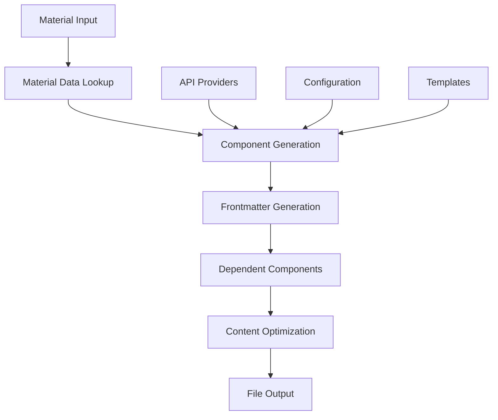
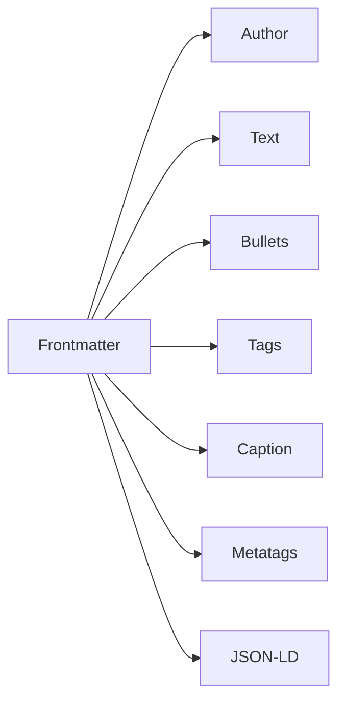
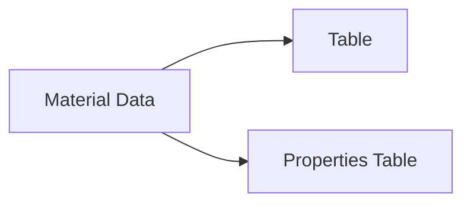

# Data Flow Architecture

**📋 Complete data flow documentation for Z-Beam Generator**  
**🎯 Scope**: End-to-end data movement through the generation pipeline  
**🏗️ Architecture**: Fail-fast, component-based, API-dependent system  

---

## 🌊 High-Level Data Flow Overview



### Core Data Movement Principles

1. **Material-Centric**: All data flows start with material selection
2. **Component Dependencies**: Frontmatter → all other components  
3. **API-Driven**: Most components require external API calls
4. **Fail-Fast**: Invalid data stops pipeline immediately
5. **File-Based Output**: All components generate files in structured directories

---

## 🔄 Detailed Data Flow Stages

### Stage 1: Input Processing & Validation

#### 1.1 Material Input Resolution
```python
# Input Sources
CLI Input: --material "Aluminum"
Batch Mode: All materials from Materials.yaml
Custom List: --materials "Steel,Copper,Aluminum"

# Material Validation Process
Materials.yaml → Material Database Load → Validation → Selection
```

**Data Flow**:
```
User Input → Argument Parser → Material Validator → Material Object
```

**Key Files**:
- `cli/argument_parser.py` - Command line processing
- `data/Materials.yaml` - Material database
- `data/materials.py` - Material data access layer

#### 1.2 Component Selection & Validation
```python
# Component Selection Logic
Default: All available components
Explicit: --components "frontmatter,text,table"  
Exclusion: --exclude "author,caption"

# Component Dependency Resolution
frontmatter → Required for: author, text, table, bullets, metatags, jsonld, tags, caption
```

**Data Flow**:
```
Component Input → Component Registry → Dependency Graph → Generation Order
```

### Stage 2: Configuration & API Setup

#### 2.1 Configuration Loading
```python
# Configuration Sources (Priority Order)
1. Command Line Arguments (--provider, --ai-detector)
2. Environment Variables (.env file)
3. Configuration Files (config/*.yaml)
4. System Defaults (hardcoded fallbacks)
```

**Data Flow**:
```
.env File → Environment Loader → API Key Manager → Client Factory → API Clients
```

**Key Files**:
- `api/env_loader.py` - Environment variable processing
- `api/key_manager.py` - API key management  
- `api/client_factory.py` - API client creation
- `config/` - Configuration files

#### 2.2 API Client Initialization
```python
# API Client Setup Process
API Keys → Client Configuration → Connection Testing → Client Pool
```

**Provider Types**:
- **Content Generation**: DeepSeek (primary), Grok (fallback)
- **AI Detection**: Winston.ai (with bias correction), GPTZero (fallback)
- **Caching**: Redis (optional), File-based (default)

### Stage 3: Component Generation Pipeline

#### 3.1 Frontmatter Generation (Foundation Component)
```python
# Frontmatter Data Flow
Material Object → Template Loading → API Call (DeepSeek/Grok) → YAML Generation → File Write
```

**Process**:
```
Material Data:
{
  "name": "Aluminum",
  "density": 2.70,
  "melting_point": 660.3,
  "properties": {...}
}

↓ API Processing ↓

Frontmatter YAML:
---
title: "Aluminum Laser Cleaning"
material: "aluminum"
author_object:
  id: 3
  name: "Ikmanda Roswati"
  expertise: "Ultrafast Laser Physics"
properties:
  density: 2.70
  melting_point: 660.3
---
```

**Output**: `content/components/frontmatter/{material}-laser-cleaning.md`

#### 3.2 Dependent Component Generation
Once frontmatter exists, other components can generate in parallel:

##### Text Component Data Flow
```python
# Text Generation Process
Frontmatter Data → Multi-Layer Prompts → API Call → Content Generation → Optimization → File Write
```

**Prompt Layers**:
1. **Base Layer**: Technical guidelines and structure
2. **Persona Layer**: Author personality and expertise  
3. **Formatting Layer**: Markdown structure and style

**Process**:
```
Frontmatter → Author Persona → Prompt Construction → API Call → Raw Content → Optimization → Final Content
```

##### Table Component Data Flow
```python
# Table Generation Process  
Material Properties → Data Structuring → YAML Generation → Min/Max Calculations → File Write
```

**Data Transformation**:
```
Material Properties:
{
  "density": {"value": 2.70, "unit": "g/cm³"},
  "melting_point": {"value": 660.3, "unit": "°C"}
}

↓ Processing ↓

Table YAML:
properties:
  - name: "Density"
    value: "2.70"
    unit: "g/cm³"
    min: "2.65"
    max: "2.75"
```

##### Author Component Data Flow (Frontmatter-Only)
```python
# Author Generation Process
Frontmatter author_object → YAML Extraction → Content Personalization → File Write
```

**No API Calls Required** - Pure data extraction:
```
Frontmatter author_object → Direct YAML Generation → File Output
```

### Stage 4: Content Optimization Pipeline

#### 4.1 AI Detection & Scoring
```python
# Optimization Data Flow
Generated Content → Winston.ai Analysis → Bias Correction → Score Evaluation → Iteration Decision
```

**Winston.ai Bias Correction**:
```
Raw Content → Technical Content Detection → Composite Scoring Algorithm → Bias-Corrected Score
```

**Bias Correction Process**:
```
Original Winston Score: 12.1%
Technical Content Detected: True
Composite Algorithm Applied:
  - Sentence Distribution: 35%
  - Readability Normalized: 25%  
  - Content Authenticity: 20%
  - Technical Adjustment: 15%
  - Winston Baseline: 5%
Final Score: 59.5% (+47.4 improvement)
```

#### 4.2 Iterative Optimization
```python
# Optimization Loop
Current Content → AI Analysis → Score Check → (if < target) → Content Refinement → Repeat
```

**Optimization Targets**:
- **Winston.ai Score**: 85.0+ (high human confidence)
- **Content Quality**: Technical accuracy preserved
- **Readability**: Professional writing maintained

### Stage 5: File Output & Organization

#### 5.1 File Writing & Organization
```python
# Output Structure
content/components/
├── frontmatter/{material}-laser-cleaning.md
├── text/{material}-laser-cleaning.md
├── table/{material}-laser-cleaning.yaml
├── author/{material}-laser-cleaning.yaml
├── bullets/{material}-laser-cleaning.yaml
├── metatags/{material}-laser-cleaning.yaml
├── jsonld/{material}-laser-cleaning.yaml
├── tags/{material}-laser-cleaning.yaml
└── caption/{material}-laser-cleaning.yaml
```

#### 5.2 Versioning & Metadata
```python
# Version Logging Data Flow
Component Generation → Version Log Creation → Metadata Attachment → File Stamping
```

**Version Information**:
- Generation timestamp
- API provider used
- Content version
- Optimization scores
- Processing duration

---

## 🔄 Component Interaction Patterns

### Frontmatter-Dependent Components



**Dependency Pattern**:
1. **Frontmatter** generates first (foundation)
2. **Author** extracts from frontmatter (no API)
3. **All others** use frontmatter + API calls

### Independent Components



**Independent Pattern**:
- Direct material data access
- No frontmatter dependency
- Self-contained generation

---

## 📊 Data Transformation Examples

### Material Data → Frontmatter
```yaml
# Input: Materials.yaml
aluminum:
  name: "Aluminum"
  symbol: "Al"
  density: 2.70
  melting_point: 660.3
  properties:
    thermal_conductivity: 237
    electrical_conductivity: 37.7

# Output: frontmatter/aluminum-laser-cleaning.md
---
title: "Aluminum Laser Cleaning: Precision Surface Treatment"
material: "aluminum"
symbol: "Al"
density: 2.70
melting_point: 660.3
author_object:
  id: 3
  name: "Ikmanda Roswati"
  title: "Ph.D."
  expertise: "Ultrafast Laser Physics and Material Interactions"
  country: "Indonesia"
  sex: "m"
  image: "/images/author/ikmanda-roswati.jpg"
---
```

### Frontmatter → Author Component
```yaml
# Input: frontmatter author_object
author_object:
  id: 3
  name: "Ikmanda Roswati"
  expertise: "Ultrafast Laser Physics"

# Output: author/aluminum-laser-cleaning.yaml
authorInfo:
  id: 3
  name: Ikmanda Roswati
  title: Ph.D.
  expertise: Ultrafast Laser Physics and Material Interactions
  country: Indonesia
  profile:
    description: "Ikmanda Roswati is a ultrafast laser physics specialist..."
    expertiseAreas:
    - Laser cleaning systems and applications
    - Material science and processing
materialContext:
  specialization: "Aluminum laser cleaning applications"
```

### Material Data → Table Component
```yaml
# Input: Materials.yaml properties
properties:
  density: 2.70
  melting_point: 660.3
  thermal_conductivity: 237

# Output: table/aluminum-laser-cleaning.yaml
properties:
  - name: "Density"
    value: "2.70"
    unit: "g/cm³"
    min: "2.65"
    max: "2.75"
    category: "Physical"
  - name: "Melting Point"
    value: "660.3"
    unit: "°C"
    min: "658"
    max: "663"
    category: "Thermal"
```

---

## ⚡ Performance & Optimization Data Flow

### Caching Strategy
```python
# Cache Data Flow
API Request → Cache Check → (if miss) API Call → Cache Store → Response Return
```

**Cache Types**:
- **Client Cache**: API response caching (in-memory)
- **Persistent Cache**: Long-term storage (file-based)
- **Circuit Breaker**: Failure prevention caching

### Parallel Processing
```python
# Parallel Generation Data Flow
Material List → Worker Pool → Parallel Component Generation → Result Aggregation
```

**Parallelization Strategy**:
- Material-level parallelization (multiple materials)
- Component-level parallelization (within material)
- API call batching (efficiency optimization)

---

## 🛡️ Error Handling & Data Validation

### Validation Checkpoints
```python
# Data Validation Flow
Input → Format Validation → Content Validation → API Validation → Output Validation
```

**Validation Types**:
1. **Input Validation**: Material exists, component available
2. **API Validation**: Keys valid, endpoints reachable
3. **Content Validation**: Generated content meets requirements
4. **Output Validation**: Files written correctly, format valid

### Error Recovery Patterns
```python
# Error Recovery Data Flow
Error Detection → Error Classification → Recovery Strategy → Retry Logic → Fallback Action
```

**Recovery Strategies**:
- **API Failures**: Fallback providers (DeepSeek → Grok)
- **Content Issues**: Regeneration with different parameters  
- **File Errors**: Alternative output locations
- **Network Issues**: Exponential backoff retry

---

## 📈 Monitoring & Observability

### Data Flow Metrics
```python
# Metrics Collection Points
Input → Processing Time → API Calls → Success Rate → Output Quality → Error Rate
```

**Key Metrics**:
- **Generation Speed**: Materials per minute
- **API Performance**: Response times, success rates
- **Content Quality**: Winston.ai scores, optimization success
- **Error Rates**: Failures by type and component

### Logging Data Flow
```python
# Log Data Flow
Event → Log Level Decision → Structured Logging → File Write → Analysis Tools
```

**Log Types**:
- **Application Logs**: `logs/z-beam.log`
- **API Logs**: `logs/api_calls.log`
- **Error Logs**: `logs/errors.log`
- **Performance Logs**: `logs/performance.log`

---

## 🔧 Configuration Data Flow

### Configuration Hierarchy
```python
# Configuration Resolution Order
CLI Args → Environment Variables → Config Files → Defaults
```

**Configuration Sources**:
1. **Command Line**: `--provider deepseek --ai-detector winston`
2. **Environment**: `DEEPSEEK_API_KEY=sk-...`
3. **Files**: `config/ai_detection.yaml`
4. **Defaults**: Hardcoded system defaults

### Dynamic Configuration
```python
# Runtime Configuration Updates
Initial Config → Runtime Modifications → Component Adaptation → Result Tracking
```

**Dynamic Updates**:
- API provider fallback (DeepSeek → Grok)
- Optimization parameter adjustment
- Retry logic adaptation
- Cache strategy modification

---

**🎯 Data Flow Summary**: Material input → API processing → Component generation → Optimization → File output  
**🔄 Core Pattern**: Fail-fast validation, dependency-aware generation, iterative optimization  
**📊 Key Insight**: Frontmatter serves as the foundation data layer for all dependent components
