# System Maintenance & Operations

**🔧 Comprehensive maintenance procedures for Z-Beam Generator**  
**🎯 Scope**: Routine maintenance, optimization, monitoring, and cleanup  
**⚙️ Purpose**: Keep system running efficiently and prevent issues  

---

## 🗓️ Maintenance Overview

### Maintenance Philosophy

The Z-Beam Generator requires **proactive maintenance** to ensure optimal performance:

- **Preventive maintenance**: Regular tasks to prevent issues
- **Performance optimization**: Keep generation speed and quality high
- **Resource management**: Manage cache, logs, and storage
- **Monitoring**: Track system health and usage patterns
- **Updates**: Keep dependencies and configurations current

### Maintenance Schedule

```mermaid
gantt
    title Z-Beam Generator Maintenance Schedule
    dateFormat X
    axisFormat %d
    
    section Daily
    Log Review           :active, daily1, 0, 1d
    Performance Check    :active, daily2, 0, 1d
    Error Monitoring     :active, daily3, 0, 1d
    
    section Weekly
    Cache Cleanup        :weekly1, 6, 1d
    Log Rotation         :weekly2, 6, 1d
    API Health Check     :weekly3, 6, 1d
    
    section Monthly
    Dependency Updates   :monthly1, 29, 1d
    Performance Analysis :monthly2, 29, 1d
    Configuration Review :monthly3, 29, 1d
    
    section Quarterly
    Full System Audit    :quarterly1, 89, 1d
    Backup Verification  :quarterly2, 89, 1d
    Capacity Planning    :quarterly3, 89, 1d
```



---

## 📅 Daily Maintenance Tasks

### 1. Log Review and Analysis

```bash
#!/bin/bash
# Daily log review script
# Usage: ./scripts/maintenance/daily_log_review.sh

echo "🔍 Daily Log Review - $(date)"
echo "=================================="

# Check for errors in recent logs
ERROR_COUNT=$(grep -c "ERROR" logs/*.log 2>/dev/null || echo "0")
WARN_COUNT=$(grep -c "WARN" logs/*.log 2>/dev/null || echo "0")

echo "📊 Log Summary:"
echo "   Errors: $ERROR_COUNT"
echo "   Warnings: $WARN_COUNT"

# Show recent errors
if [ "$ERROR_COUNT" -gt 0 ]; then
    echo ""
    echo "🚨 Recent Errors:"
    grep "ERROR" logs/*.log | tail -5
fi

# Check log file sizes
echo ""
echo "📁 Log File Sizes:"
ls -lh logs/*.log 2>/dev/null | awk '{print "   " $9 ": " $5}'

# Rotate logs if needed
for log_file in logs/*.log; do
    if [ -f "$log_file" ]; then
        file_size=$(stat -f%z "$log_file" 2>/dev/null || stat -c%s "$log_file" 2>/dev/null)
        if [ "$file_size" -gt 10485760 ]; then  # 10MB
            echo "   Rotating large log: $(basename "$log_file")"
            mv "$log_file" "${log_file}.$(date +%Y%m%d)"
            touch "$log_file"
        fi
    fi
done
```

### 2. Performance Health Check

```python
#!/usr/bin/env python3
"""
Daily performance health check
Usage: python3 scripts/maintenance/daily_health_check.py
"""

import json
import time
from datetime import datetime, timedelta
from pathlib import Path

def daily_health_check():
    """Perform daily system health check."""
    print("🏥 Daily Health Check - " + datetime.now().strftime("%Y-%m-%d %H:%M"))
    print("=" * 50)
    
    # Check system resources
    check_system_resources()
    
    # Check API responsiveness
    check_api_responsiveness()
    
    # Check recent generation performance
    check_generation_performance()
    
    # Check cache efficiency
    check_cache_efficiency()
    
    # Generate health report
    generate_health_report()

def check_system_resources():
    """Check CPU, memory, and disk usage."""
    print("\n💾 System Resources")
    
    import psutil
    
    # CPU usage
    cpu_percent = psutil.cpu_percent(interval=1)
    print(f"   CPU Usage: {cpu_percent}%")
    
    # Memory usage
    memory = psutil.virtual_memory()
    memory_percent = memory.percent
    memory_available = memory.available / (1024**3)  # GB
    print(f"   Memory Usage: {memory_percent}% (Available: {memory_available:.1f}GB)")
    
    # Disk usage
    disk = psutil.disk_usage('.')
    disk_percent = (disk.used / disk.total) * 100
    disk_free = disk.free / (1024**3)  # GB
    print(f"   Disk Usage: {disk_percent:.1f}% (Free: {disk_free:.1f}GB)")
    
    # Alert on high usage
    if cpu_percent > 80:
        print("   ⚠️ High CPU usage detected")
    if memory_percent > 85:
        print("   ⚠️ High memory usage detected")
    if disk_percent > 90:
        print("   🚨 Low disk space warning")

def check_api_responsiveness():
    """Test API response times."""
    print("\n🔗 API Responsiveness")
    
    from api.client_factory import APIClientFactory
    
    providers = ['deepseek', 'grok']
    
    for provider in providers:
        try:
            client = APIClientFactory.create_client(provider)
            
            # Test simple request
            start_time = time.time()
            response = client.generate_content(
                "Test. Respond with just 'OK'.",
                max_tokens=10
            )
            response_time = time.time() - start_time
            
            status = "✅ Good" if response_time < 5 else "⚠️ Slow" if response_time < 15 else "🚨 Very Slow"
            print(f"   {provider}: {response_time:.2f}s {status}")
            
        except Exception as e:
            print(f"   {provider}: ❌ Error - {e}")

def check_generation_performance():
    """Check recent generation performance metrics."""
    print("\n📊 Generation Performance")
    
    # Load recent performance data
    perf_file = Path('logs/performance.json')
    if perf_file.exists():
        try:
            with open(perf_file) as f:
                perf_data = json.load(f)
            
            # Analyze last 24 hours
            cutoff_time = datetime.now() - timedelta(hours=24)
            recent_gens = [
                g for g in perf_data.get('generations', [])
                if datetime.fromisoformat(g['timestamp']) > cutoff_time
            ]
            
            if recent_gens:
                avg_time = sum(g['duration'] for g in recent_gens) / len(recent_gens)
                success_rate = sum(1 for g in recent_gens if g['success']) / len(recent_gens)
                
                print(f"   Recent Generations: {len(recent_gens)}")
                print(f"   Average Time: {avg_time:.2f}s")
                print(f"   Success Rate: {success_rate:.2%}")
                
                if success_rate < 0.9:
                    print("   ⚠️ Low success rate detected")
                if avg_time > 30:
                    print("   ⚠️ Slow generation times detected")
            else:
                print("   No recent generations found")
                
        except Exception as e:
            print(f"   Error loading performance data: {e}")
    else:
        print("   No performance data available")

def check_cache_efficiency():
    """Check cache hit rates and efficiency."""
    print("\n💨 Cache Efficiency")
    
    cache_stats_file = Path('cache/stats.json')
    if cache_stats_file.exists():
        try:
            with open(cache_stats_file) as f:
                cache_stats = json.load(f)
            
            hit_rate = cache_stats.get('hit_rate', 0)
            cache_size = cache_stats.get('cache_size', 0)
            
            print(f"   Hit Rate: {hit_rate:.2%}")
            print(f"   Cache Size: {cache_size} entries")
            
            if hit_rate < 0.3:
                print("   ⚠️ Low cache hit rate - consider cache tuning")
            
        except Exception as e:
            print(f"   Error loading cache stats: {e}")
    else:
        print("   No cache statistics available")

def generate_health_report():
    """Generate daily health report."""
    report = {
        'timestamp': datetime.now().isoformat(),
        'status': 'healthy',  # Would be determined by checks
        'checks_performed': [
            'system_resources',
            'api_responsiveness',
            'generation_performance',
            'cache_efficiency'
        ]
    }
    
    # Save report
    reports_dir = Path('logs/health_reports')
    reports_dir.mkdir(exist_ok=True)
    
    report_file = reports_dir / f"health_report_{datetime.now().strftime('%Y%m%d')}.json"
    with open(report_file, 'w') as f:
        json.dump(report, f, indent=2)
    
    print(f"\n📋 Health report saved: {report_file}")

if __name__ == '__main__':
    daily_health_check()
```

### 3. Error Monitoring and Alerts

```python
#!/usr/bin/env python3
"""
Error monitoring and alerting system
Usage: python3 scripts/maintenance/error_monitor.py
"""

import re
from collections import defaultdict
from datetime import datetime, timedelta
from pathlib import Path

def monitor_errors():
    """Monitor and analyze system errors."""
    print("🚨 Error Monitoring - " + datetime.now().strftime("%Y-%m-%d %H:%M"))
    print("=" * 50)
    
    # Analyze log files for errors
    error_summary = analyze_log_errors()
    
    # Check for critical error patterns
    critical_errors = find_critical_errors(error_summary)
    
    # Generate alerts if needed
    if critical_errors:
        generate_error_alerts(critical_errors)
    
    # Update error tracking
    update_error_tracking(error_summary)

def analyze_log_errors():
    """Analyze recent errors in log files."""
    error_summary = defaultdict(list)
    
    log_files = Path('logs').glob('*.log')
    cutoff_time = datetime.now() - timedelta(hours=24)
    
    for log_file in log_files:
        try:
            with open(log_file) as f:
                for line_num, line in enumerate(f, 1):
                    if 'ERROR' in line or 'CRITICAL' in line:
                        # Extract timestamp if available
                        timestamp_match = re.search(r'(\d{4}-\d{2}-\d{2} \d{2}:\d{2}:\d{2})', line)
                        if timestamp_match:
                            timestamp = datetime.strptime(timestamp_match.group(1), '%Y-%m-%d %H:%M:%S')
                            if timestamp < cutoff_time:
                                continue
                        
                        error_summary[log_file.name].append({
                            'line_number': line_num,
                            'content': line.strip(),
                            'timestamp': timestamp_match.group(1) if timestamp_match else 'unknown'
                        })
        except Exception as e:
            print(f"   Error reading {log_file}: {e}")
    
    return error_summary

def find_critical_errors(error_summary):
    """Identify critical error patterns."""
    critical_patterns = [
        r'API.*key.*invalid',
        r'Connection.*failed',
        r'Disk.*full',
        r'Memory.*error',
        r'Configuration.*missing'
    ]
    
    critical_errors = []
    
    for log_file, errors in error_summary.items():
        for error in errors:
            content = error['content']
            for pattern in critical_patterns:
                if re.search(pattern, content, re.IGNORECASE):
                    critical_errors.append({
                        'log_file': log_file,
                        'error': error,
                        'pattern': pattern
                    })
    
    return critical_errors

def generate_error_alerts(critical_errors):
    """Generate alerts for critical errors."""
    print(f"\n🚨 Critical Errors Detected: {len(critical_errors)}")
    
    for error in critical_errors:
        print(f"   File: {error['log_file']}")
        print(f"   Line: {error['error']['line_number']}")
        print(f"   Time: {error['error']['timestamp']}")
        print(f"   Error: {error['error']['content'][:100]}...")
        print(f"   Pattern: {error['pattern']}")
        print()
    
    # Save alert to file
    alert_file = Path('logs/alerts') / f"alert_{datetime.now().strftime('%Y%m%d_%H%M%S')}.json"
    alert_file.parent.mkdir(exist_ok=True)
    
    import json
    with open(alert_file, 'w') as f:
        json.dump(critical_errors, f, indent=2, default=str)

if __name__ == '__main__':
    monitor_errors()
```

---

## 📅 Weekly Maintenance Tasks

### 1. Cache Cleanup and Optimization

```python
#!/usr/bin/env python3
"""
Weekly cache cleanup and optimization
Usage: python3 scripts/maintenance/weekly_cache_cleanup.py
"""

import json
import shutil
from datetime import datetime, timedelta
from pathlib import Path

def weekly_cache_cleanup():
    """Perform weekly cache maintenance."""
    print("🧹 Weekly Cache Cleanup - " + datetime.now().strftime("%Y-%m-%d"))
    print("=" * 50)
    
    # Clean expired cache entries
    clean_expired_cache()
    
    # Optimize cache structure
    optimize_cache_structure()
    
    # Update cache statistics
    update_cache_statistics()
    
    # Generate cache report
    generate_cache_report()

def clean_expired_cache():
    """Remove expired cache entries."""
    print("\n🗑️ Cleaning Expired Cache")
    
    cache_dir = Path('cache')
    if not cache_dir.exists():
        print("   No cache directory found")
        return
    
    expired_files = 0
    total_size_freed = 0
    
    # Define cache expiry times
    cache_expiry = {
        'api_responses': timedelta(hours=24),
        'material_data': timedelta(days=7),
        'component_cache': timedelta(hours=6)
    }
    
    for cache_type, expiry_time in cache_expiry.items():
        cache_type_dir = cache_dir / cache_type
        if not cache_type_dir.exists():
            continue
        
        cutoff_time = datetime.now() - expiry_time
        
        for cache_file in cache_type_dir.glob('*.json'):
            try:
                # Check file modification time
                file_time = datetime.fromtimestamp(cache_file.stat().st_mtime)
                
                if file_time < cutoff_time:
                    file_size = cache_file.stat().st_size
                    cache_file.unlink()
                    expired_files += 1
                    total_size_freed += file_size
                    
            except Exception as e:
                print(f"   Error processing {cache_file}: {e}")
    
    print(f"   Removed {expired_files} expired files")
    print(f"   Freed {total_size_freed / 1024 / 1024:.2f} MB")

def optimize_cache_structure():
    """Optimize cache directory structure."""
    print("\n⚡ Optimizing Cache Structure")
    
    cache_dir = Path('cache')
    
    # Ensure proper directory structure
    required_subdirs = ['api_responses', 'material_data', 'component_cache', 'temp']
    
    for subdir in required_subdirs:
        subdir_path = cache_dir / subdir
        subdir_path.mkdir(parents=True, exist_ok=True)
    
    # Move misplaced files to correct locations
    for cache_file in cache_dir.glob('*.json'):
        if 'api_' in cache_file.name:
            shutil.move(str(cache_file), str(cache_dir / 'api_responses' / cache_file.name))
        elif 'material_' in cache_file.name:
            shutil.move(str(cache_file), str(cache_dir / 'material_data' / cache_file.name))
        elif 'component_' in cache_file.name:
            shutil.move(str(cache_file), str(cache_dir / 'component_cache' / cache_file.name))
    
    print("   Cache structure optimized")

def update_cache_statistics():
    """Update cache performance statistics."""
    print("\n📊 Updating Cache Statistics")
    
    cache_dir = Path('cache')
    stats = {
        'last_updated': datetime.now().isoformat(),
        'directories': {},
        'total_files': 0,
        'total_size': 0
    }
    
    for subdir in cache_dir.iterdir():
        if subdir.is_dir():
            files = list(subdir.glob('*.json'))
            total_size = sum(f.stat().st_size for f in files)
            
            stats['directories'][subdir.name] = {
                'file_count': len(files),
                'total_size': total_size,
                'avg_file_size': total_size / len(files) if files else 0
            }
            
            stats['total_files'] += len(files)
            stats['total_size'] += total_size
    
    # Save statistics
    with open(cache_dir / 'stats.json', 'w') as f:
        json.dump(stats, f, indent=2)
    
    print(f"   Statistics updated: {stats['total_files']} files, {stats['total_size'] / 1024 / 1024:.2f} MB")

def generate_cache_report():
    """Generate weekly cache performance report."""
    print("\n📋 Generating Cache Report")
    
    # Load current and previous statistics
    cache_dir = Path('cache')
    current_stats_file = cache_dir / 'stats.json'
    
    if current_stats_file.exists():
        with open(current_stats_file) as f:
            current_stats = json.load(f)
        
        # Generate report
        report = {
            'date': datetime.now().strftime('%Y-%m-%d'),
            'cache_efficiency': {
                'total_files': current_stats['total_files'],
                'total_size_mb': current_stats['total_size'] / 1024 / 1024,
                'directories': current_stats['directories']
            }
        }
        
        # Save weekly report
        reports_dir = Path('logs/cache_reports')
        reports_dir.mkdir(exist_ok=True)
        
        report_file = reports_dir / f"cache_report_{datetime.now().strftime('%Y%m%d')}.json"
        with open(report_file, 'w') as f:
            json.dump(report, f, indent=2)
        
        print(f"   Report saved: {report_file}")
    else:
        print("   No statistics available for report")

if __name__ == '__main__':
    weekly_cache_cleanup()
```

### 2. Log Rotation and Archival

```bash
#!/bin/bash
# Weekly log rotation and archival
# Usage: ./scripts/maintenance/weekly_log_rotation.sh

echo "📂 Weekly Log Rotation - $(date)"
echo "================================"

# Create archive directory
ARCHIVE_DIR="logs/archive/$(date +%Y/%m)"
mkdir -p "$ARCHIVE_DIR"

# Rotate and compress logs
for log_file in logs/*.log; do
    if [ -f "$log_file" ]; then
        base_name=$(basename "$log_file" .log)
        archive_name="${base_name}_$(date +%Y%m%d).log"
        
        echo "Archiving: $log_file -> $ARCHIVE_DIR/$archive_name"
        
        # Copy to archive and compress
        cp "$log_file" "$ARCHIVE_DIR/$archive_name"
        gzip "$ARCHIVE_DIR/$archive_name"
        
        # Clear original log
        > "$log_file"
    fi
done

# Clean old archives (older than 3 months)
find logs/archive -name "*.gz" -mtime +90 -delete
echo "Cleaned archives older than 3 months"

# Generate log summary
echo ""
echo "📊 Log Archive Summary:"
du -sh logs/archive/* 2>/dev/null | head -10
```

### 3. API Health and Performance Check

```python
#!/usr/bin/env python3
"""
Weekly API health and performance analysis
Usage: python3 scripts/maintenance/weekly_api_check.py
"""

import json
import time
import statistics
from datetime import datetime, timedelta
from pathlib import Path

def weekly_api_check():
    """Perform comprehensive API health check."""
    print("🔗 Weekly API Health Check - " + datetime.now().strftime("%Y-%m-%d"))
    print("=" * 50)
    
    # Test API performance
    performance_results = test_api_performance()
    
    # Analyze historical performance
    analyze_historical_performance()
    
    # Check rate limits and quotas
    check_rate_limits()
    
    # Generate API health report
    generate_api_health_report(performance_results)

def test_api_performance():
    """Test API performance with various request types."""
    print("\n⚡ Testing API Performance")
    
    from api.client_factory import APIClientFactory
    
    providers = ['deepseek', 'grok']
    test_prompts = [
        ("short", "Generate a brief technical description of aluminum.", 50),
        ("medium", "Explain laser cleaning process for steel surfaces in detail.", 200),
        ("long", "Write a comprehensive technical article about titanium laser cleaning applications.", 500)
    ]
    
    results = {}
    
    for provider in providers:
        print(f"\n   Testing {provider}:")
        provider_results = {'tests': [], 'avg_response_time': 0, 'success_rate': 0}
        
        try:
            client = APIClientFactory.create_client(provider)
            
            for test_name, prompt, max_tokens in test_prompts:
                print(f"     {test_name}: ", end="", flush=True)
                
                test_result = run_api_test(client, prompt, max_tokens)
                provider_results['tests'].append({
                    'test': test_name,
                    'result': test_result
                })
                
                if test_result['success']:
                    print(f"✅ {test_result['response_time']:.2f}s")
                else:
                    print(f"❌ {test_result['error']}")
            
            # Calculate averages
            successful_tests = [t['result'] for t in provider_results['tests'] if t['result']['success']]
            if successful_tests:
                provider_results['avg_response_time'] = statistics.mean(
                    t['response_time'] for t in successful_tests
                )
                provider_results['success_rate'] = len(successful_tests) / len(provider_results['tests'])
            
        except Exception as e:
            print(f"     Error testing {provider}: {e}")
        
        results[provider] = provider_results
    
    return results

def run_api_test(client, prompt, max_tokens):
    """Run individual API test."""
    try:
        start_time = time.time()
        response = client.generate_content(prompt, max_tokens=max_tokens)
        response_time = time.time() - start_time
        
        return {
            'success': True,
            'response_time': response_time,
            'response_length': len(response) if response else 0
        }
    except Exception as e:
        return {
            'success': False,
            'error': str(e),
            'response_time': 0,
            'response_length': 0
        }

def analyze_historical_performance():
    """Analyze API performance trends."""
    print("\n📈 Historical Performance Analysis")
    
    perf_file = Path('logs/api_performance.json')
    if perf_file.exists():
        try:
            with open(perf_file) as f:
                historical_data = json.load(f)
            
            # Analyze last 30 days
            cutoff_date = datetime.now() - timedelta(days=30)
            recent_data = [
                entry for entry in historical_data
                if datetime.fromisoformat(entry['timestamp']) > cutoff_date
            ]
            
            if recent_data:
                avg_response_time = statistics.mean(entry['avg_response_time'] for entry in recent_data)
                avg_success_rate = statistics.mean(entry['success_rate'] for entry in recent_data)
                
                print(f"   30-day Average Response Time: {avg_response_time:.2f}s")
                print(f"   30-day Average Success Rate: {avg_success_rate:.2%}")
                
                # Trend analysis
                if len(recent_data) >= 4:
                    recent_avg = statistics.mean(entry['avg_response_time'] for entry in recent_data[-4:])
                    older_avg = statistics.mean(entry['avg_response_time'] for entry in recent_data[:4])
                    
                    if recent_avg > older_avg * 1.2:
                        print("   ⚠️ Performance trend: Degrading")
                    elif recent_avg < older_avg * 0.8:
                        print("   ✅ Performance trend: Improving")
                    else:
                        print("   📊 Performance trend: Stable")
            else:
                print("   No recent historical data available")
                
        except Exception as e:
            print(f"   Error analyzing historical data: {e}")
    else:
        print("   No historical performance data found")

def check_rate_limits():
    """Check API rate limits and usage."""
    print("\n🚦 Rate Limit Analysis")
    
    # This would integrate with actual API provider rate limit APIs
    # For now, simulate checking
    
    providers = ['deepseek', 'grok']
    
    for provider in providers:
        print(f"   {provider}:")
        print(f"     Daily Requests: Simulated check needed")
        print(f"     Rate Limit Status: Would check provider API")
        print(f"     Quota Usage: Would analyze from logs")

def generate_api_health_report(performance_results):
    """Generate comprehensive API health report."""
    print("\n📋 Generating API Health Report")
    
    report = {
        'timestamp': datetime.now().isoformat(),
        'performance_results': performance_results,
        'summary': {
            'providers_tested': len(performance_results),
            'overall_health': 'good'  # Would be calculated
        }
    }
    
    # Save report
    reports_dir = Path('logs/api_reports')
    reports_dir.mkdir(exist_ok=True)
    
    report_file = reports_dir / f"api_health_{datetime.now().strftime('%Y%m%d')}.json"
    with open(report_file, 'w') as f:
        json.dump(report, f, indent=2)
    
    print(f"   Report saved: {report_file}")

if __name__ == '__main__':
    weekly_api_check()
```

---

## 📅 Monthly Maintenance Tasks

### 1. Dependency Updates and Security Audit

```bash
#!/bin/bash
# Monthly dependency updates and security audit
# Usage: ./scripts/maintenance/monthly_dependency_update.sh

echo "🔄 Monthly Dependency Update - $(date)"
echo "====================================="

# Backup current requirements
cp requirements.txt requirements.txt.backup.$(date +%Y%m%d)
echo "✅ Backed up current requirements.txt"

# Check for outdated packages
echo ""
echo "📦 Checking for outdated packages:"
pip list --outdated --format=json > outdated_packages.json

# Show outdated packages
python3 -c "
import json
with open('outdated_packages.json') as f:
    outdated = json.load(f)
if outdated:
    print(f'Found {len(outdated)} outdated packages:')
    for pkg in outdated:
        print(f'  {pkg[\"name\"]}: {pkg[\"version\"]} -> {pkg[\"latest_version\"]}')
else:
    print('All packages are up to date')
"

# Security audit
echo ""
echo "🔒 Running security audit:"
pip-audit --format=json --output=security_audit.json
if [ $? -eq 0 ]; then
    echo "✅ No security vulnerabilities found"
else
    echo "⚠️ Security vulnerabilities detected - check security_audit.json"
fi

# Update packages (with confirmation)
echo ""
read -p "Update packages? (y/N): " -n 1 -r
echo
if [[ $REPLY =~ ^[Yy]$ ]]; then
    pip install --upgrade -r requirements.txt
    pip freeze > requirements.txt
    echo "✅ Packages updated"
    
    # Test system after updates
    echo "🧪 Testing system after updates:"
    python3 -c "import sys; sys.path.insert(0, '.'); from run import main; print('✅ System imports successful')"
else
    echo "⏭️ Skipped package updates"
fi

# Clean up
rm -f outdated_packages.json security_audit.json
```

### 2. Performance Analysis and Optimization

```python
#!/usr/bin/env python3
"""
Monthly performance analysis and optimization recommendations
Usage: python3 scripts/maintenance/monthly_performance_analysis.py
"""

import json
import statistics
from datetime import datetime, timedelta
from pathlib import Path
from collections import defaultdict

def monthly_performance_analysis():
    """Perform comprehensive monthly performance analysis."""
    print("📊 Monthly Performance Analysis - " + datetime.now().strftime("%Y-%m"))
    print("=" * 50)
    
    # Analyze generation performance
    analyze_generation_performance()
    
    # Analyze API performance
    analyze_api_performance()
    
    # Analyze cache performance
    analyze_cache_performance()
    
    # Generate optimization recommendations
    generate_optimization_recommendations()
    
    # Create monthly summary report
    create_monthly_report()

def analyze_generation_performance():
    """Analyze content generation performance metrics."""
    print("\n🎯 Generation Performance Analysis")
    
    perf_file = Path('logs/performance.json')
    if not perf_file.exists():
        print("   No performance data available")
        return
    
    with open(perf_file) as f:
        perf_data = json.load(f)
    
    # Filter to last 30 days
    cutoff_date = datetime.now() - timedelta(days=30)
    recent_generations = [
        g for g in perf_data.get('generations', [])
        if datetime.fromisoformat(g['timestamp']) > cutoff_date
    ]
    
    if not recent_generations:
        print("   No recent generation data")
        return
    
    # Analyze by component type
    component_stats = defaultdict(list)
    for gen in recent_generations:
        component_stats[gen['component']].append(gen['duration'])
    
    print(f"   Total Generations: {len(recent_generations)}")
    print(f"   Components Analyzed: {len(component_stats)}")
    
    for component, durations in component_stats.items():
        avg_duration = statistics.mean(durations)
        median_duration = statistics.median(durations)
        max_duration = max(durations)
        
        print(f"   {component}:")
        print(f"     Count: {len(durations)}")
        print(f"     Avg Duration: {avg_duration:.2f}s")
        print(f"     Median Duration: {median_duration:.2f}s")
        print(f"     Max Duration: {max_duration:.2f}s")
        
        # Performance flags
        if avg_duration > 30:
            print(f"     ⚠️ Slow average performance")
        if max_duration > 120:
            print(f"     🚨 Very slow maximum performance")

def analyze_api_performance():
    """Analyze API provider performance."""
    print("\n🔗 API Performance Analysis")
    
    api_perf_file = Path('logs/api_performance.json')
    if not api_perf_file.exists():
        print("   No API performance data available")
        return
    
    with open(api_perf_file) as f:
        api_data = json.load(f)
    
    # Analyze last 30 days
    cutoff_date = datetime.now() - timedelta(days=30)
    recent_api_data = [
        entry for entry in api_data
        if datetime.fromisoformat(entry['timestamp']) > cutoff_date
    ]
    
    if recent_api_data:
        for provider in ['deepseek', 'grok']:
            provider_data = [entry for entry in recent_api_data if provider in entry.get('providers', {})]
            
            if provider_data:
                response_times = [entry['providers'][provider]['avg_response_time'] for entry in provider_data if provider in entry['providers']]
                success_rates = [entry['providers'][provider]['success_rate'] for entry in provider_data if provider in entry['providers']]
                
                print(f"   {provider}:")
                print(f"     Avg Response Time: {statistics.mean(response_times):.2f}s")
                print(f"     Avg Success Rate: {statistics.mean(success_rates):.2%}")
                print(f"     Data Points: {len(provider_data)}")

def analyze_cache_performance():
    """Analyze cache efficiency and performance."""
    print("\n💨 Cache Performance Analysis")
    
    cache_reports_dir = Path('logs/cache_reports')
    if not cache_reports_dir.exists():
        print("   No cache reports available")
        return
    
    # Get recent cache reports
    cache_reports = sorted(cache_reports_dir.glob('cache_report_*.json'))[-4:]  # Last 4 weeks
    
    if cache_reports:
        total_files = []
        total_sizes = []
        
        for report_file in cache_reports:
            with open(report_file) as f:
                report = json.load(f)
            
            total_files.append(report['cache_efficiency']['total_files'])
            total_sizes.append(report['cache_efficiency']['total_size_mb'])
        
        print(f"   Average Cache Files: {statistics.mean(total_files):.0f}")
        print(f"   Average Cache Size: {statistics.mean(total_sizes):.2f} MB")
        print(f"   Cache Growth Rate: {((total_sizes[-1] - total_sizes[0]) / total_sizes[0] * 100):.1f}% over 4 weeks")

def generate_optimization_recommendations():
    """Generate performance optimization recommendations."""
    print("\n💡 Optimization Recommendations")
    
    recommendations = []
    
    # Analyze current performance data to generate recommendations
    # This would be based on the analysis above
    
    recommendations.extend([
        "Consider implementing parallel component generation for independent components",
        "Review API timeout settings if response times are consistently high",
        "Implement more aggressive caching for frequently requested materials",
        "Consider batch processing for multiple material generations",
        "Monitor memory usage during large batch operations"
    ])
    
    for i, rec in enumerate(recommendations, 1):
        print(f"   {i}. {rec}")

def create_monthly_report():
    """Create comprehensive monthly performance report."""
    print("\n📋 Creating Monthly Report")
    
    report = {
        'month': datetime.now().strftime('%Y-%m'),
        'generated_on': datetime.now().isoformat(),
        'summary': {
            'performance_analysis_completed': True,
            'optimization_recommendations_generated': True,
            'data_sources_analyzed': ['generation_performance', 'api_performance', 'cache_performance']
        }
    }
    
    # Save monthly report
    reports_dir = Path('logs/monthly_reports')
    reports_dir.mkdir(exist_ok=True)
    
    report_file = reports_dir / f"monthly_report_{datetime.now().strftime('%Y%m')}.json"
    with open(report_file, 'w') as f:
        json.dump(report, f, indent=2)
    
    print(f"   Monthly report saved: {report_file}")

if __name__ == '__main__':
    monthly_performance_analysis()
```

### 3. Configuration Review and Updates

```python
#!/usr/bin/env python3
"""
Monthly configuration review and validation
Usage: python3 scripts/maintenance/monthly_config_review.py
"""

import yaml
import json
from pathlib import Path
from datetime import datetime

def monthly_config_review():
    """Review and validate all system configurations."""
    print("⚙️ Monthly Configuration Review - " + datetime.now().strftime("%Y-%m"))
    print("=" * 50)
    
    # Review main configuration files
    review_main_configs()
    
    # Review component configurations
    review_component_configs()
    
    # Review API configurations
    review_api_configs()
    
    # Check for configuration drift
    check_configuration_drift()
    
    # Generate configuration report
    generate_config_report()

def review_main_configs():
    """Review main system configuration files."""
    print("\n📋 Main Configuration Review")
    
    main_configs = [
        'config/settings.py',  # Consolidated configuration
        'data/Materials.yaml',
        'data/Categories.yaml'
    ]
    
    for config_file in main_configs:
        config_path = Path(config_file)
        if config_path.exists():
            try:
                with open(config_path) as f:
                    config_data = yaml.safe_load(f)
                
                print(f"   ✅ {config_file}: Valid YAML ({len(str(config_data))} chars)")
                
                # Check for common configuration issues
                if config_file == 'data/Materials.yaml':
                    materials = config_data.get('materials', {})
                    print(f"      Materials defined: {len(materials)}")
                    
                    # Check for materials missing required properties
                    required_props = ['density', 'melting_point', 'thermal_conductivity']
                    for material, props in materials.items():
                        missing_props = [p for p in required_props if p not in props]
                        if missing_props:
                            print(f"      ⚠️ {material} missing: {', '.join(missing_props)}")
                
            except yaml.YAMLError as e:
                print(f"   ❌ {config_file}: Invalid YAML - {e}")
            except Exception as e:
                print(f"   ❌ {config_file}: Error reading - {e}")
        else:
            print(f"   ⚠️ {config_file}: File not found")

def review_component_configs():
    """Review component-specific configurations."""
    print("\n🧩 Component Configuration Review")
    
    components_dir = Path('components')
    if not components_dir.exists():
        print("   Components directory not found")
        return
    
    for component_dir in components_dir.iterdir():
        if component_dir.is_dir() and component_dir.name != '__pycache__':
            config_file = component_dir / 'config.yaml'
            
            if config_file.exists():
                try:
                    with open(config_file) as f:
                        config_data = yaml.safe_load(f)
                    print(f"   ✅ {component_dir.name}: Configuration valid")
                    
                    # Component-specific validation could go here
                    
                except yaml.YAMLError as e:
                    print(f"   ❌ {component_dir.name}: Invalid config YAML - {e}")
            else:
                print(f"   ⚠️ {component_dir.name}: No config.yaml (using defaults)")

def review_api_configs():
    """Review API configurations."""
    print("\n🔗 API Configuration Review")
    
    # Check environment variables
    import os
    api_keys = {
        'DEEPSEEK_API_KEY': os.getenv('DEEPSEEK_API_KEY'),
        'GROK_API_KEY': os.getenv('GROK_API_KEY')
    }
    
    for key_name, key_value in api_keys.items():
        if key_value:
            print(f"   ✅ {key_name}: Present ({len(key_value)} chars)")
        else:
            print(f"   ⚠️ {key_name}: Not set")
    
    # Check API configuration files
    api_config_file = Path('api/config.py')
    if api_config_file.exists():
        print(f"   ✅ API config file: {api_config_file}")
    else:
        print(f"   ❌ API config file missing: {api_config_file}")

def check_configuration_drift():
    """Check for configuration drift from defaults."""
    print("\n🔄 Configuration Drift Analysis")
    
    # This would compare current configs with defaults
    # For now, simulate the check
    
    print("   Checking for configuration changes...")
    print("   📊 Analysis would compare current vs. default configurations")
    print("   📈 Track configuration change history")
    print("   🔍 Identify potential configuration issues")

def generate_config_report():
    """Generate monthly configuration report."""
    print("\n📋 Generating Configuration Report")
    
    report = {
        'month': datetime.now().strftime('%Y-%m'),
        'review_date': datetime.now().isoformat(),
        'configurations_reviewed': [
            'main_configs',
            'component_configs',
            'api_configs'
        ],
        'status': 'completed'
    }
    
    # Save configuration report
    reports_dir = Path('logs/config_reports')
    reports_dir.mkdir(exist_ok=True)
    
    report_file = reports_dir / f"config_review_{datetime.now().strftime('%Y%m')}.json"
    with open(report_file, 'w') as f:
        json.dump(report, f, indent=2)
    
    print(f"   Configuration report saved: {report_file}")

if __name__ == '__main__':
    monthly_config_review()
```

---

## 📅 Quarterly Maintenance Tasks

### 1. Full System Audit

```python
#!/usr/bin/env python3
"""
Quarterly comprehensive system audit
Usage: python3 scripts/maintenance/quarterly_system_audit.py
"""

def quarterly_system_audit():
    """Perform comprehensive quarterly system audit."""
    print("🔍 Quarterly System Audit - " + datetime.now().strftime("%Y-Q%q"))
    print("=" * 50)
    
    # System architecture review
    audit_system_architecture()
    
    # Security audit
    audit_security()
    
    # Performance benchmarking
    audit_performance_benchmarks()
    
    # Data integrity audit
    audit_data_integrity()
    
    # Capacity planning analysis
    audit_capacity_planning()
    
    # Generate comprehensive audit report
    generate_audit_report()

# Implementation would include comprehensive checks for:
# - System architecture compliance
# - Security vulnerabilities
# - Performance benchmarks
# - Data integrity
# - Capacity planning
# - Compliance requirements
```

---

## 🚨 Emergency Maintenance Procedures

### System Recovery

```bash
#!/bin/bash
# Emergency system recovery procedures
# Usage: ./scripts/maintenance/emergency_recovery.sh

echo "🚨 Emergency System Recovery"
echo "============================"

# Check system status
echo "1. Checking system status..."
python3 scripts/tools/system_diagnostics.py

# Attempt automatic recovery
echo "2. Attempting automatic recovery..."

# Clear cache if corrupted
if [ -d "cache" ]; then
    echo "   Clearing cache..."
    rm -rf cache/*
    mkdir -p cache/{api_responses,material_data,component_cache,temp}
fi

# Reset logs if full
echo "   Checking log disk usage..."
LOG_USAGE=$(du -sm logs 2>/dev/null | cut -f1)
if [ "$LOG_USAGE" -gt 1000 ]; then  # More than 1GB
    echo "   Rotating large logs..."
    ./scripts/maintenance/weekly_log_rotation.sh
fi

# Test API connectivity
echo "3. Testing API connectivity..."
python3 -c "
from api.client_factory import APIClientFactory
try:
    client = APIClientFactory.create_client('deepseek')
    response = client.generate_content('Test', max_tokens=10)
    print('✅ API connectivity restored')
except:
    print('❌ API connectivity still failed')
"

echo "Emergency recovery complete"
```

---

**🔧 Maintenance Strategy**: Proactive prevention and optimization  
**📅 Scheduled Tasks**: Daily, weekly, monthly, and quarterly procedures  
**🚨 Emergency Response**: Recovery procedures for system failures
